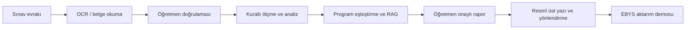

# MAHİR

> Öğretmen kontrolünü merkeze alan; sınav verilerini doğrulanabilir öğrenme kanıtlarına, resmî rapora ve kurum içi yazışma taslağına dönüştüren Türkçe çok ajanlı karar destek prototipi.

MAHİR, **TEKNOFEST 2026 Türkçe Yapay Zekâ Dil Ajanları Yarışması - 1. Senaryo: Kamu Evrak ve Yazışma Süreçleri İçin Akıllı Ajan Destek Sistemi** kapsamında geliştirilmiştir.

Sistem, yarışma senaryosunu eğitim kurumlarına uyarlamaktadır. MAHİR'in işlediği gelen evrak; sınav puan çizelgesi, sınav veri giriş belgesi veya onaylanmış sınav analiz raporudur. Prototip, genel amaçlı bütün kamu evraklarını değil, bu tanımlı eğitim evrakı akışını uçtan uca ele alır.

> **Temel ilke:** MAHİR önerir, hesaplar ve kanıt sunar; nihai değerlendirme ve onay öğretmene aittir.

## Yarışma görevlerinin tamamlanma durumu

Şartnamenin 6.4. bölümünde iki görevin birlikte tamamlanması istenmektedir. MAHİR'de her iki görev de eğitim alanına uyarlanmış demo kapsamında çalışmaktadır.

| Şartname görevi | MAHİR'deki karşılığı | Durum |
|---|---|---|
| Görev 1: Evrak Sınıflandırma ve İçerik Analizi | Sınav evrakının okunması, yapılandırılması, doğrulanması, öğretim programıyla eşleştirilmesi ve analiz edilmesi | **Tamamlandı - çalışan demo** |
| Görev 2: Resmî Yazı Taslaklama ve Birim Yönlendirme | Öğretmen onaylı rapordan resmî üst yazı, ek listesi ve okul yönetimine yönlendirme paketi oluşturulması | **Tamamlandı - çalışan demo** |

### Görev 1: Evrak Sınıflandırma ve İçerik Analizi

Şartnamedeki Görev 1 isterlerinin MAHİR'deki karşılıkları aşağıdadır.

| Beklenen yetenek | MAHİR'de nasıl karşılanır? |
|---|---|
| Evrakı OCR veya doğrudan metin olarak okuyabilme | DOCX, PDF, XLSX, CSV ve görsel dosyalar kabul edilir. Görseller yetkilendirilmiş uzak OCR servisiyle okunur. |
| Evrak türünü belirleme | Dosya türü, sınav bileşeni ve rapor bağlamı ayrıştırılır; tanımlı olmayan dosya ve bağlamlar reddedilir. |
| Önemli bilgi unsurlarını çıkarma | Okul, öğretmen, ders, sınıf/şube, dönem, sınav tarihi, soru puanları, öğrenci puanları ve öğrenme çıktısı eşleştirmeleri yapılandırılır. |
| Eksik bilgileri tespit etme | Zorunlu alan, puan sınırı, toplam puan, soru sayısı, ders-sınıf-program eşleşmesi ve okunamayan hücre denetimleri öğretmen onayından önce çalışır. |
| İlgili kural ve standartları önerme | Sorular resmî öğretim programındaki öğrenme çıktılarıyla eşleştirilir; RAG katmanı yalnız öğretmen onayından sonra resmî program bağlamını kullanır. |
| Kısa ve öz özet oluşturma | Soru, öğrenme çıktısı, tema ve sınıf düzeyinde başarı özetleri ile kanıt bağlantıları üretilir. |

Görev 1 çıktısı, öğretmenin düzeltebildiği bir doğrulama ekranı ve ardından oluşturulan **Sınav Sonuçları Analiz Raporu**dur. Sayısal başarı oranları büyük dil modeli tarafından tahmin edilmez; doğrulanmış puanlardan uygulama koduyla hesaplanır.

### Görev 2: Resmî Yazı Taslaklama ve Birim Yönlendirme

Şartnamedeki Görev 2 isterlerinin MAHİR'deki karşılıkları aşağıdadır.

| Beklenen yetenek | MAHİR'de nasıl karşılanır? |
|---|---|
| Uygun resmî yazı taslağı oluşturma | Onaylanmış analiz raporundan okul/kurum müdürlüğüne hitap eden üst yazı taslağı hazırlanır. |
| Resmî üsluba uygunluk | Muhatap, konu, metin, ekler, imza makamı ve sonraki işlem alanları standart bir yapıda oluşturulur. |
| Doğru birime yönlendirme önerisi | Belge, "Bilgi ve gereği" işlem türüyle okul/kurum müdürlüğüne yönlendirilir. |
| Süreç hakkında bilgilendirme | `Taslak -> Öğretmen kontrolü -> Demo aktarımı -> Paraf bekliyor -> Elektronik imza bekliyor` adımları kullanıcıya gösterilir. |
| Eksik bilgi talebi | Okul/kurum adı, öğretmen, ders, sınıf/şube veya dönem eksikse resmî yazı oluşturulmaz; eksik alanlar kullanıcıya bildirilir. |

Görev 2 çıktıları; indirilebilir Word üst yazısı, ek listesi ve JSON biçimindeki EBYS demo aktarım paketidir. **Demo gerçek EBYS sistemine belge göndermez; gerçek evrak sayısı, kayıt tarihi, paraf veya elektronik imza üretmez.** Bu alanlar yalnız yetkili kurum entegrasyonu sonrasında EBYS tarafından oluşturulabilir.

## Uçtan uca MAHİR akışı



1. Öğretmen sınav türünü ve ders bağlamını seçer.
2. Sınav evrakı yüklenir veya veriler elle girilir.
3. Sistem dosyayı okur; eksik, okunamayan veya çelişkili alanları bildirir.
4. Öğretmen verileri düzeltir ve onaylar.
5. Başarı oranları soru ve öğrenme çıktısı puanlarından deterministik olarak hesaplanır.
6. RAG, yalnız onaylı veriler üzerinden resmî öğretim programı bağlamını getirir.
7. Rapor öğretmen incelemesinden sonra Word ve PDF olarak üretilir.
8. Onaylı rapordan resmî üst yazı ve kurum içi yönlendirme paketi hazırlanır.

## Çok ajanlı mimari

MAHİR'de görev sınırları belirlenmiş beş uzman ajan bulunur:

| Ajan | Sorumluluk | Yapmadığı işlem |
|---|---|---|
| Belge Anlama Ajanı | Onaylı girdiyi standart eğitim belgesine dönüştürür | Pedagojik yorum yapmaz |
| Program Eşleştirme Ajanı | Soruları resmî ders programındaki öğrenme çıktılarıyla eşleştirir | Puan hesaplamaz |
| Ölçme ve Değerlendirme Ajanı | Soru ve öğrenme çıktısı başarı oranlarını hesaplar | LLM ile sayı üretmez |
| Pedagojik Analiz Ajanı | Onaylı kanıtı resmî program bağlamıyla yorumlar | Ham öğrenci verisini modele göndermez |
| Raporlama Ajanı | Kanıtları A-H yapısındaki resmî rapora dönüştürür | Sonuçları yeniden hesaplamaz |

Bu ayrım, bir ajanın ürettiği sonucun diğer ajan tarafından izlenebilmesini ve sayısal hesapların dil modeli yorumundan bağımsız kalmasını sağlar.

## Jüri için hızlı başlangıç

### Windows'ta çalıştırma

1. Depoyu GitHub'dan klonlayınız veya ZIP olarak indirip klasöre çıkarınız.
2. Bilgisayarınızda **Python 3.10 veya üzeri** bulunduğunu kontrol ediniz.
3. Proje ana klasöründeki `MAHIR_BASLAT.cmd` dosyasına çift tıklayınız.
4. Tarayıcı otomatik olarak açılmazsa `http://127.0.0.1:8000/index.html` adresine gidiniz.
5. MAHİR'i kullandığınız süre boyunca açılan sunucu penceresini açık tutunuz.

Lütfen `index.html` dosyasını doğrudan açmayınız. Belge yükleme ve analiz servislerinin başlatılabilmesi için `MAHIR_BASLAT.cmd` dosyasını kullanınız.

### Komut satırıyla çalıştırma

```bash
git clone https://github.com/peykan1071/MAHIR-PROTOTIP-HTML.git
cd MAHIR-PROTOTIP-HTML
python backend/run_file_receiver.py
```

Windows'ta `python` komutu tanınmıyorsa aşağıdaki komutu kullanınız:

```powershell
py backend/run_file_receiver.py
```

## OCR ve RAG demo erişimi

Depo tek başına indirildiğinde arayüz, belge doğrulama ve yerel analiz akışı çalıştırılabilir. Yetkilendirilmiş uzak **OCR ve RAG** servisleri için proje sahibi tarafından ayrıca sağlanan `secrets.local.txt` dosyasını proje ana klasörüne yerleştiriniz:

```text
MAHIR_OCR_SHARED_SECRET=<ayrıca sağlanan erişim anahtarı>
MAHIR_RAG_SHARED_SECRET=<ayrıca sağlanan erişim anahtarı>
```

Erişim anahtarı olmadan ücretli uzak servisler kullanılamaz. Uzak GPU servisleri kullanılmadığında sıfıra ölçeklenir; bu nedenle ilk OCR veya RAG isteği normalden daha uzun sürebilir.

### Erişim anahtarları neden repoda bulunmuyor?

Bu durum bir kurulum eksikliği değil; bilinçli bir güvenlik ve maliyet kontrolü kararıdır.

- Git deposuna eklenen bir erişim anahtarı, daha sonra silinse bile eski commitlerde ve çatallarda kalabilir.
- Herkese açık anahtarlar, ücretli GPU servislerinin yetkisiz kullanılmasına neden olabilir.
- Gerçek servis kimlik bilgilerinin koddan ayrı tutulması, kontrollü erişim ve veri minimizasyonu yaklaşımının gereğidir.
- `.gitignore`, `secrets.local.txt` dosyasının yanlışlıkla Git geçmişine eklenmesini engeller.

Yetkili jüri değerlendirmesinde tam erişim, ayrıca iletilen yerel yapılandırma dosyasıyla veya süre ve kota sınırı bulunan jüri erişimiyle sağlanır.

## 9. sınıf Türk Dili ve Edebiyatı pilotu

MAHİR'in ilk doğrulama alanı **9. sınıf Türk Dili ve Edebiyatı** dersidir. Pilot veri paketi:

- dört temayı kapsayan **54 öğrenme çıktısı**,
- resmî dönem ve senaryo tablolarıyla doğrulanan **66 süreç bileşeni**,
- Dinleme/İzleme, Okuma, Konuşma ve Yazma alan becerileri,
- tema, ders, sınıf ve sınav türü bağlamını koruyan kayıt yapısı

içerir.

TDE kodları yalnızca **Türk Dili ve Edebiyatı + 9. sınıf** profili seçildiğinde kullanıma açılır. Başka bir ders veya sınıf bağlamında TDE kodu gönderilmesi arka uç tarafından reddedilir. Ayrıntılı bilgi için [TDE 9 pilot veri paketini](shared/pilot/tde9/README.md) inceleyebilirsiniz.

## Doğruluk ve halüsinasyon kontrolü

- Belge gelmeden soru, puan veya öğrenme çıktısı üretilmez.
- Program kodları serbest metinden uydurulmaz; tanımlı ders-sınıf kataloğundan alınır.
- Öğrenci toplamları soru puanlarından hesaplanır; LLM'e hesap yaptırılmaz.
- Her soru puanı tanımlı azami puanla sınırlandırılır.
- Eksik veya okunamayan veri öğretmen tarafından düzeltilmeden analiz tamamlanmaz.
- RAG yalnız öğretmen onayından sonraki pedagojik raporlama aşamasında kullanılır.
- Kaynak bağlam bulunamazsa sistem içerik uydurmak yerine bu durumu açıkça bildirir.
- Word ve PDF çıktıları öğretmen onayı verilmeden etkinleşmez.

## Veri güvenliği ve etik sınırlar

- Depoda gerçek öğrenci adı, T.C. kimlik numarası veya okul numarası bulunmaz.
- Pilot verilerde `ÖĞR-001` benzeri anonim kimlikler kullanılır.
- Ham öğrenci listesi ve kimlik belirleyici kurumsal alanlar LLM/RAG istemlerine gönderilmez.
- Öğrenci eşleştirmesi yalnızca oturumluk takma referanslarla yapılır.
- Gerçek kamu verisi yerine sentetik, anonim veya kullanımı açık örnek veriler kullanılır.
- Üretim ortamına geçişten önce kurumsal kimlik doğrulama, yetkilendirme, kayıt politikası ve KVKK kontrolleri ayrıca tamamlanmalıdır.

## Çalışan özellikler ve prototip sınırları

| Bileşen | Güncel durum |
|---|---|
| Tek sayfalık öğretmen akışı | Çalışıyor |
| TDE 9 program kataloğu ve ayrıntılı süreç bileşenleri | Çalışıyor |
| DOCX, PDF, XLSX ve CSV belge okuma | Çalışıyor |
| Çoklu görsel OCR ve grup birleştirme | Çalışıyor - uzak GPU servisiyle |
| Öğretmen veri doğrulaması | Çalışıyor |
| Kurallı sınav ve öğrenme çıktısı analizi | Çalışıyor |
| Program kaynaklı RAG yorumlama | Çalışıyor - uzak GPU servisiyle |
| Word ve PDF rapor üretimi | Çalışıyor |
| Resmî üst yazı ve yönlendirme paketi | Çalışıyor - demo kapsamında |
| Gerçek EBYS aktarımı ve elektronik imza | Simüle ediliyor; yetkili kurum entegrasyonu gerektirir |
| Kalıcı ilişkisel veritabanı | Sonraki geliştirme aşaması |
| Kurumsal kullanıcı hesabı ve yetkilendirme | Prototip sonrası |

## Jüri için 15 dakikalık önerilen gösterim

Şartnameye göre final süresi **10 dakika sunum + 5 dakika soru-cevap** biçimindedir.

1. **1 dakika:** Problem, kullanıcı ve öğretmen onayı ilkesi
2. **2 dakika:** Sınav evrakının yüklenmesi ve OCR/belge okuma
3. **2 dakika:** Eksik-çelişkili veri doğrulaması
4. **2 dakika:** Soru, öğrenme çıktısı ve tema bazlı kurallı analiz
5. **1 dakika:** RAG destekli, kaynaklı pedagojik değerlendirme
6. **1 dakika:** Word/PDF raporu ve kanıt görünümü
7. **1 dakika:** Resmî üst yazı, birim yönlendirme ve EBYS demosu
8. **5 dakika:** Jüri soruları

İnternet kesintisi veya uzak GPU soğuk başlangıcı olasılığına karşı önceden hazırlanmış anonim veri, örnek rapor ve kayıtlı demo görüntüsü yedek olarak bulundurulmalıdır. Jüri talep ettiğinde canlı çalıştırma yapılabilmelidir.

## Testler

Python doğrulamalarını çalıştırmak için:

```bash
python -m unittest discover -s tests -p "test_*.py"
```

Node.js kuruluysa JavaScript kontrolleri de çalıştırılabilir:

```bash
node tests/program-catalog.test.js
node tests/workspace-backup.test.js
node tests/data-entry-flow.test.js
node tests/score-corrections.test.js
node tests/report-evidence.test.js
node tests/ebys-demo.test.js
```

## Proje yapısı

```text
MAHIR-PROTOTIP-HTML/
|-- index.html                 # Ekranların anlamsal yapısı
|-- styles.css                # Arayüz ve rapor görünümü
|-- script.js                 # Kullanıcı akışı ve ön yüz bağlantıları
|-- MAHIR_BASLAT.cmd          # Windows hızlı başlatıcı
|-- assets/js/                # Program kataloğu, yedekleme ve çıktı üreticileri
|-- backend/app/              # Belge okuma, doğrulama ve analiz motorları
|-- backend/app/agents/       # Beş uzman ajan ve orkestratör
|-- shared/pilot/tde9/        # TDE 9 pilot program verileri
|-- shared/templates/         # Veri giriş ve rapor şablonları
|-- tests/                    # Python ve JavaScript kontrolleri
`-- docs/                     # Mimari ve geliştirme belgeleri
```

## Teknik belgeler ve kaynaklar

- [Belge Anlama Ajanı](docs/architecture/document-understanding-agent.md)
- [Program Eşleştirme Ajanı](docs/architecture/program-mapping-agent.md)
- [Ölçme ve Değerlendirme Ajanı](docs/architecture/measurement-evaluation-agent.md)
- [Pedagojik Analiz Ajanı](docs/architecture/pedagogical-analysis-agent.md)
- [Raporlama Ajanı](docs/architecture/reporting-agent.md)
- [Standart Eğitim Belgesi](docs/architecture/canonical-education-document.md)
- [Türkiye Yüzyılı Maarif Modeli](https://tymm.meb.gov.tr/)
- [TDE 9 pilot veri paketi](shared/pilot/tde9/README.md)
- [Geliştirme ilkeleri](DEVELOPMENT_CHARTER.md)
- [Değişiklik günlüğü](CHANGELOG.md)

## Sonraki geliştirme adımları

1. OCR ve RAG akışlarının farklı anonim belge örnekleriyle genişletilmiş doğrulaması
2. Süreli ve kullanım kotası sınırlandırılmış jüri demo erişimi
3. Kalıcı ilişkisel veritabanı
4. Kurumsal kimlik doğrulama ve yetkilendirme
5. Yetkili kurumlarla gerçek EBYS entegrasyonu
6. Üretim ortamı için KVKK, denetim kaydı ve saklama politikaları

## Ekip

- **Zülal Ülker Daştan** - Takım kaptanı, Türk Dili ve Edebiyatı
- **Lokman Daştan** - Din Kültürü ve Ahlak Bilgisi
- **Gonca Ergül** - Fen Bilimleri
- **Hakan Ergül** - Matematik

---

**MAHİR, öğretmenin mesleki kararını devralmak için değil; kanıtı görünür, analizi izlenebilir ve resmî raporlama sürecini yönetilebilir kılmak için geliştirilmiştir.**
