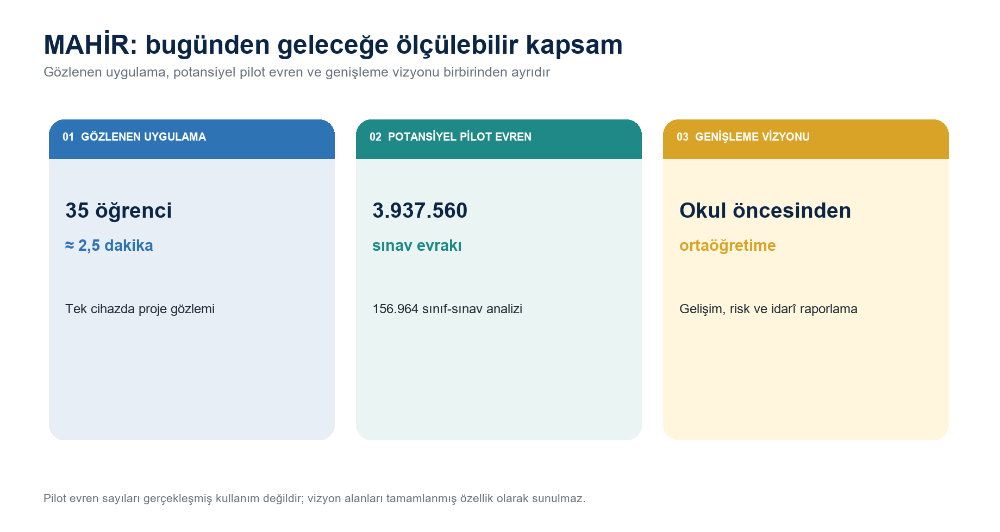
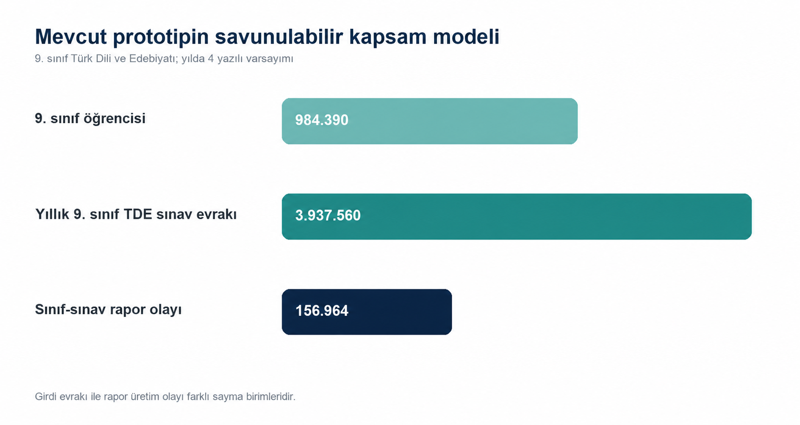

# MAHİR

[](https://github.com/peykan1071/MAHIR-PROTOTIP-HTML/actions/workflows/tests.yml)

> Öğretmen kontrolünü merkeze alan; sınav verilerini doğrulanabilir öğrenme kanıtlarına, resmî rapora ve kurum içi yazışma taslağına dönüştüren Türkçe çok ajanlı karar destek prototipi.

MAHİR, **TEKNOFEST 2026 Türkçe Yapay Zekâ Dil Ajanları Yarışması - 1. Senaryo: Kamu Evrak ve Yazışma Süreçleri İçin Akıllı Ajan Destek Sistemi** kapsamında geliştirilmiştir.


> **Temel ilke:** MAHİR doğrular, hesaplar, kaynaklı taslak üretir ve kanıt sunar; nihai pedagojik değerlendirme, düzeltme ve onay öğretmene aittir.

## Öğretmen olmayan okuyucu için: Bir sınav kâğıdının evrak yolculuğu

Bir okulda sınav kâğıdı yalnızca öğrencinin üzerine cevap yazdığı sıradan bir sayfa değildir. Öğretmen bu belgeyi öğretim programına, yıllık plana, sınav türüne, soru-puan dağılımına ve ölçme kurallarına göre hazırlar. Belge; okul ve eğitim öğretim yılı başlığını, öğrencinin sınıf/şube bilgisini, sınav türünü, soruları, azami puanları ve değerlendirme alanlarını taşır. Bu nedenle sınav kâğıdı, okulun resmî eğitim-öğretim faaliyeti içinde üretilen ve öğrenci başarısının değerlendirilmesine dayanak olan bir **eğitim evrakıdır**.

### Mahir Öğretmen'in sınav haftası

Mahir Öğretmen aynı sınavı birden fazla 9. sınıf şubesine uygulayacaktır. Önce sınav kâğıdını ve puan çizelgesini hazırlar; boş belge öğretmenden öğrenciye gider. Sınav sırasında her öğrenci kendi kâğıdını doldurur. Süre bittiğinde belgeler yeniden öğretmene teslim edilir. Böylece öğretmenin hazırlayıp dışarı verdiği boş belge, öğrenci cevabı ve puan kanıtıyla zenginleşmiş şekilde öğretmenin iş akışına geri döner.

Öğretmen açısından asıl evrak yükü bundan sonra başlar: Her kâğıdın doğru öğrenciye ve şubeye ait olduğunu kontrol etmek, soru puanlarını kaydetmek, eksik veya hatalı alanları bulmak, sınıf sonuçlarını hesaplamak, soruları öğrenme çıktılarıyla ilişkilendirmek, her şube için analiz raporu hazırlamak ve sonucu okul yönetimine üst yazıyla sunmak gerekir. Aynı sınav farklı şubelerde uygulanmışsa ortak bilgiler tekrar tekrar girilir; yazılı, dinleme/izleme ve konuşma bileşenleri ayrıca değerlendirilir.

MAHİR bu hikâyede öğretmenin yerine karar veren bir sistem değil, öğretmenin evrak işleme zincirini destekleyen çok ajanlı yardımcıdır. Öğrenciden geri dönen sınav kâğıdı veya öğretmenin oluşturduğu puan çizelgesi MAHİR'in **işleyeceği gelen eğitim evrakıdır**. MAHİR belgeyi okur, sınıflandırır, önemli alanları çıkarır, eksikleri gösterir ve öğretmen onayından sonra hesaplama ile kaynaklı analiz taslağını üretir. Öğretmenin onayladığı analiz raporu, üst yazı ve ek listesi ise okul yönetimine sunulacak **giden evrak paketini** oluşturur.

```mermaid
flowchart LR
    A["Öğretmen sınav evrakını hazırlar"] --> B["Boş sınav kâğıdı öğrenciye sunulur"]
    B --> C["Öğrenci cevaplandırır ve öğretmene teslim eder"]
    C --> D["Gelen eğitim evrakı: doldurulmuş sınav / puan çizelgesi"]
    D --> E["MAHİR: okuma, sınıflandırma, eksik bilgi ve içerik analizi"]
    E --> F["Öğretmen doğrulaması ve onayı"]
    F --> G["Sınıf analiz raporu"]
    G --> H["Giden evrak: üst yazı ve rapor ekleri"]
    H --> I["Okul/kurum müdürlüğü"]
```



### Yarışma senaryosuyla birebir eşleme

| Kamu evrak sürecindeki aşama | Okuldaki somut karşılığı | MAHİR'in görevi |
|---|---|---|
| Kuruma/çalışana ulaşan belge | Öğrencinin cevaplandırıp öğretmene teslim ettiği sınav kâğıdı, soru bazlı puan çizelgesi veya sınav veri giriş belgesi | Belgeyi kabul eder; dosya türünü, sınıf/şubeyi, soru ve puan alanlarını yapılandırır. |
| İlk inceleme ve sınıflandırma | Belgenin hangi sınıfa, sınav bileşenine ve öğrenci referansına ait olduğunun kontrolü | OCR/belge okuma yapar, açıkça etiketlenmiş alanları çıkarır ve belirsizlikleri öğretmene gösterir. |
| İçerik analizi ve eksik bilgi tespiti | Soru sayısı, azami puan, öğrenci puanı, toplam, öğrenme çıktısı ve bağlam kontrolleri | Kurallı doğrulamaları çalıştırır; öğretmenin düzeltmesi gereken alanları bildirir. |
| Dayanak ve standartlarla ilişkilendirme | Sınav sorularının TDE 9 öğretim programındaki öğrenme çıktıları ve süreç bileşenleriyle ilişkilendirilmesi | Öğretmen seçimini kayıtlı program kataloğuyla doğrular; RAG yalnız doğrulanmış resmî kaynak bağlamını getirir. |
| Resmî yazı taslaklama | Onaylı sınıf analizinin okul yönetimine sunulması | Word/PDF analiz raporu, üst yazı ve ek listesi taslağı üretir. |
| Birime yönlendirme | Belgenin okul/kurum müdürlüğüne bilgi ve gereği için sunulması | Demo yönlendirme ve EBYS aktarım paketi hazırlar; gerçek kayıt, paraf veya elektronik imza üretmez. |

> **Önemli idarî sınır:** Buradaki “gelen evrak” ifadesi, öğrenciden öğretmene geri dönen belgenin MAHİR tarafından işlenecek girdi olmasını anlatan işlevsel senaryo eşlemesidir. Her sınav kâğıdının EBYS'de “gelen yazı” olarak kaydedildiği iddia edilmez. EBYS niteliğindeki resmî yazışma; öğretmen onayından sonra hazırlanan üst yazı ve rapor ekleri aşamasında başlar ve mevcut prototipte yalnız demo olarak gösterilir.

### Temel kavramlar

| Kavram | Bu projede ne anlama gelir? |
|---|---|
| Sınav evrakı | Öğretmenin hazırladığı, öğrencinin cevaplandırdığı ve değerlendirilmek üzere öğretmene geri sunduğu tek sınav belgesidir. Bir sınıftaki her öğrenci ayrı bir sınav evrakı üretir. |
| Gelen eğitim evrakı | Doldurulmuş sınav kâğıdı, soru bazlı puan çizelgesi veya veri giriş belgesi gibi öğretmenin inceleme ve değerlendirme iş akışına ulaşan belgedir. Bu, MAHİR senaryosundaki işlevsel “gelen evrak” karşılığıdır. |
| Sınıf-sınav analizi | Bir şubenin tek sınavındaki öğrenci evraklarının topluca değerlendirilmesidir. Örneğin 35 öğrenci evrakı çoğunlukla bir sınıf-sınav analiz olayına karşılık gelir. |
| Öğrenme çıktısı | Öğrencinin öğretim süreci sonunda edinmesi beklenen bilgi, beceri veya yeterliktir. |
| Öğrenme kanıtı | Bir öğrenme çıktısına ne ölçüde ulaşıldığını gösteren sınav, performans, gözlem veya portfolyo verisidir. |
| Giden evrak paketi | Öğretmen tarafından onaylanan analiz raporunun üst yazı ve ek listesiyle okul/kurum müdürlüğüne sunulacak biçime getirilmesidir. |
| Üst yazı | Analiz raporunun okul yönetimine veya başka bir resmî makama sunulmasında kullanılan resmî yazı taslağıdır. |
| EBYS | MEB'e bağlı okul ve kurumlarda resmî belgelerin oluşturulması, paraflanması, elektronik imzalanması, gönderilmesi ve arşivlenmesi için kullanılan Elektronik Belge Yönetim Sistemidir. MEBBİS ortak ekranı erişim yollarından biridir. |

## Otomatik test güvencesi

GitHub, `main` dalına gönderilen her değişiklikte ve her çekme isteğinde Python ve JavaScript testlerini yeniden çalıştırır. README'nin üstündeki rozet son çalıştırmanın güncel durumunu gösterir; rozete tıklayan okuyucu çalıştırma tarihini, test günlüklerini ve test sayılarını doğrudan GitHub üzerinden inceleyebilir.

En son GitHub Actions doğrulamasında **301 Python testi**, **13 JavaScript test dosyası** ve ana tarayıcı betiğinin sözdizimi kontrolü başarıyla tamamlanmıştır. Bu sonuç, kodla tanımlanan davranışların doğrulandığını gösterir; gerçek kullanıcı etki araştırması veya her belge türünde kusursuzluk iddiası değildir. OCR ve RAG servis anahtarları test hattına eklenmez; uzak servis senaryoları güvenli taklitlerle sınanır.

Sistem, yarışma senaryosunu eğitim kurumlarına uyarlamaktadır. MAHİR'in giriş tarafında işlediği belgeler; doldurulmuş sınav kâğıdı, sınav puan çizelgesi ve sınav veri giriş belgesidir. Çıkış tarafında öğretmen onaylı analiz raporu, üst yazı ve ek listesi hazırlanır. Prototip, genel amaçlı bütün kamu evraklarını değil, bu tanımlı eğitim evrakı akışını uçtan uca ele alır.

### Güncel prototip özeti

- Aynı ders, sınıf düzeyi, sınav bileşeni, soru sayısı ve azami puan yapısındaki birden fazla şube tek çalışma içinde işlenebilir.
- Öğretmen ortak sınavın öğrenme çıktılarını bir kez seçer; seçim yalnız aynı yapıya sahip şubelere uygulanır. Yazılı, dinleme/izleme ve konuşma sınavları birbirine karıştırılmaz.
- Her şube için ayrı Word/PDF raporu hazırlanabilir. TDE 9 profilinde onaylı yazılı, dinleme/izleme ve konuşma raporları **%70 + %15 + %15** sabit ağırlıklarıyla genel değerlendirme raporunda birleştirilebilir.
- İl, ilçe, okul/kurum, öğretmen ve eğitim öğretim yılı bir kez girildiğinde aynı çalışma içindeki diğer raporlara aktarılır; sınıf/şube ve sınava özgü alanlar ayrı korunur.
- Onaylanmış birden fazla rapor, tek üst yazı ve ek listesi bulunan EBYS demo paketine dönüştürülebilir. Gerçek EBYS gönderimi ve elektronik imza kapsam dışındadır.

## Problem, kullanıcı ve potansiyel etki

Öğretmenler yalnızca sınav puanı vermekle kalmaz; sınav verilerini kontrol eder, soru ve öğrenme çıktısı düzeyinde yorumlar, sınıfın güçlü ve gelişime açık yönlerini belirler, raporlar ve gerektiğinde kurum içi yazışmaya dönüştürür. Bu işlemlerin farklı belgeler ve araçlar üzerinde elle yürütülmesi zaman kaybına, tekrar eden veri girişine ve izlenebilirlik sorunlarına yol açabilir.

MAHİR; belge okuma, veri doğrulama, kurallı hesaplama, program eşleştirme, kaynaklı pedagojik değerlendirme ve resmî raporlama adımlarını öğretmen kontrolündeki tek bir akışta birleştirmek üzere geliştirilmiştir. Amaç yeni bir karar mercii oluşturmak değil, öğretmenin mevcut işini daha düzenli, izlenebilir ve yeniden kullanılabilir hâle getirmektir.

### MAHİR olmadan ve MAHİR ile iş akışı karşılaştırması

Aşağıdaki tablo, aynı sınav analizi ve raporlama görevinin araç ve süreç düzeyindeki karşılaştırmasıdır. **Ölçülmüş bir kullanıcı etki araştırması değildir.** “MAHİR olmadan” sütunu, işlemlerin öğretmen tarafından belge, hesap tablosu ve metin düzenleyici gibi ayrı araçlarla yürütüldüğü referans iş akışını ifade eder.

| Boyut | MAHİR olmadan referans iş akışı | MAHİR ile mevcut prototip | Kanıt ve sınır |
|---|---|---|---|
| Veri hazırlama | Sınav verileri kullanılan araca uygun biçimde öğretmen tarafından düzenlenir ve farklı belgelere aktarılabilir. | DOCX, PDF, XLSX, CSV, görsel veya elle giriş yolları ortak doğrulama ekranında birleştirilir. | Her iki yöntemde de kaynak verinin doğruluğu öğretmenin sorumluluğundadır; düşük kaliteli OCR sonucu ayrıca kontrol edilmelidir. |
| Veri kontrolü | Eksik, hatalı veya tutarsız değerler öğretmenin kendi kontrol yöntemiyle bulunur. | Zorunlu alan, puan sınırı, toplam puan, soru sayısı ve bağlam kontrolleri analizden önce çalışır. | Otomatik kontrol, doğru girilmiş fakat pedagojik olarak yanlış olan bir veriyi her durumda tespit edemez. |
| Sayısal hesaplama | Ortalama, başarı oranı ve dağılımlar kullanılan tablo veya formüllerle ayrı ayrı hesaplanır. | Sayısal sonuçlar öğretmen onaylı puanlardan kurallı uygulama koduyla hesaplanır. | Hesaplar LLM'e yaptırılmaz; yanlış kaynak veri yanlış sonuca yol açabilir. |
| Öğrenme çıktısı ilişkisi | Soru ve öğrenme çıktısı ilişkisi ayrı belge veya tablolarda kurulabilir. | Öğretmenin seçtiği ilişki kayıtlı TDE 9 program kataloğuyla doğrulanır ve analiz boyunca korunur. | Sistem öğrenme çıktısını kendiliğinden kesin olarak belirlemez; seçme ve doğrulama öğretmene aittir. |
| İzlenebilirlik | Sayısal bulgu, kaynak soru ve rapor metni arasındaki bağlantı kullanılan belgelere göre dağınık kalabilir. | Soru, puan, öğrenme çıktısı, analiz bulgusu ve rapor arasında ortak veri ve işlem izi tutulur. | İzlenebilirlik prototip oturumu kapsamındadır; kurumsal ve kalıcı denetim altyapısı henüz tamamlanmamıştır. |
| Rapor hazırlama | Hesaplanan sonuçlar öğretmen tarafından rapor şablonuna aktarılır ve metin düzenlenir. | Doğrulanmış bulgular, düzenlenebilir Word ve PDF analiz raporuna dönüştürülür. | Üretilen rapor taslaktır; öğretmen incelemesi ve onayı olmadan nihai kabul edilmez. |
| Üst yazı | Rapor bilgileri ayrı bir resmî yazı şablonuna aktarılır. | Onaylı rapordan üst yazı ve ek listesi taslağı hazırlanır. | Gerçek EBYS aktarımı, evrak numarası, paraf ve elektronik imza üretilmez. |
| İşlem bütünlüğü | Veri, hesap, yorum, rapor ve yazışma birden fazla araç ve dosyada yürütülebilir. | Adımlar tek öğretmen akışı ve ortak veri sözleşmesi içinde birbirine bağlanır. | Prototip, genel amaçlı tüm kamu evraklarını veya bütün dersleri kapsamaz. |
| Zaman | Proje ekibinin aynı kapsamdaki görev gözleminde, 35 öğrencilik sınav verisinin elle analiz edilerek rapor ve üst yazıya dönüştürülmesi en az 2 saat sürmüştür. | Tek cihazdaki proje gözleminde aynı kapsamdaki sentetik verinin rapor ve üst yazıya dönüştürülmesi yaklaşık 2,5 dakika sürmüştür. | Bu sonuç, proje ekibinin tek görev gözlemine dayanır; hedef kullanıcılarla yapılmış tekrarlı ve kontrollü bir deney değildir. Veri hazırlama ve öğretmenin nihai içerik incelemesi karşılaştırma kapsamı dışında tutulmuştur. |
| Çıktı kalitesi | Kalite; öğretmenin kullandığı şablona, formüllere, kontrol adımlarına ve ayırdığı zamana bağlıdır. | Standart veri kontrolleri, program kataloğu, kaynak sınırları ve ortak rapor yapısı daha tutarlı çıktı üretmeyi hedefler. | Gerçek kullanıcı belgeleri uzmanlarca puanlanmadığı için kalite artışı henüz kanıtlanmış değildir. |
| Hata riski | Tekrar eden veri aktarımı ve elle kurulan formüller hata olasılığı oluşturabilir. | Tekrarlı hesap ve aktarım adımları azaltılır; tanımlı doğrulama kontrolleri uygulanır. | Hata oranında azalma henüz karşılaştırmalı kullanıcı çalışmasıyla ölçülmemiştir. |
| İnsan kontrolü | Analiz, yorum ve resmî belge sorumluluğu öğretmendedir. | Analiz, yorum ve resmî belge sorumluluğu yine öğretmendedir; MAHİR karar destek ve taslak üretim aracı olarak kalır. | MAHİR öğretmenin pedagojik veya idarî kararının yerine geçmez. |

Bu karşılaştırma, MAHİR'in **hangi adımları birleştirdiğini ve hangi kontrolleri sağladığını** gösterir. Tek görev gözlemindeki süre farkının hedef kullanıcı koşullarında doğrulanması; hata oranı ve çıktı kalitesinin ölçülmesi için aynı anonim sınav verisinin MAHİR olmadan ve MAHİR ile işlendiği karşılaştırmalı pilot çalışma yapılacaktır.

## Türkiye Yüzyılı Maarif Modeli ile aynı dili konuşan analiz

Türkiye Yüzyılı Maarif Modeli yalnızca ders içeriklerini yenileyen bir program değişikliği değildir. Model; eğitimin amaçlarını, öğrenme sürecini ve ölçme-değerlendirmeyi açıklamak için kendine özgü bir kavram sistemi kullanır. Önceki uygulamalarda yaygın olan kazanım ve konu merkezli anlatımın yanında; **öğrenme çıktıları, süreç bileşenleri, alan becerileri, kavramsal beceriler, eğilimler, programlar arası bileşenler ve öğrenme kanıtları** gibi kavramlar öne çıkar.

Bu değişim yalnızca eski terimlerin yenileriyle değiştirilmesi değildir. Değerlendirme; öğrencinin sadece kaç puan aldığından, hangi öğrenme çıktısında nasıl bir kanıt ortaya koyduğuna ve öğretmenin sonraki öğrenme sürecini hangi bulgularla planlayabileceğine doğru genişler. MAHİR bu nedenle eski bir sınav analiz tablosuna yeni program adları eklenerek kurulmamıştır; veri, hesaplama, kanıt ve rapor zincirini Maarif Modeli'nin kavramsal yapısı içinde kurar.

| Geleneksel sınav analizi | MAHİR'in Maarif Modeli uyumlu yaklaşımı |
|---|---|
| Sınıf ortalaması ve genel başarı oranı | Soru, öğrenme çıktısı ve öğrenme kanıtı düzeyinde inceleme |
| Konu veya kazanım başlığına dayalı genel sonuç | Öğretmenin seçtiği öğrenme çıktısını resmî program kataloğuyla doğrulama |
| Sayısal sonuçların listelenmesi | Sayısal bulgunun program bağlamı ve kanıt dayanağıyla açıklanması |
| Sonucun kaynağının sınırlı görünürlüğü | Sorudan öğrenme çıktısına uzanan izlenebilir kanıt zinciri |
| Genel veya kaynaksız öneri | Doğrulanmış program kaynaklarıyla sınırlandırılmış açıklama |
| Otomatik sistem hükmü izlenimi | Öğretmen doğrulaması, öğretmen onayı ve öğretmen kararı |

> **Ayırt edici tasarım özelliği:** MAHİR yalnızca puanları hesaplamaz; öğretmenin onayladığı sınav verisini Türkiye Yüzyılı Maarif Modeli'nin öğrenme çıktıları ve öğrenme kanıtları yaklaşımı içinde anlamlandırır.

> **Bilimsel sınır:** Mevcut prototip öğrencinin açık uçlu cevabını kendiliğinden puanlamaz ve soru metninden kesin bir öğrenme çıktısı keşfettiğini iddia etmez. Soru puanları ile öğrenme çıktısı ilişkileri öğretmen tarafından girilir veya doğrulanır; MAHİR onaylı veri üzerinden hesaplama, kanıtlandırma, program bağlamlandırması ve raporlama yapar.

### Türkiye ölçeği

Millî Eğitim Bakanlığının **2024-2025 Örgün Eğitim İstatistikleri** verilerine göre Türkiye'deki örgün eğitim kurumlarında toplam **1.187.409 öğretmen** görev yapmaktadır. Bu öğretmenlerin **1.009.671'i (%85,0) resmî**, **177.738'i (%15,0) özel** okullardadır.

| İstatistiksel kavram | MAHİR bağlamındaki karşılığı |
|---|---|
| Hedef evren (potansiyel kullanıcı evreni) | Türkiye'deki örgün eğitim kurumlarında görev yapan 1.187.409 öğretmen |
| Mevcut pilot kapsamı | 9. sınıf Türk Dili ve Edebiyatı sınav analizi ve raporlama akışı |
| Pilot veri seti | Gerçek kişileri temsil etmeyen sentetik ve anonim sınav verileri |
| Analiz birimleri | Soru, anonim öğrenci, öğrenme çıktısı, tema, sınıf ve rapor |
| İstatistiksel çıkarım sınırı | Temsilî öğretmen örneklemiyle etki araştırması yapılmadığı için evrene yönelik süre tasarrufu veya başarı etkisi tahmin edilmez |
| Genellenebilirlik sınırı | İşlevsel pilot sonuçları bütün ders, sınıf ve kurum türlerine doğrudan genellenemez |
| Genişleme potansiyeli | Ders ve sınıfa özgü doğrulanmış program katalogları eklenerek yeni alanlara uyarlanabilir |

Buradaki **1.187.409** sayısı MAHİR'in mevcut kullanıcı sayısı veya pilot örneklemi değildir; çözümün ele aldığı problemin ulusal ölçekteki hedef evrenini gösterir. Prototipin çalışan ve doğrulanmış ilk uygulama alanı TDE 9 pilotudur. Pilot, sistemin işlevlerini doğrular; öğretmen başına zaman tasarrufu veya ülke genelindeki etki hakkında henüz istatistiksel bir tahmin üretmez.

Kaynak: [Millî Eğitim Bakanlığı, 2024-2025 Örgün Eğitim İstatistikleri](https://sgb.meb.gov.tr/www/quot2024-2025-orgun-egitim-istatistikleri-yayimlandiquot/icerik/771)



### Mevcut prototip, pilot evren ve gelecek vizyonu

| Kapsam düzeyi | Ne ifade ediyor? | Ölçek | Kanıt durumu |
|---|---|---|---|
| Gözlenen uygulama | 35 öğrencilik geçmiş sınav verisinin analiz raporu ve üst yazı taslağına dönüştürülmesi | Yaklaşık 2,5 dakika | Tek cihazda proje gözlemi |
| Mevcut prototip | 9. sınıf Türk Dili ve Edebiyatı yazılı, dinleme/izleme ve konuşma sınavlarının ayrı ve birleşik analizi | Çalışan prototip | Sentetik ve anonim verilerle test |
| Potansiyel pilot evren | Aynı ders ve sınıf düzeyindeki teorik yıllık hacim | 3.937.560 sınav evrakı; 156.964 sınıf-sınav analizi | MEB 2024/25 verisi ve yılda dört yazılı varsayımı |
| Genişleme vizyonu | Farklı dersler, kademeler, gelişim, risk ve idarî raporlama | Tek kesin sayı yok | Tamamlanmış özellik değildir |



Yaklaşık **2,5 dakikalık** gözlem, kontrollü, tekrarlı ve temsilî bir deney değildir. Bu nedenle Türkiye geneline yönelik zaman tasarrufu, doğruluk artışı veya eğitimsel etki çıkarımı yapılmaz.

### Gösterim senaryosunun resmî dayanağı

README'de görselleriyle sunulan yazılı sınav uygulaması, **9. sınıf Türk Dili ve Edebiyatı dersi 2025-2026 eğitim öğretim yılı ikinci dönem ikinci yazılı sınavı** bağlamında hazırlanmıştır. Yazılı sınavın soru yapısı, puan dağılımı ve öğrenme çıktısı ilişkileri; Millî Eğitim Bakanlığı tarafından yayımlanan ilgili konu-soru dağılım tablosu, sınav senaryosu ve resmî öğretim programı doğrultusunda ekip tarafından MAHİR'in veri yapısına uyarlanmıştır. Dinleme/izleme ve konuşma örnekleri ise aynı sınıf düzeyindeki resmî TDE 9 program kataloğunun ilgili alan becerileri ve süreç bileşenleri kullanılarak sentetik biçimde oluşturulmuştur.

Bu senaryo, resmî program dilinin ve ölçme bağlamının MAHİR'de nasıl yapılandırıldığını göstermek için kullanılır. Soru-öğrenme çıktısı ilişkileri öğretmen tarafından seçilir veya doğrulanır; sistem bu ilişkileri kendiliğinden kesin bir pedagojik eşleştirme olarak üretmez.

> **Sentetik sınıf ile resmî dayanağın ayrımı:** Gösterimdeki 35 öğrenci referansı ve soru puanları gerçek bir sınıftan alınmamıştır. Veri seti; belge okuma, öğretmen doğrulaması, öğrenme kanıtı hesaplama, program bağlamlandırması, raporlama ve üst yazı oluşturma akışını göstermek amacıyla üretilmiş sentetik ve anonim bir sınav simülasyonudur.

> **Temsil ve etki sınırı:** Bu örnek, MAHİR'in resmî sınav bağlamına nasıl uyarlanabildiğini gösterir; gerçek bir sınıfın başarısını, Türkiye genelindeki öğrencileri, ölçülmüş zaman tasarrufunu veya sistemin eğitimsel etkisini temsil etmez.

## Ulusal ölçek modeli ve genişleme vizyonu

MEB 2024/25 örgün eğitim istatistikleri, aynı ayrıntıda tamamlanmış 2025/26 resmî veri bulunmadığı için en yakın tam referans dönem olarak kullanılmıştır. Bu sayılar **2025/26 gerçekleşmeleri değildir**.

| Gösterge | Resmî sayı | MAHİR açısından doğru yorum |
|---|---:|---|
| Örgün eğitim öğretmeni | 1.187.409 | Mevcut kullanıcı değil; uzun vadeli hedef evren |
| Resmî okul öğretmeni | 1.009.671 (%85,0) | Hedef evrenin resmî kurum bölümü |
| Özel okul öğretmeni | 177.738 (%15,0) | Hedef evrenin özel kurum bölümü |
| İlkokul öğrencisi | 5.704.483 | Sınav evrakına değil, gelişim izleme vizyonuna dâhil |
| Ortaokul öğrencisi | 5.085.890 | Okul türüne göre ayrıştırılması gereken sınav alanı |
| Ortaöğretim öğrencisi | 4.374.035 | Okul türüne göre ayrıştırılması gereken sınav alanı |

<p align="center">
  
</p>

<p align="center">
  
</p>

### Sınav evrakı modelinin sınırı

İlk açık varsayımlı çalışmada ortaokul için yıllık 24, lise için yıllık 48 sınav evrakı katsayısı kullanılarak **332.015.040 potansiyel sınav evrakı** hesaplanmıştır. Bu sayı gerçekleşmiş resmî ulusal evrak sayısı veya üretilmiş rapor sayısı değildir.

<p align="center"></p>

Daha doğru bir model; okul türünü, sınıf düzeyini, sınava tabi ortak/seçmeli/alan/meslek derslerini ve sınav sıklığını ayrı ayrı hesaba katmalıdır. İmam hatip ortaokulları, Anadolu imam hatip liseleri, mesleki ve teknik liseler ile diğer okul türleri tek katsayıyla temsil edilmemelidir. İlkokul ve okul öncesi, yazılı sınav evrakı hesabına katılmaz.

### Sınav dışı raporlama vizyonu

Mevcut prototip sınav analiziyle sınırlıdır. Aşağıdaki alanlar tamamlanmış özellikler değil; uzman doğrulaması, yeni veri sözleşmeleri ve ayrı etik/yetki kontrolleri gerektiren gelecek vizyonudur.

| Alan | Belge ve veri örnekleri | Gelecekte değerlendirilebilecek MAHİR desteği |
|---|---|---|
| Performans ve proje | Görev, proje, sunum, rubrik, kontrol listesi, öz/akran değerlendirme | Puan ve gözlemleri ölçüt bazında birleştiren öğretmen kontrollü değerlendirme |
| Portfolyo | Ürün dosyası, süreç kaydı, geri bildirim ve gelişim kanıtı | Dönem içindeki gelişimi kanıt zinciriyle özetleme |
| Akademik izleme | Devamsızlık, ders başarısı, tekrar eden eksiklik ve destek kaydı | Kesin hüküm vermeyen izleme göstergeleri ve öğretmen/yöneticiye açıklanabilir uyarı |
| Kurul ve zümre | Sınav analizleri, kararlar, izleme sonuçları | Toplu eğilimleri ve izlenecek kararları rapor taslağına dönüştürme |
| Okul öncesi ve ilkokul | Gözlem, gelişim dosyası, beceri kontrol listesi, veli bilgilendirmesi | Sınav puanı yerine gelişim kanıtlarını öğretmen onayıyla yapılandırma |
| İdarî süreçler | Risk izleme, stratejik plan göstergeleri, faaliyet ve dönem raporları | Farklı veri kaynaklarını kanıtlı kurumsal rapor taslağında birleştirme |

### Rehberlik ve psikolojik danışma sınırı

Gelecekteki rehberlik desteği; bireyi tanıma, görüşme/izleme, yönlendirme, etkinlik ve e-Rehberlik kayıtları gibi kurumsal süreçleri kapsayabilir. Ancak MAHİR:

- psikolojik tanı koymaz,
- klinik risk veya kesin öğrenci profili üretmez,
- rehber öğretmenin mesleki kararının yerine geçmez,
- mahrem verileri genel amaçlı LLM/RAG katmanına göndermez,
- yalnız yetkili rol, açık amaç, veri minimizasyonu ve insan onayı bulunan süreçlerde kullanılabilir.

## İhtiyacın resmî dayanağı ve kullanıcı doğrulama planı

Millî Eğitim Bakanlığı **Yazılı ve Uygulamalı Sınavlar Yönergesi**, sınav sonuçlarının ilgili ders öğretmeni tarafından sisteme girilmesini; sınavların şube ve sınıf bazında analiz edilmesini ve belirlenen konu veya kazanım eksiklikleri için iyileştirici önlemler alınmasını öngörür. Bu yükümlülük, MAHİR'in desteklediği sınav analizi ve sonuçların raporlanması iş akışının kurumsal dayanağını oluşturur.

MAHİR; öğretmenin yürüttüğü bu süreci veri doğrulama, kurallı hesaplama, öğrenme çıktısı düzeyinde inceleme, rapor oluşturma ve kurum içi yazışma taslağı hazırlama adımlarıyla desteklemek amacıyla geliştirilmiştir. Projenin ihtiyaç gerekçesi, bu aşamada mevzuat ve resmî kaynak incelemesine dayanmaktadır; henüz tamamlanmış bir saha ihtiyaç araştırması veya gerçek kullanıcı etki çalışması bulunduğu iddia edilmemektedir.

MEB tarafından öğretmen görüşlerine dayalı izleme-değerlendirme çalışmaları ve ölçme-değerlendirme süreçlerine yönelik ihtiyaç belirleme çalıştayları yürütülmektedir. Bu çalışmalar alanın geliştirilmesine yönelik kurumsal ilgiyi gösterir; ancak MAHİR'in otomatik analiz, raporlama ve üst yazı oluşturma işlevlerine duyulan ihtiyacı tek başına doğrulamaz.

Sonraki geliştirme aşamasında hedef kullanıcılarla iki ayrı çalışma planlanmaktadır:

1. **İhtiyaç analizi:** Türk Dili ve Edebiyatı öğretmenlerinin mevcut sınav değerlendirme yöntemleri, süreçte harcadıkları zaman, karşılaştıkları güçlükler ve otomatik raporlamadan beklentileri incelenecektir.
2. **Pilot kullanıcı testi:** Öğretmenlerin MAHİR'i müdahalesiz biçimde kullanması gözlemlenecek; görev tamamlama durumu, işlem süreleri, yardım ihtiyacı, teknik sorunlar ve kullanım sonrası değerlendirmeleri kaydedilecektir.

Çalışmalar tamamlandığında örneklem özellikleri, soru ve görev metinleri, analiz yöntemi ve bulgular açık biçimde raporlanacaktır. Temsilî örneklem ve yeterli ölçüm bulunmadan zaman tasarrufu, memnuniyet, başarı artışı veya ülke geneline genellenebilir etki iddiasında bulunulmayacaktır.

Kaynaklar:

- [MEB Yazılı ve Uygulamalı Sınavlar Yönergesi](https://odsgm.meb.gov.tr/meb_iys_dosyalar/2024_02/07101329_odsgm_mevzuat_kitapcigi.pdf)
- [Öğretmen görüşlerine dayalı Türkiye Yüzyılı Maarif Modeli izleme ve değerlendirme çalışmaları](https://ttkb.meb.gov.tr/www/ogretmen-goruslerine-dayali-olarak-hazirlanan-turkiye-yuzyili-maarif-modeli-izleme-ve-degerlendirme-raporlari-tamamlandi/icerik/907/tr)
- [Sınıf içi ölçme ve değerlendirme süreçlerine yönelik ihtiyaç belirleme çalıştayı](https://odsgm.meb.gov.tr/www/ortaokullarda-sinif-ici-olcme-ve-degerlendirme-sureclerine-yonelik-ihtiyac-belirleme-calistayi-gerceklestirildi/icerik/1579/tr)

## Yarışma görevlerinin tamamlanma durumu

Şartnamenin 6.4. bölümünde iki görevin birlikte tamamlanması istenmektedir. MAHİR'de her iki görev de eğitim alanına uyarlanmış demo kapsamında çalışmaktadır.

| Şartname görevi | MAHİR'deki karşılığı | Durum |
|---|---|---|
| Görev 1: Evrak Sınıflandırma ve İçerik Analizi | Sınav evrakının okunması, yapılandırılması ve doğrulanması; öğretmenin seçtiği öğrenme çıktılarının program bağlamında kontrol edilmesi ve puanların analiz edilmesi | **Tamamlandı - çalışan demo** |
| Görev 2: Resmî Yazı Taslaklama ve Birim Yönlendirme | Öğretmen onaylı rapordan resmî üst yazı, ek listesi ve okul yönetimine yönlendirme paketi oluşturulması | **Tamamlandı - çalışan demo** |

### Görev 1: Evrak Sınıflandırma ve İçerik Analizi

Şartnamedeki Görev 1 isterlerinin MAHİR'deki karşılıkları aşağıdadır.

| Beklenen yetenek | MAHİR'de nasıl karşılanır? |
|---|---|
| Evrakı OCR veya doğrudan metin olarak okuyabilme | DOCX, PDF, XLSX, CSV ve görsel dosyalar kabul edilir. Görseller yetkilendirilmiş uzak OCR servisiyle okunur. |
| Evrak türünü belirleme | Dosya türü ve rapor bağlamı ayrıştırılır. Sınav bileşeni öğretmenin Hazırlık ekranındaki seçimiyle belirlenir; OCR dosya adından veya işaret kutusundan tahmin yürütmez. |
| Önemli bilgi unsurlarını çıkarma | Okul, öğretmen, ders, etiketli sınıf/şube hücresi, dönem, sınav tarihi, soru puanları, öğrenci puanları ve öğrenme çıktısı eşleştirmeleri yapılandırılır. |
| Eksik bilgileri tespit etme | Zorunlu alan, puan sınırı, toplam puan, soru sayısı, ders-sınıf-program eşleşmesi ve okunamayan hücre denetimleri öğretmen onayından önce çalışır. |
| İlgili kural ve standartları önerme | Öğretmenin soru için seçtiği öğrenme çıktısı kayıtlı resmî program kataloğuyla doğrulanır; RAG katmanı yalnız öğretmen onayından sonra resmî program bağlamını kullanır. |
| Kısa ve öz özet oluşturma | Soru, öğrenme çıktısı, tema ve sınıf düzeyinde başarı özetleri ile kanıt bağlantıları üretilir. |

Görev 1 çıktısı, öğretmenin düzeltebildiği bir doğrulama ekranı ve ardından oluşturulan **Sınav Sonuçları Analiz Raporu**dur. Sayısal başarı oranları büyük dil modeli tarafından tahmin edilmez; doğrulanmış puanlardan uygulama koduyla hesaplanır.

### Görev 2: Resmî Yazı Taslaklama ve Birim Yönlendirme

Şartnamedeki Görev 2 isterlerinin MAHİR'deki karşılıkları aşağıdadır.

| Beklenen yetenek | MAHİR'de nasıl karşılanır? |
|---|---|
| Uygun resmî yazı taslağı oluşturma | Onaylanmış analiz raporundan okul/kurum müdürlüğüne hitap eden üst yazı taslağı hazırlanır. |
| Resmî üsluba uygunluk | Muhatap, konu, metin, ekler, imza makamı ve sonraki işlem alanları standart bir yapıda oluşturulur. |
| Doğru birime yönlendirme önerisi | Belge, "Bilgi ve gereği" işlem türüyle okul/kurum müdürlüğüne yönlendirilir. |
| Süreç hakkında bilgilendirme | `Taslak -> Öğretmen kontrolü -> Demo aktarımı -> Paraf bekliyor -> Elektronik imza bekliyor` adımları kullanıcıya gösterilir. |
| Eksik bilgi talebi | Okul/kurum adı, öğretmen, ders, sınıf/şube veya dönem eksikse resmî yazı oluşturulmaz; eksik alanlar kullanıcıya bildirilir. |

Görev 2 çıktıları; indirilebilir Word üst yazısı, ek listesi ve JSON biçimindeki EBYS demo aktarım paketidir. Birden fazla onaylı rapor aynı üst yazının ayrı ekleri olarak paketlenebilir. **Demo gerçek EBYS sistemine belge göndermez; gerçek evrak sayısı, kayıt tarihi, paraf veya elektronik imza üretmez.** Bu alanlar yalnız yetkili kurum entegrasyonu sonrasında EBYS tarafından oluşturulabilir.

## Uçtan uca MAHİR akışı

```mermaid
flowchart LR
    A["Ders ve sınav bileşeni"] --> B["Çoklu evrak yükleme"]
    B --> C["OCR / belge okuma ve sınıf-şube gruplama"]
    C --> D["Öğretmen veri doğrulaması"]
    D --> E["Ortak öğrenme çıktılarının seçimi"]
    E --> F["Kurallı ölçme ve ajan analizi"]
    F --> G["Şube bazlı Word / PDF raporları"]
    G --> H["TDE genel değerlendirme: %70 + %15 + %15"]
    G --> I["Tek üst yazı ve çoklu ek paketi"]
    H --> I
    I --> J["EBYS aktarım demosu"]
```



1. Öğretmen ders bağlamını ve yazılı, dinleme/izleme veya konuşma bileşenini seçer.
2. Bir ya da birden fazla şubeye ait sınav evrakı yüklenir veya veriler elle girilir.
3. Sistem dosyayı okur; yalnız açıkça etiketlenmiş sınıf/şube bilgisini kullanarak evrakları gruplar ve eksik, okunamayan veya çelişkili alanları bildirir.
4. Öğretmen puanları, soru yapısını, öğrenci referanslarını ve sınıf/şube gruplarını düzeltir ve onaylar.
5. Ortak sınavın öğrenme çıktıları bir kez seçilir; seçim yalnız aynı ders, sınıf düzeyi, sınav bileşeni, soru sayısı ve azami puan yapısındaki şubelere uygulanır.
6. Başarı oranları soru ve öğrenme çıktısı puanlarından deterministik olarak hesaplanır; RAG yalnız onaylı veriler üzerinden resmî öğretim programı bağlamını getirir.
7. Her şube için rapor öğretmen incelemesinden sonra Word ve PDF olarak üretilir.
8. TDE 9 kapsamında onaylı üç bileşen raporu sabit **%70 yazılı + %15 dinleme/izleme + %15 konuşma** ağırlıklarıyla genel değerlendirme raporunda birleştirilebilir.
9. İl, ilçe, okul/kurum, öğretmen ve eğitim öğretim yılı ortak rapor bağlamı olarak bir kez girilir ve çalışma içindeki raporlara aktarılır.
10. Onaylı raporlar tek üst yazı, çoklu ek listesi ve kurum içi yönlendirme paketine dönüştürülür.

### Akışın ekran kanıtları

Görseller ayrıntılı inceleme için tıklanabilir.

#### 1. Rol ve eğitim bağlamı

Kullanıcı önce görev rolünü, ardından kademe, okul türü, sınıf düzeyi, ders türü ve dersi birbirine bağlı alanlardan seçer. Böylece rapor doğru öğretim programı ve görev bağlamıyla kurulur. Türk Dili ve Edebiyatı öğretmeni ekranında yüklenebilecek sınav evrakları, MAHİR'in yapacağı işlemler ve üretilebilecek raporlar ayrıca açıklanır.

<p align="center"><a href="assets/readme/02-hazirlik-baglami.png"></a></p>

<p align="center"><a href="assets/readme/03-tde-evrak-rehberi.png"></a></p>

#### 2. Veri giriş yolları ve üç bileşenli genel değerlendirme

Öğretmen soru bazlı puan çizelgesi görselleri, kendi Word/PDF/Excel tablosu, MAHİR şablonu veya elle veri girişi yollarından birini kullanabilir. Ayrı ayrı onaylanan yazılı, dinleme/izleme ve konuşma raporları daha sonra sabit **%70 + %15 + %15** ağırlıklarıyla genel değerlendirmede birleştirilebilir; bu adımda yeni sınav evrakı yüklenmez.

<p align="center"><a href="assets/readme/04-veri-giris-yollari.png"></a></p>

<p align="center"><a href="assets/readme/05-uc-rapor-genel-degerlendirme.png"></a></p>

#### 3. Toplu OCR ve kaynak izlenebilirliği

Görsel OCR yolu, her görselde tek öğrenci bulunan soru bazlı puan çizelgeleri içindir. Soru numarası, azami puan, öğrencinin aldığı puan ve açıkça etiketlenmiş sınıf/şube hücresi okunur; kaynak dosya adı korunur. Sınav bileşeni öğretmenin Hazırlık ekranındaki seçimiyle belirlenir. Boş puan hücreleri soru sırasını bozmadan korunur ve öğrenci referansları sayısal sıraya alınır. Toplu yüklemede her dosyanın ilerlemesi görünür; fotoğraf kalitesi, açı, ışık ve el yazısı sonucu etkileyebileceğinden OCR çıktısı otomatik olarak doğru kabul edilmez.

<p align="center"><a href="assets/readme/06-toplu-ocr-okuma.png"></a></p>

#### 4. Veri minimizasyonu ve açık öğretmen kontrolü

Ad-soyad ve T.C. kimlik numarası analiz için kullanılmaz. Öğrenciler <code>ÖĞR-001</code> benzeri anonim referanslarla ayrıştırılır. MAHİR'in sınıf/şube bazında grupladığı puanlar, azami puanlar ve toplamlar öğretmenin düzenleme ve kontrolüne sunulur; açık onay verilmeden analiz başlamaz.

<p align="center"><a href="assets/readme/07-sinif-veri-kontrolu.png"></a></p>

#### 5. Ortak öğrenme çıktılarının güvenli aktarımı

Aynı yapıdaki ortak sınav için öğrenme çıktıları bir kez seçilir ve yalnız ders, sınıf düzeyi, sınav bileşeni, soru sayısı ve azami puan dizisi eşleşen sınıf/şubelere uygulanır. Böylece bir şubede yapılan eşleştirme diğer uygun şubelerin analizini de besler; farklı yapıdaki sınavlara taşınmaz.

<p align="center"><a href="assets/readme/08-ortak-ogrenme-ciktilari.png"></a></p>

#### 6. Altı uzman ajan ve ortak dil modeli turu

Analiz ekranı; Belge Anlama, Program Eşleştirme, Ölçme ve Değerlendirme, Pedagojik Analiz ve Raporlama adımlarını ayrı ayrı gösterir. Yükleme öncesinde çalışan Belge Okuma ve OCR Kalite Ajanı ile birlikte mimari altı uzman görev bileşeninden oluşur. Beş analiz ajanının istemleri tek ortak dil modeli turunda çözümlenir. Ekrandaki süre yalnız ilgili çalıştırmanın analiz aşamasıdır; veri hazırlama, öğretmen kontrolü ve rapor incelemesini kapsayan uçtan uca süre değildir.

<p align="center"><a href="assets/readme/14-cok-ajanli-analiz.png"></a></p>

#### 7. Kanıta ve doğrulanmış kaynağa dayalı rapor

Rapor; sınıf başarı özetini, soru bazlı gerçekleşme düzeylerini ve öğretmenin seçtiği öğrenme çıktılarının hangi puanlardan hesaplandığını birlikte gösterir. Pedagojik öneriler yalnız onaylı puanlardan ve adı, ilgili sayfası ve kullanım amacı gösterilen doğrulanmış eğitim kaynaklarından üretilir.

<p align="center"><a href="assets/readme/15-ogrenme-kanitlari-raporu.png"></a></p>

<p align="center"><a href="assets/readme/16-kaynak-temelli-oneriler.png"></a></p>

#### 8. Öğretmen onayı, üst yazı ve EBYS demo sınırı

Nihai rapor öğretmen onayından sonra Word veya PDF olarak indirilebilir. Onaylı tek ya da birden fazla rapordan resmî üst yazı ve ek listesi hazırlanabilir; tamamlanan Word üst yazısı, öğretmenin değerlendirdiği sınav evrakının kurum yönetimine sunulan giden evrak paketine dönüşmesini görünür kılar. Prototip MEBBİS'e veya gerçek MEB EBYS'ye bağlı değildir; evrak sayısı, kayıt tarihi, paraf veya elektronik imza üretmez ve gerçek sisteme belge göndermez.

<p align="center"><a href="assets/readme/17-rapor-onayi-ebys-demo.png"></a></p>

<p align="center"><a href="assets/readme/18-resmi-ust-yazi.png"></a></p>

### Çoklu sınıflarda ortak sınav ve rapor bağlamı

MAHİR, aynı sınavın birden fazla şubede uygulanması durumunda tekrar eden öğretmen işini azaltır. Öğrenme çıktısı seçimi; ders, sınıf düzeyi, sınav bileşeni, soru sayısı ve azami puan dizisi birlikte eşleştiğinde diğer şubelere aktarılır. Farklı sınav bileşenleri veya farklı soru yapıları arasında otomatik aktarım yapılmaz. Ortak eşleştirme sonradan değişirse eski analiz ve rapor onayı geçersizleştirilerek yeniden analiz istenir.

Kurumsal rapor bilgileri de çalışma düzeyinde paylaşılır. **İl, ilçe, okul/kurum adı, öğretmenin adı soyadı ve eğitim öğretim yılı** ilk raporda doğrulandıktan sonra diğer raporlara uygulanır. **Sınıf/şube, dönem, sınav sırası ve sınav tarihi** her sınavın kendi bağlamında tutulur. Eğitim öğretim yılı yalnız `2025-2026` gibi ardışık iki yılı gösteren biçimde kabul edilir.

## Çok ajanlı mimari

MAHİR'de görev sınırları belirlenmiş altı uzman ajan bulunur. Buradaki **ajan**, bağımsız bir sunucu veya ayrı bir yapay zekâ modeli değil; tanımlı girdisi, çıktısı, yetki sınırı, hata politikası ve işlem izi bulunan uzman görev bileşenidir. Belge Okuma ve OCR Kalite Ajanı dosya yükleme aşamasında; diğer beş ajan öğretmen onayından sonraki analiz aşamasında çalışır:

| Ajan | Sorumluluk | Yapmadığı işlem |
|---|---|---|
| Belge Okuma ve OCR Kalite Ajanı | Belge türünü, OCR gereksinimini ve okuma kalitesini denetler | OCR sonucunu öğretmen onayı olmadan doğru kabul etmez |
| Belge Anlama Ajanı | Onaylı girdiyi standart eğitim belgesine dönüştürür | Pedagojik yorum yapmaz |
| Program Eşleştirme Ajanı | Öğretmenin soru için seçtiği öğrenme çıktısını kayıtlı resmî program bağlamında doğrular | Otomatik öğrenme çıktısı üretmez veya puan hesaplamaz |
| Ölçme ve Değerlendirme Ajanı | Onaylanmış soru puanlarından soru ve öğrenme çıktısı başarı oranlarını hesaplar | Cevap metni puanlamaz ve LLM ile sayı üretmez |
| Pedagojik Analiz Ajanı | Onaylı kanıtı resmî program bağlamıyla yorumlar | Ham öğrenci verisini modele göndermez |
| Raporlama Ajanı | Kanıtları A-H yapısındaki resmî rapora dönüştürür | Sonuçları yeniden hesaplamaz |

Bu ayrım, bir ajanın ürettiği sonucun diğer ajan tarafından izlenebilmesini ve sayısal hesapların dil modeli yorumundan bağımsız kalmasını sağlar. İlk ajanın kalite sonucu yükleme kaydındaki `documentQuality` alanında; analiz aşamasındaki diğer beş ajanın çalışma sırası, süresi, bulguları ve LLM kullanımı ortak ajan izinde tutulur.

### İki aşamalı çalışma düzeni

| Aşama | Bileşenler | Öğretmen kontrolü |
|---|---|---|
| Veri kabul kapısı | Belge Okuma ve OCR Kalite Ajanı | OCR sonucu, eksik ve belirsiz alanlar öğretmene sunulur; onay verilmeden analiz başlamaz. |
| Onay sonrası analiz hattı | Belge Anlama -> Program Eşleştirme -> Ölçme ve Değerlendirme -> Pedagojik Analiz -> Raporlama | Rapor ve kurumsal belge taslakları öğretmen incelemesi ve onayı olmadan nihai kabul edilmez. |

### Standart Eğitim Belgesi - CED

**Canonical Education Document (CED)**; öğretmen tarafından onaylanan sınav bağlamını, soru yapısını, anonim öğrenci puanlarını ve öğrenme çıktısı ilişkilerini ajanlar arasında taşıyan standart eğitim belgesi modelidir. CED bir yapay zekâ kararı değildir; ajanların aynı veri sözleşmesi üzerinden çalışmasını ve bir aşamadaki bulgunun sonraki aşamada izlenebilmesini sağlar.

| CED'nin taşıdığı bilgiler | CED'nin yapmadıkları |
|---|---|
| Ders, sınıf, okul türü, dönem, sınav türü ve sınav sırası | OCR işlemi yapmaz |
| Soru numarası, azami puan ve öğretmen onaylı soru puanları | Öğrenme çıktısını kendiliğinden seçmez |
| Öğretmenin seçtiği öğrenme çıktıları ve katkı ilişkileri | Pedagojik karar veya resmî onay üretmez |
| Anonim öğrenci referansları, doğrulama bulguları ve işlem izi | Ham kimlik verisini LLM/RAG katmanına taşımaz |

### Deterministik işlemler ile LLM/RAG ayrımı

| Ajan | LLM/RAG kullanımı | Bilimsel ve teknik sınır |
|---|---|---|
| Belge Okuma ve OCR Kalite | Yok | OCR kalite bulguları öğretmen doğrulamasının yerini tutmaz. |
| Belge Anlama | Yok | Yalnız onaylanmış veriyi CED yapısına dönüştürür. |
| Program Eşleştirme | Yok | Öğretmenin seçimini katalogla doğrular; otomatik pedagojik seçim yapmaz. |
| Ölçme ve Değerlendirme | Yalnız açıklayıcı anomali kontrolü | LLM hiçbir puanı, oranı veya toplamı değiştiremez. |
| Pedagojik Analiz | Doğrulanmış program kaynağıyla RAG | Kaynak yoksa veya yanıt kapsam dışına çıkarsa açıklama rapora alınmaz. |
| Raporlama | Yok | Önceki ajanların doğrulanmış sonuçlarını düzenler; yeniden hesaplama yapmaz. |

Pedagojik Analiz Ajanı isteğe bağlıdır. RAG/LLM erişimi başarısız olursa sayısal analiz ve kanıt temelli rapor yorumsuz biçimde devam edebilir. Başarısız ajanlar ve atlanan alanlar işlem izinde saklanır; eksik kanıt tamamlanmış gibi gösterilmez.

LLM kullanan görevlerin istemleri ortak kuyruğa yazılıp tek toplu istek içinde gönderilebilir. Bu, ayrı ağ turlarını azaltan teknik bir optimizasyondur; sıfır GPU maliyeti, sabit süre veya ajan sayısından bağımsız performans iddiası değildir.

### RAG kaynak ve kapsam korumaları

- RAG yalnız öğretmenin onayladığı anonimleştirilmiş veri üzerinde çalışır.
- Arama; kayıtlı program, sınıf, tema ve seçilmiş öğrenme çıktısı bağlamıyla sınırlandırılır.
- Tema çözülemezse daha geniş ve riskli bir aramaya düşülmez.
- Kaynak bulunmayan model yanıtı rapora taşınmaz.
- Başka öğrenme çıktısı koduna veya yanlış beceri alanına sapan yanıt reddedilir.
- Kullanılan kaynaklar belge adı ve orijinal PDF sayfa numaralarıyla işlem izine eklenir.
- RAG başarısızlığı deterministik sayısal analizi durdurmaz.

## Projeyi inceleme rehberi

### Sunumu izlemeden depo üzerinden inceleme

Projeyi yalnızca depo ve belgeler üzerinden değerlendiren okuyucu aşağıdaki kanıt zincirini izleyebilir:

1. [Örnek sınav girdisi](shared/sample-exam.csv): Sisteme hangi verilerin sağlandığını gösterir.
2. [Yapılandırılmış standart eğitim belgesi örneği](shared/ced-example.json): Onaylı verinin ajanlar arasında hangi ortak sözleşmeyle taşındığını gösterir.
3. [TDE 9 pilot veri paketi ve kapsam açıklaması](shared/pilot/tde9/README.md): Öğretmenin seçtiği öğrenme çıktısının program bağlamında nasıl doğrulandığını gösterir.
4. [Ajan mimari belgeleri](docs/architecture/): Altı bileşenin görev, yetki, hata ve LLM sınırlarını gösterir.
5. [Örnek analiz raporu](shared/report-example.txt): Sayısal sonuçların ve kanıtların nasıl sunulduğunu gösterir.
6. [Otomatik testler](tests/): İş akışının, güvenlik sınırlarının ve öğretmen kontrol noktalarının nasıl doğrulandığını gösterir.

Bu dosyalar örnek girdiden yapılandırılmış veriye, analiz çıktısına ve doğrulama kontrollerine uzanan akışın repo üzerinden izlenebilmesini sağlar. Örnek dosyalar sentetiktir; gerçek öğrenci kimliği içermez.

### Windows'ta çalıştırma

1. Depoyu GitHub'dan klonlayınız veya ZIP olarak indirip klasöre çıkarınız.
2. Bilgisayarınızda **Python 3.10 veya üzeri** bulunduğunu kontrol ediniz.
3. Proje ana klasöründeki `MAHIR_BASLAT.cmd` dosyasına çift tıklayınız.
4. Tarayıcı otomatik olarak açılmazsa `http://127.0.0.1:8000/index.html` adresine gidiniz.
5. MAHİR'i kullandığınız süre boyunca açılan sunucu penceresini açık tutunuz.

Lütfen `index.html` dosyasını doğrudan açmayınız. Belge yükleme ve analiz servislerinin başlatılabilmesi için `MAHIR_BASLAT.cmd` dosyasını kullanınız.

### Komut satırıyla çalıştırma

```bash
git clone https://github.com/peykan1071/MAHIR-PROTOTIP-HTML.git
cd MAHIR-PROTOTIP-HTML
python backend/run_file_receiver.py
```

Windows'ta `python` komutu tanınmıyorsa aşağıdaki komutu kullanınız:

```powershell
py backend/run_file_receiver.py
```

## OCR ve RAG demo erişimi

Depo tek başına indirildiğinde arayüz, belge doğrulama ve yerel analiz akışı çalıştırılabilir. Yetkilendirilmiş uzak **OCR ve RAG** servisleri için proje sahibi tarafından ayrıca sağlanan `secrets.local.txt` dosyasını proje ana klasörüne yerleştiriniz:

```text
MAHIR_OCR_SHARED_SECRET=<ayrıca sağlanan erişim anahtarı>
MAHIR_RAG_SHARED_SECRET=<ayrıca sağlanan erişim anahtarı>
```

Erişim anahtarı olmadan ücretli uzak servisler kullanılamaz. Uzak GPU servisleri kullanılmadığında sıfıra ölçeklenir; bu nedenle ilk OCR veya RAG isteği normalden daha uzun sürebilir.

### Erişim anahtarları neden repoda bulunmuyor?

Bu durum bir kurulum eksikliği değil; bilinçli bir güvenlik ve maliyet kontrolü kararıdır.

- Git deposuna eklenen bir erişim anahtarı, daha sonra silinse bile eski commitlerde ve çatallarda kalabilir.
- Herkese açık anahtarlar, ücretli GPU servislerinin yetkisiz kullanılmasına neden olabilir.
- Gerçek servis kimlik bilgilerinin koddan ayrı tutulması, kontrollü erişim ve veri minimizasyonu yaklaşımının gereğidir.
- `.gitignore`, `secrets.local.txt` dosyasının yanlışlıkla Git geçmişine eklenmesini engeller.

Yetkili değerlendirmede tam erişim, ayrıca iletilen yerel yapılandırma dosyasıyla veya süre ve kota sınırı bulunan değerlendirme erişimiyle sağlanır.

## 9. sınıf Türk Dili ve Edebiyatı pilotu

MAHİR'in ilk doğrulama alanı **9. sınıf Türk Dili ve Edebiyatı** dersidir. Pilot veri paketi:

- dört temayı kapsayan **54 öğrenme çıktısı**,
- resmî programdan yapılandırılan **237 süreç bileşeni** ve **614 ayrıntılı gösterge**,
- Dinleme/İzleme, Okuma, Konuşma ve Yazma alan becerileri,
- tema, ders, sınıf ve sınav bileşeni bağlamını koruyan kayıt yapısı

içerir.

TDE kodları yalnızca **Türk Dili ve Edebiyatı + 9. sınıf** profili seçildiğinde kullanıma açılır. Başka bir ders veya sınıf bağlamında TDE kodu gönderilmesi arka uç tarafından reddedilir. Ayrıntılı bilgi için [TDE 9 pilot veri paketini](shared/pilot/tde9/README.md) inceleyebilirsiniz.

## Doğruluk ve halüsinasyon kontrolü

- Belge gelmeden soru, puan veya öğrenme çıktısı üretilmez.
- Program kodları serbest metinden uydurulmaz; tanımlı ders-sınıf kataloğundan alınır.
- Öğrenci toplamları soru puanlarından hesaplanır; LLM'e hesap yaptırılmaz.
- Her soru puanı tanımlı azami puanla sınırlandırılır.
- Ortak öğrenme çıktıları yalnız aynı sınav yapısındaki şubelere aktarılır; farklı sınav bileşenleri birbirine karıştırılmaz.
- Eksik veya okunamayan veri öğretmen tarafından düzeltilmeden analiz tamamlanmaz.
- RAG yalnız öğretmen onayından sonraki pedagojik raporlama aşamasında kullanılır.
- Kaynak bağlam bulunamazsa sistem içerik uydurmak yerine bu durumu açıkça bildirir.
- Word ve PDF çıktıları öğretmen onayı verilmeden etkinleşmez.

## Veri güvenliği ve etik sınırlar

- Depoda gerçek öğrenci adı, T.C. kimlik numarası veya okul numarası bulunmaz.
- Pilot verilerde `ÖĞR-001` benzeri anonim kimlikler kullanılır.
- Ham öğrenci listesi ve kimlik belirleyici kurumsal alanlar LLM/RAG istemlerine gönderilmez.
- Öğrenci eşleştirmesi yalnızca oturumluk takma referanslarla yapılır.
- Gerçek kamu verisi yerine sentetik, anonim veya kullanımı açık örnek veriler kullanılır.
- Üretim ortamına geçişten önce kurumsal kimlik doğrulama, yetkilendirme, kayıt politikası ve KVKK kontrolleri ayrıca tamamlanmalıdır.

## Çalışan özellikler ve prototip sınırları

| Bileşen | Güncel durum |
|---|---|
| Tek sayfalık öğretmen akışı | Çalışıyor |
| TDE 9 program kataloğu ve ayrıntılı süreç bileşenleri | Çalışıyor |
| DOCX, PDF, XLSX ve CSV belge okuma | Çalışıyor |
| Çoklu görsel OCR ve etiketli sınıf/şube gruplama | Çalışıyor - uzak GPU servisiyle |
| Öğretmen veri doğrulaması | Çalışıyor |
| Aynı yapıdaki çoklu şubelerde ortak öğrenme çıktısı | Çalışıyor; seçim bir kez yapılır ve eşleşen şubelere uygulanır |
| Kurallı sınav ve öğrenme çıktısı analizi | Çalışıyor |
| Program kaynaklı RAG yorumlama | Çalışıyor - uzak GPU servisiyle |
| Yazılı, dinleme/izleme ve konuşma için Word/PDF raporu | Çalışıyor |
| TDE genel değerlendirme raporu | Çalışıyor; sabit %70 yazılı + %15 dinleme/izleme + %15 konuşma |
| Ortak kurumsal rapor bilgilerinin yeniden kullanımı | Çalışıyor; sınava özgü alanlar ayrı korunur |
| Tek üst yazıda birden fazla onaylı rapor eki | Çalışıyor - demo kapsamında |
| Gerçek EBYS aktarımı ve elektronik imza | Simüle ediliyor; yetkili kurum entegrasyonu gerektirir |
| Kalıcı ilişkisel veritabanı | Sonraki geliştirme aşaması |
| Kurumsal kullanıcı hesabı ve yetkilendirme | Prototip sonrası |

## Testler

Python doğrulamalarını çalıştırmak için:

```bash
python -m unittest discover -s tests -p "test_*.py"
```

Node.js kuruluysa repodaki 13 JavaScript test dosyasının tamamı ve ana tarayıcı betiğinin sözdizimi kontrolü çalıştırılabilir:

```bash
node --test tests/*.test.js
node --check script.js
```

JavaScript test **dosyası** sayısı, test vakası sayısı değildir. CI başarısı kodla tanımlanan davranışları doğrular; gerçek kullanıcı etkisini veya bütün belge türlerinde kusursuzluğu kanıtlamaz.

## Proje yapısı

```text
MAHIR-PROTOTIP-HTML/
|-- index.html                 # Ekranların anlamsal yapısı
|-- styles.css                # Arayüz ve rapor görünümü
|-- script.js                 # Kullanıcı akışı ve ön yüz bağlantıları
|-- MAHIR_BASLAT.cmd          # Windows hızlı başlatıcı
|-- assets/js/                # Program kataloğu, yedekleme ve çıktı üreticileri
|   |-- mahir-shared-outcomes.js # Aynı yapıdaki şubeler için ortak çıktı eşleştirmesi
|   `-- mahir-ebys-demo.js    # Tek üst yazı ve çoklu ek demo paketi
|-- backend/app/              # Belge okuma, doğrulama ve analiz motorları
|-- backend/app/agents/       # Öğretmen onayı sonrası beş analiz ajanı ve orkestratör
|-- backend/app/ocr_quality_agent.py # Yükleme aşamasındaki OCR kalite ajanı
|-- backend/app/general_report_merger.py # Üç TDE bileşen raporunu birleştirme
|-- shared/pilot/tde9/        # TDE 9 pilot program verileri
|-- shared/templates/         # Veri giriş ve rapor şablonları
|-- tests/                    # Python ve JavaScript kontrolleri
`-- docs/                     # Mimari ve geliştirme belgeleri
```

## Teknik belgeler ve kaynaklar

- [Belge Anlama Ajanı](docs/architecture/document-understanding-agent.md)
- [Belge Okuma ve OCR Kalite Ajanı](docs/architecture/ocr-quality-agent.md)
- [Program Eşleştirme Ajanı](docs/architecture/program-mapping-agent.md)
- [Ölçme ve Değerlendirme Ajanı](docs/architecture/measurement-evaluation-agent.md)
- [Pedagojik Analiz Ajanı](docs/architecture/pedagogical-analysis-agent.md)
- [Raporlama Ajanı](docs/architecture/reporting-agent.md)
- [Standart Eğitim Belgesi](docs/architecture/canonical-education-document.md)
- [Türkiye Yüzyılı Maarif Modeli](https://tymm.meb.gov.tr/)
- [TDE 9 pilot veri paketi](shared/pilot/tde9/README.md)
- [Geliştirme ilkeleri](DEVELOPMENT_CHARTER.md)
- [Değişiklik günlüğü](CHANGELOG.md)

## Sonraki geliştirme adımları

1. OCR ve RAG akışlarının farklı anonim belge örnekleriyle genişletilmiş doğrulaması
2. Süreli ve kullanım kotası sınırlandırılmış değerlendirme erişimi
3. Kalıcı ilişkisel veritabanı
4. Kurumsal kimlik doğrulama ve yetkilendirme
5. Yetkili kurumlarla gerçek EBYS entegrasyonu
6. Üretim ortamı için KVKK, denetim kaydı ve saklama politikaları

## Ekip

### Zülal Ülker Daştan — Takım Kaptanı ve Kurucu Lider

Türk Dili ve Edebiyatı öğretmenidir. Alanında tezsiz yüksek lisans eğitimine; eğitim teknolojileri, ölçme ve değerlendirme, yapay zekâ ve proje koordinasyonu deneyimine sahiptir.

**MAHİR'deki sorumluluğu:** Proje vizyonunu ve ürün stratejisini oluşturur; kullanıcı deneyimi, yapay zekâ senaryoları, içerik yaklaşımı, ekip koordinasyonu, sürüm takibi ve yaygınlaştırma çalışmalarını yönetir.

### Lokman Daştan — Araştırma Lideri

Din Kültürü ve Ahlak Bilgisi öğretmenidir. İlahiyat alanında yüksek lisans eğitimine; eğitim araştırmaları, pedagojik değerlendirme, etik, veri gizliliği ve raporlama deneyimine sahiptir.

**MAHİR'deki sorumluluğu:** Pedagojik uygunluğu, etik ve gizlilik ilkelerini, öğretmen doğrulama adımlarını ve üretilen raporların eğitim dili bakımından tutarlılığını denetler.

### Gonca Ergül — Bilimsel İçerik Lideri

Fen Bilimleri öğretmenidir. Bilimsel içerik, STEM uygulamaları, rubrik geliştirme, beceri temelli ölçme ve dijital eğitim araçları alanlarında deneyim sahibidir.

**MAHİR'deki sorumluluğu:** Bilimsel içerik doğrulamasını, program ve öğrenme çıktısıyla uyumlu değerlendirme tasarımını, rubrik çalışmalarını ve öğretmen geri bildirimlerinin ürüne aktarılmasını yönetir.

### Hakan Ergül — Teknik Lider

Matematik öğretmenidir. Alanında yüksek lisans eğitimine; Python programlama, veri analizi, algoritma geliştirme ve web tabanlı sistemler konularında deneyime sahiptir.

**MAHİR'deki sorumluluğu:** Sistem mimarisi, veri analizi ve algoritmaları geliştirir; bileşenlerin entegrasyonu ile test, güvenlik, performans ve teknik sürdürülebilirlik çalışmalarını yönetir.

---

**MAHİR öğretmenin yerine karar vermez. Öğrenme kanıtlarını görünür, sınav analizini izlenebilir hâle getirir. Resmî raporlama ve kurum içi yazışma süreçlerinde öğretmene yardımcı olur.**
