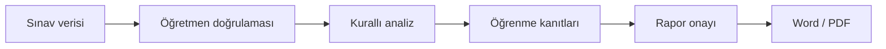

# MAHİR

> Öğretmen kontrolünü merkeze alan, sınav verilerini öğrenme kanıtlarına dönüştüren Türkçe eğitim karar destek prototipi.

MAHİR; öğretmenin sınav verilerini yapılandırmasına, doğrulamasına, öğrenme çıktılarıyla ilişkilendirmesine ve sonuçları standart bir **Sınav Sonuçları Analiz Raporu** olarak üretmesine yardımcı olur.

Proje, **TEKNOFEST 2026 Türkçe Yapay Zekâ Dil Ajanları Yarışması – Senaryo 1: Kamu Evrak ve Resmî Yazışma Süreçleri İçin Çok Ajanlı Destek** kapsamında geliştirilmektedir.

> **Temel ilke:** MAHİR önerir ve kanıt sunar; nihai değerlendirme ile onay öğretmene aittir.

## Problem ve çözüm

Sınav sonrası değerlendirme; öğrenci puanlarının kontrolü, soru ve öğrenme çıktısı düzeyinde hesaplama, pedagojik yorumlama ve resmî raporlama gibi birbirine bağlı işlemler içerir. Bu süreç öğretmen için zaman alıcıdır ve farklı belge biçimleri arasında veri kaybı riski taşır.

MAHİR bu akışı tek bir öğretmen kontrollü süreçte birleştirir:



## Çalışan prototipte neler var?

- Kademe, okul türü, sınıf ve ders bağlamının adım adım seçilmesi
- Soru sayısı, puan dağılımı ve öğrenme çıktısı eşleştirmesinin öğretmen tarafından tanımlanması
- Word belgelerindeki tanınabilir tabloların okunarak veri onay ekranına aktarılması
- PDF, görsel ve elektronik tablo dosyalarının kabul edilerek öğretmen doğrulama akışına alınması
- Elle veri girişi seçeneği
- Okunamayan veya eksik alanların analiz öncesinde düzeltilmesini zorunlu kılan doğrulamalar
- Soru, sınıf ve öğrenme çıktısı düzeyinde deterministik başarı hesaplamaları
- Ders–sınıf–program eşleşmesini hem arayüzde hem arka uçta denetleyen kurallar
- Dil derslerinde yazılı, dinleme/izleme ve konuşma bileşenlerinin ayrı ele alınması
- Öğretmen onayından sonra kilitlenen A–H yapısındaki rapor
- Tarayıcıda Word ve PDF çıktısı üretimi
- Açık öğrenci listesi ve ham sınav verisini dışarıda bırakan yerel çalışma yedeği

## TDE 9 pilotu

İlk doğrulama alanı **9. sınıf Türk Dili ve Edebiyatı** dersidir.

Pilot veri paketinde:

- dört temaya yayılmış **54 öğrenme çıktısı**,
- resmî dönem ve senaryo tablolarında doğrulanan **66 süreç bileşeni**,
- Dinleme/İzleme, Okuma, Konuşma ve Yazma alan becerileri,
- tema bağlamını koruyan ders–sınıf kapsamlı kayıt yapısı

bulunur.

TDE kodları yalnız **Türk Dili ve Edebiyatı + 9. sınıf** profili seçildiğinde açılır. Başka bir derse TDE kodu gönderilmesi arka uç tarafından da reddedilir. Ayrıntılar için [TDE 9 pilot veri paketi](shared/pilot/tde9/README.md) incelenebilir.

## Sistem sınırı ve doğruluk yaklaşımı

MAHİR’in mevcut analiz motoru kurallı ve deterministiktir:

- Başarı oranlarını LLM değil, uygulama kodu hesaplar.
- Program kodları serbest metinden uydurulmaz; tanımlı ders–sınıf kataloğundan alınır.
- Öğretmenin düzeltmediği eksik veya okunamayan veriyle analiz tamamlanmaz.
- Nihai Word/PDF çıktıları öğretmen onayı verilmeden etkinleşmez.

Bu yaklaşım, ileride eklenecek yapay zekâ katmanının hesaplama ve resmî kod üretme yerine, doğrulanmış kanıtları yorumlama görevinde kalmasını sağlar.

## Güncel geliştirme durumu

| Katman | Durum |
|---|---|
| Tek sayfalık öğretmen akışı | Çalışıyor |
| TDE 9 program kataloğu | Çalışıyor |
| DOCX tablo okuma | Çalışıyor |
| Öğretmen veri doğrulaması | Çalışıyor |
| Kurallı sınav ve öğrenme çıktısı analizi | Çalışıyor |
| Word/PDF rapor üretimi | Çalışıyor |
| Çoklu görsel OCR ve grup birleştirme | Geliştirme aşamasında |
| Kalıcı ilişkisel veritabanı | Planlandı |
| Ortak Metin parçalama ve RAG dizini | Planlandı |
| Sağlayıcıdan bağımsız LLM API katmanı | Planlandı |
| Kullanıcı hesabı, yetkilendirme ve kurumsal entegrasyon | Prototip sonrası |

Bu tablo özellikle prototipte çalışan özelliklerle yol haritasını birbirinden ayırır; henüz tamamlanmayan bir bileşen çalışıyormuş gibi sunulmaz.

## Yerel kurulum

### Gereksinimler

- Python 3.10 veya üzeri
- Güncel bir masaüstü tarayıcı
- Depoyu indirmek için Git

### Çalıştırma

```bash
git clone https://github.com/peykan1071/MAHIR-PROTOTIP-HTML.git
cd MAHIR-PROTOTIP-HTML
python backend/run_file_receiver.py
```

Windows'ta `python` komutu tanınmıyorsa:

```powershell
py backend/run_file_receiver.py
```

Ardından tarayıcıda şu adres açılır:

```text
http://127.0.0.1:8000/index.html
```

Sunucuyu durdurmak için terminalde `Ctrl+C` kullanılabilir.

## Testler

Python doğrulamalarını çalıştırmak için:

```bash
python -m unittest discover -s tests -p "test_*.py"
```

Node.js kuruluysa tarayıcıdan bağımsız JavaScript kontrolleri de çalıştırılabilir:

```bash
node tests/program-catalog.test.js
node tests/workspace-backup.test.js
```

## Proje yapısı

```text
MAHIR-PROTOTIP-HTML/
├── index.html                 # Ekranların semantik yapısı
├── styles.css                 # Arayüz ve rapor görünümü
├── script.js                  # Kullanıcı akışı ve ön yüz bağlantıları
├── assets/js/                 # Program kataloğu, yedekleme ve çıktı üreticileri
├── backend/app/               # Belge okuma, doğrulama ve analiz motorları
├── shared/pilot/tde9/         # TDE 9 pilot program verileri
├── shared/templates/          # Veri giriş ve rapor şablonları
├── tests/                     # Python ve JavaScript kontrolleri
└── docs/                      # Mimari ve geliştirme belgeleri
```

## Veri güvenliği

- Depoya gerçek öğrenci adı, T.C. kimlik numarası veya okul numarası eklenmemelidir.
- Pilot verilerinde `P001`, `P002` gibi takma kimlikler kullanılmalıdır.
- Mevcut sürüm yerel prototiptir; üretim ortamına yönelik kimlik doğrulama, yetkilendirme, kayıt politikası ve KVKK uyumluluk kontrolleri ayrıca tamamlanmalıdır.
- Gelecekte haricî bir LLM API’si kullanıldığında doğrudan kişisel veriler modele gönderilmeyecektir.

## Kaynak ilkesi

Program verileri, **Türkiye Yüzyılı Maarif Modeli** kapsamındaki resmî ders programları, Ortak Metin ve konu-soru dağılım tabloları esas alınarak yapılandırılır. Resmî belgede bulunmayan ders, sınıf, sınav veya süreç bileşeni için veri üretilmez.

- [Türkiye Yüzyılı Maarif Modeli](https://tymm.meb.gov.tr/)
- [TDE 9 pilot veri paketi ve kaynak kullanım ilkeleri](shared/pilot/tde9/README.md)
- [Proje geliştirme ilkeleri](DEVELOPMENT_CHARTER.md)
- [Değişiklik günlüğü](CHANGELOG.md)

## Yol haritası

1. Çoklu görsel yükleme, OCR doğrulama ve grup birleştirme
2. Yapısal veriler için ilişkisel veritabanı
3. Ortak Metin’in anlam temelli parçalara ayrılması ve vektör dizini
4. Kaynak gösteren RAG katmanı
5. Sağlayıcıdan bağımsız LLM bağlantısı
6. Anonim pilot verilerle uçtan uca doğrulama
7. Kurumsal güvenlik ve entegrasyon hazırlıkları

## Ekip

- **Zülal Ülker Daştan** — Takım kaptanı, Türk Dili ve Edebiyatı
- **Lokman Daştan** — Din Kültürü ve Ahlak Bilgisi
- **Gonca Ergül** — Fen Bilimleri
- **Hakan Ergül** — Matematik

---

**MAHİR**, öğretmenin mesleki kararını devralmak için değil; kanıtı görünür, analizi izlenebilir ve raporlamayı yönetilebilir kılmak için geliştirilmektedir.
