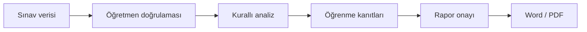

# MAHİR

> Öğretmen kontrolünü merkeze alan, sınav verilerini öğrenme kanıtlarına dönüştüren Türkçe eğitim karar destek prototipi.

MAHİR; öğretmenin sınav verilerini yapılandırmasına, doğrulamasına, öğrenme çıktılarıyla ilişkilendirmesine ve sonuçları standart bir **Sınav Sonuçları Analiz Raporu** olarak üretmesine yardımcı olur.

Proje, **TEKNOFEST 2026 Türkçe Yapay Zekâ Dil Ajanları Yarışması – Senaryo 1: Kamu Evrak ve Resmî Yazışma Süreçleri İçin Çok Ajanlı Destek** kapsamında geliştirilmektedir.

> **Temel ilke:** MAHİR önerir ve kanıt sunar; nihai değerlendirme ile onay öğretmene aittir.

## Problem ve çözüm

Hazırlık ekranından sonra öğretmen, standart MAHİR Veri Giriş Şablonu'nu indirebilir; doldurduğu Word, PDF veya görüntü belgesini yükleyebilir. Dosya türü ve boyutu denetlendikten sonra belge öğretmen kontrol ekranına aktarılır. Görsel grubu olarak yüklenen puanlama fotoğrafları (en fazla 10 adet, her biri tek öğrencilik puan tablosu), `MAHIR_OCR_REMOTE_URL` tanımlıysa uzaktaki bir OCR sunucusuna (bkz. aşağıdaki "Modal ile OCR") gönderilip öğrenci satırlarına dönüştürülür; tanımlı değilse görseller OCR yapılmadan öğretmen kontrolüne bırakılır.

MAHİR bu akışı tek bir öğretmen kontrollü süreçte birleştirir:



Ardından `http://127.0.0.1:8000/index.html` adresi açılır. Bu yerel sunucunun PaddleOCR'a ya da başka bir üçüncü parti pakete ihtiyacı yoktur (düz `python3` yeterlidir) — OCR hiçbir zaman bu makinede çalışmaz.

### Modal ile OCR

Görsel puan tablolarının OCR ile okunması, ayrı bir "OCR işçisi" (`backend/run_ocr_worker.py`) üzerinden çalışır ve bu işçinin gerçek bir GPU'ya ihtiyacı vardır. Bu işçi, kendi hesabınıza bağlı, **7/24 hazır ve kararlı bir adresi olan** bir [Modal](https://modal.com) fonksiyonu olarak çalışır (T4 GPU, saniye başına faturalandırma, boştayken sıfıra ölçeklenip ücret kesilmez - Modal her ay $30 ücretsiz kredi veriyor, bu kişisel/seyrek kullanım için genelde tüm faturayı karşılar).

**Tek seferlik kurulum** (kendi bilgisayarınızda - Modal'ın kendi build sistemi imajı uzakta derlediği için Docker kurmanıza gerek yoktur):

```bash
pip install modal
modal setup   # tarayıcıdan Modal hesabınızla giriş yapmanızı ister
```

**Dağıtım:**

```bash
git clone --branch ocr-isleri <repo-url> mahir && cd mahir
export MAHIR_OCR_SHARED_SECRET="uzun-rastgele-bir-parola"
modal deploy modal_app.py
```

(PowerShell'de `export` yerine `$env:MAHIR_OCR_SHARED_SECRET = "..."` kullanın.) İlk dağıtım, modelleri (~2 GB) indirip imaja gömdüğü için birkaç dakika sürer; komut bitince ekrana basılan **Web URL** (`https://<kullanıcı-adınız>--mahir-ocr-worker-ocr-worker.modal.run` gibi) kararlıdır - bir daha değişmez, tekrar dağıtım yapana kadar aynı kalır. Kendi bilgisayarınızda bu adresi ve az önce belirlediğiniz parolayı kullanarak yerel sunucuyu başlatın:

```bash
set MAHIR_OCR_REMOTE_URL=https://xxxx.modal.run
set MAHIR_OCR_SHARED_SECRET=uzun-rastgele-bir-parola
python3 backend/run_file_receiver.py
```

(PowerShell'de `set` yerine `$env:MAHIR_OCR_REMOTE_URL = "..."` kullanın.)

**Not**: `MAHIR_OCR_REMOTE_URL` artık koda gömülü bir varsayılana sahip (bkz. `backend/app/file_receiver.py`), `MAHIR_RAG_REMOTE_URL` gibi. Kendi dağıtımınızı kullanıyorsanız yukarıdaki gibi ayarlayın; bu depodaki dağıtımla çalışıyorsanız ayarlamanıza gerek yok. OCR'ı bilinçli olarak kapatmak için boş string verin.

**Önemli**: `MAHIR_OCR_REMOTE_URL` ve `MAHIR_OCR_SHARED_SECRET`, **aynı terminal penceresinde ve `run_file_receiver.py`'yi başlatmadan önce** ayarlanmalıdır. Bunları bir pencerede ayarlayıp sunucuyu başka bir pencerede (veya zaten açık bir pencerede, sunucuyu yeniden başlatmadan) çalıştırırsanız değişkenler sessizce yok sayılır - sunucu hata vermez, sadece OCR'sız "pass-through" moduna düşer. Bunu şu şekilde ayırt edebilirsiniz: tarayıcının Ağ (Network) sekmesinde `/mahir-upload` yanıtına bakınca `"structuredData": null` ve `"message": "N görsel alındı ve öğretmen kontrolüne hazırlandı."` görüyorsanız (OCR sonucu değil, sadece "alındı" onayı), env değişkenleri devreye girmemiş demektir - sunucuyu durdurup aynı pencerede env değişkenlerini tekrar ayarlayıp yeniden başlatın.

`MAHIR_OCR_SHARED_SECRET`, servis adresi herkese açık olduğu için isteklerin `X-MAHIR-OCR-Key` başlığıyla doğrulanmasını sağlar - istemci ve işçi tarafında aynı parola tanımlı olmalı; hiçbiri tanımlı değilse (yerel geliştirme/test) doğrulama yapılmaz. `MAHIR_OCR_REMOTE_URL` tanımlı değilken görsel yüklemeleri OCR yapılmadan kabul edilir; sunucu çökmez.

### Paylaşılan parola zorunludur (2026-08-16'dan itibaren)

Her iki uzak servis de artık parola doğruluyor: parolasız veya yanlış parolalı istekler **401** alır. Yerel sunucuyu başlatmadan önce **aynı kabukta** iki değişkeni de tanımlayın:

```bash
export MAHIR_RAG_SHARED_SECRET=...
export MAHIR_OCR_SHARED_SECRET=...
python backend/run_file_receiver.py
```

Bu depoda parolalar `secrets.local.txt` dosyasında tutulur; dosya `.gitignore`'da olduğu için depoya girmez. Dosya sizde yoksa parolaları bilen biriyle paylaşılması gerekir - koddan türetilemez.

**Parolayı değiştirmek** yalnız ortam değişkenini güncellemekle olmaz: değer *dağıtım anında* Modal uygulamasına gömülüyor (bkz. `rag_service.py` ve `modal_app.py` içindeki `modal.Secret.from_dict`). Yeni parola için değişkeni tanımlayıp `python -m modal deploy rag_service.py` ve `python -m modal deploy modal_app.py` komutlarını yeniden çalıştırın.

Sınırlamalar: Boşta kalan servis bir süre sonra sıfıra ölçeklenir; gelen ilk istek konteyneri yeniden başlatıp pipeline'ı GPU'ya yükler (soğuk başlangıç, model dosyaları imaja gömülü olduğu için saniyeler-birkaç dakika sürebilir) - `run_ocr_worker.py` bu süreyi istek beklemeden önce tüketir. Kesin maliyet için [modal.com/pricing](https://modal.com/pricing) sayfasını kontrol edin.

## Geliştirme Kuralları

Bu projede geliştirme adım adım, küçük ve onaylı sürümler halinde yapılır. Her sprintte yalnızca belirlenen kapsam uygulanır; yapay zekâ, veritabanı, OCR, dosya okuma, PDF/Word üretimi ve sistem entegrasyonu ilk aşamada kapsam dışıdır.

Ayrıntılı geliştirme kuralları, sürümleme sistemi, dosya düzeni ve kontrol listeleri için bkz. [DEVELOPMENT_CHARTER.md](DEVELOPMENT_CHARTER.md).

- Kademe, okul türü, sınıf ve ders bağlamının adım adım seçilmesi
- Soru sayısı, puan dağılımı ve öğrenme çıktısı eşleştirmesinin öğretmen tarafından tanımlanması
- Word belgelerindeki tanınabilir tabloların okunarak veri onay ekranına aktarılması
- PDF, görsel ve elektronik tablo dosyalarının kabul edilerek öğretmen doğrulama akışına alınması
- Elle veri girişi seçeneği
- Okunamayan veya eksik alanların analiz öncesinde düzeltilmesini zorunlu kılan doğrulamalar
- Soru, sınıf ve öğrenme çıktısı düzeyinde deterministik başarı hesaplamaları
- Ders–sınıf–program eşleşmesini hem arayüzde hem arka uçta denetleyen kurallar
- Dil derslerinde yazılı, dinleme/izleme ve konuşma bileşenlerinin ayrı ele alınması
- Öğretmen onayından sonra kilitlenen A–H yapısındaki rapor
- Tarayıcıda Word ve PDF çıktısı üretimi
- Açık öğrenci listesi ve ham sınav verisini dışarıda bırakan yerel çalışma yedeği

## TDE 9 pilotu

İlk doğrulama alanı **9. sınıf Türk Dili ve Edebiyatı** dersidir.

Pilot veri paketinde:

- dört temaya yayılmış **54 öğrenme çıktısı**,
- resmî dönem ve senaryo tablolarında doğrulanan **66 süreç bileşeni**,
- Dinleme/İzleme, Okuma, Konuşma ve Yazma alan becerileri,
- tema bağlamını koruyan ders–sınıf kapsamlı kayıt yapısı

bulunur.

TDE kodları yalnız **Türk Dili ve Edebiyatı + 9. sınıf** profili seçildiğinde açılır. Başka bir derse TDE kodu gönderilmesi arka uç tarafından da reddedilir. Ayrıntılar için [TDE 9 pilot veri paketi](shared/pilot/tde9/README.md) incelenebilir.

## Sistem sınırı ve doğruluk yaklaşımı

MAHİR’in mevcut analiz motoru kurallı ve deterministiktir:

- Başarı oranlarını LLM değil, uygulama kodu hesaplar.
- Program kodları serbest metinden uydurulmaz; tanımlı ders–sınıf kataloğundan alınır.
- Öğretmenin düzeltmediği eksik veya okunamayan veriyle analiz tamamlanmaz.
- Nihai Word/PDF çıktıları öğretmen onayı verilmeden etkinleşmez.

Bu yaklaşım, ileride eklenecek yapay zekâ katmanının hesaplama ve resmî kod üretme yerine, doğrulanmış kanıtları yorumlama görevinde kalmasını sağlar.

## Güncel geliştirme durumu

| Katman | Durum |
|---|---|
| Tek sayfalık öğretmen akışı | Çalışıyor |
| TDE 9 program kataloğu | Çalışıyor |
| DOCX tablo okuma | Çalışıyor |
| Öğretmen veri doğrulaması | Çalışıyor |
| Kurallı sınav ve öğrenme çıktısı analizi | Çalışıyor |
| Word/PDF rapor üretimi | Çalışıyor |
| Çoklu görsel OCR ve grup birleştirme | Geliştirme aşamasında |
| Kalıcı ilişkisel veritabanı | Planlandı |
| Ortak Metin parçalama ve RAG dizini | Planlandı |
| Sağlayıcıdan bağımsız LLM API katmanı | Planlandı |
| Kullanıcı hesabı, yetkilendirme ve kurumsal entegrasyon | Prototip sonrası |

Bu tablo özellikle prototipte çalışan özelliklerle yol haritasını birbirinden ayırır; henüz tamamlanmayan bir bileşen çalışıyormuş gibi sunulmaz.

## Yerel kurulum

### Gereksinimler

- Python 3.10 veya üzeri
- Güncel bir masaüstü tarayıcı
- Depoyu indirmek için Git

### Çalıştırma

```bash
git clone https://github.com/peykan1071/MAHIR-PROTOTIP-HTML.git
cd MAHIR-PROTOTIP-HTML
python backend/run_file_receiver.py
```

Windows'ta `python` komutu tanınmıyorsa:

```powershell
py backend/run_file_receiver.py
```

Ardından tarayıcıda şu adres açılır:

```text
http://127.0.0.1:8000/index.html
```

Sunucuyu durdurmak için terminalde `Ctrl+C` kullanılabilir.

## Testler

Python doğrulamalarını çalıştırmak için:

```bash
python -m unittest discover -s tests -p "test_*.py"
```

Node.js kuruluysa tarayıcıdan bağımsız JavaScript kontrolleri de çalıştırılabilir:

```bash
node tests/program-catalog.test.js
node tests/workspace-backup.test.js
node tests/data-entry-flow.test.js
node tests/score-corrections.test.js
node tests/report-evidence.test.js
```

## Proje yapısı

```text
MAHIR-PROTOTIP-HTML/
├── index.html                 # Ekranların semantik yapısı
├── styles.css                 # Arayüz ve rapor görünümü
├── script.js                  # Kullanıcı akışı ve ön yüz bağlantıları
├── assets/js/                 # Program kataloğu, yedekleme ve çıktı üreticileri
├── backend/app/               # Belge okuma, doğrulama ve analiz motorları
├── backend/app/agents/        # Beş uzman ajan, orkestratör ve CED omurgası
├── shared/pilot/tde9/         # TDE 9 pilot program verileri
├── shared/templates/          # Veri giriş ve rapor şablonları
├── tests/                     # Python ve JavaScript kontrolleri
└── docs/                      # Mimari ve geliştirme belgeleri
```

## Veri güvenliği

- Depoya gerçek öğrenci adı, T.C. kimlik numarası veya okul numarası eklenmemelidir.
- Pilot verilerinde `P001`, `P002` gibi takma kimlikler kullanılmalıdır.
- Mevcut sürüm yerel prototiptir; üretim ortamına yönelik kimlik doğrulama, yetkilendirme, kayıt politikası ve KVKK uyumluluk kontrolleri ayrıca tamamlanmalıdır.
- Gelecekte haricî bir LLM API’si kullanıldığında doğrudan kişisel veriler modele gönderilmeyecektir.

## Kaynak ilkesi

Program verileri, **Türkiye Yüzyılı Maarif Modeli** kapsamındaki resmî ders programları, Ortak Metin ve konu-soru dağılım tabloları esas alınarak yapılandırılır. Resmî belgede bulunmayan ders, sınıf, sınav veya süreç bileşeni için veri üretilmez.

- [Türkiye Yüzyılı Maarif Modeli](https://tymm.meb.gov.tr/)
- [TDE 9 pilot veri paketi ve kaynak kullanım ilkeleri](shared/pilot/tde9/README.md)
- [Proje geliştirme ilkeleri](DEVELOPMENT_CHARTER.md)
- [Değişiklik günlüğü](CHANGELOG.md)

## Yol haritası

1. Çoklu görsel yükleme, OCR doğrulama ve grup birleştirme
2. Yapısal veriler için ilişkisel veritabanı
3. Ortak Metin’in anlam temelli parçalara ayrılması ve vektör dizini
4. Kaynak gösteren RAG katmanı
5. Sağlayıcıdan bağımsız LLM bağlantısı
6. Anonim pilot verilerle uçtan uca doğrulama
7. Kurumsal güvenlik ve entegrasyon hazırlıkları

## Ekip

- **Zülal Ülker Daştan** — Takım kaptanı, Türk Dili ve Edebiyatı
- **Lokman Daştan** — Din Kültürü ve Ahlak Bilgisi
- **Gonca Ergül** — Fen Bilimleri
- **Hakan Ergül** — Matematik

---

**MAHİR**, öğretmenin mesleki kararını devralmak için değil; kanıtı görünür, analizi izlenebilir ve raporlamayı yönetilebilir kılmak için geliştirilmektedir.
