# MAHİR

[](https://github.com/peykan1071/MAHIR-PROTOTIP-HTML/actions/workflows/tests.yml)
[](https://www.python.org/)
[](https://huggingface.co/Qwen/Qwen2.5-7B-Instruct)
[](https://github.com/PaddlePaddle/PaddleOCR)
[](https://qdrant.tech/documentation/concepts/hybrid-queries/)
[](https://modal.com/)

**MAHİR, öğretmen denetimini merkezde tutan Türkçe çok ajanlı bir karar destek sistemidir. Eğitim-öğretim yılı boyunca eğitim kurumlarında işlenen resmî evrakı sınıflandırıp doğrular. İçerdiği verileri öğrenme kanıtlarıyla ilişkilendirerek analiz eder; raporlara ve kurum içi resmî yazışma taslaklarına dönüştürür. Çalışan prototip, bu geniş vizyonu 9. sınıf Türk Dili ve Edebiyatı sınav evrakı üzerinden gösterir.**

MAHİR, **TEKNOFEST 2026 Türkçe Yapay Zekâ Dil Ajanları Yarışması - 1. Senaryo: Kamu Evrak ve Yazışma Süreçleri İçin Akıllı Ajan Destek Sistemi** kapsamında geliştirilmiştir.

## 18 milyon öğrenci, 1,19 milyon öğretmen, milyar ölçekli resmî evrak akışı

Millî Eğitim Bakanlığının yayımladığı 2024–2025 örgün eğitim istatistikleri, MAHİR'in çözmeyi hedeflediği sorunun ölçeğini gösterir:

| Türkiye'de örgün eğitimin ölçeği | Resmî sayı |
|---|---:|
| Öğrenci | **17.956.523** |
| Öğretmen | **1.187.409** |
| Okul | **74.040** |

Bu sayılar yalnızca öğrenci, öğretmen ve okul sayısını gösterir. Oysa öğretmenler ve rehber öğretmenler yıl boyunca öğrencilerine yönelik sınav evrakı, gelişim gözlem formları, rehberlik ve risk analizi formları, meslek seçimi anketleri ile çeşitli veli anketleri hazırlar, uygular ve değerlendirir. Bu evraka kurul ve zümre tutanakları, analiz raporları ile kurum içi resmî yazışmalar da eklenir. Türkiye'de eğitim kurumlarında bir yılda işlenen resmî evrakın toplamını gösteren yayımlanmış bir envanter bulunmamaktadır. Bununla birlikte evrak çeşitliliği ve yukarıdaki resmî istatistikler, dayanağı açıkça belirtilen bir ölçek hesabı yapılmasına imkân verir:

Bir öğrenci için bir eğitim-öğretim yılında ortalama 60 sınav ve ölçme-değerlendirme evrakı düzenlendiği varsayıldığında **17.956.523 × 60 = 1.077.391.380 evrak** ortaya çıkar. Bu hesap yalnızca öğrencilerin sınav temelli ölçme-değerlendirme evrakını kapsar. Farklı branş öğretmenlerinin kendi alanları kapsamında her öğrenci için hazırladığı, doldurulmasını sağladığı ve işlediği diğer resmî evrak da hesaba katıldığında eğitim kurumlarındaki resmî evrak akışının milyarlar ölçeğine ulaşabileceği görülür. Türkiye Yüzyılı Maarif Modeli'nin beceri ve süreç odaklı ölçme-değerlendirme yaklaşımı, sınavların yanı sıra portfolyo, proje, performans görevi, kontrol listesi, gözlem ve görüşme formu, öğrenci anketi ile öz, akran ve grup değerlendirme formu gibi çok çeşitli öğrenme kanıtlarının kullanılmasını öngörür. Bu yaklaşım, ölçme-değerlendirme sürecinde oluşturulan ve işlenen resmî evrakı çeşitlendirir. Model uygulamada yaygınlaştıkça evrak türlerinin ve işlem hacminin önümüzdeki yıllarda daha da artacağı öngörülmektedir. Dolayısıyla **1.077.391.380** sayısı bir üst sınır veya resmî envanter değil, yalnızca sınav temelli evraktan hareketle oluşturulmuş açık bir başlangıç hesabıdır.

**Yukarıdaki ölçek hesabından hareketle MAHİR'in uzun vadeli amacı, yılda 1 milyarı aşan sınav ve ölçme-değerlendirme evrakının yanı sıra eğitim kurumlarında işlenen milyarlar ölçeğindeki diğer resmî evrakın sınıflandırılması, doğrulanması, ilişkilendirilmesi, eğitim-öğretim hedefleri doğrultusunda analiz edilmesi ve yetkili insan denetiminde raporlanması için ortak bir resmî evrak işleme ve karar destek altyapısı oluşturmaktır.**

MAHİR'in amacı yalnızca resmî evrak işleme süresini kısaltmak değil; bu evrakta dağınık hâlde bulunan veri ve kanıtları, öğretmenlerin ve eğitim yöneticilerinin karar süreçlerinde kullanabileceği ölçülebilir, izlenebilir, kaynaklandırılmış ve güvenilir bilgiye dönüştürmektir.

Kaynaklar: [Millî Eğitim Bakanlığı, 2024–2025 Örgün Eğitim İstatistikleri](https://www.meb.gov.tr/2024-2025-orgun-egitim-istatistikleri-aciklandi//haber/38473/tr) · [Türkiye Yüzyılı Maarif Modeli, Öğrenme Kanıtları (Ölçme ve Değerlendirme)](https://tymm.meb.gov.tr/olcme-degerlendirme)

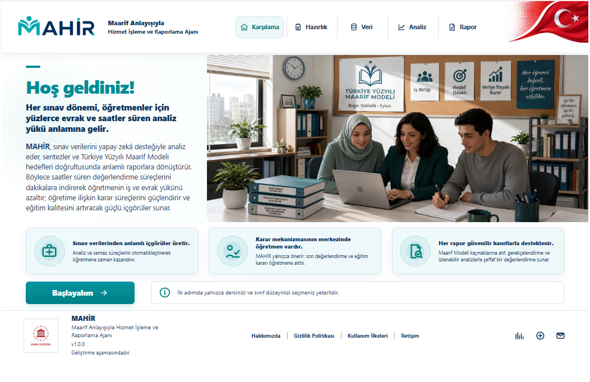

**Temel ilke: MAHİR okur, sınıflandırır, doğrular, hesaplar ve analiz eder; eğitim-öğretim programlarının ilgili maddelerine atıf içeren raporlar üretir. Nihai pedagojik değerlendirme, düzeltme ve onay öğretmene aittir.**

## İçindekiler

1. [Eğitim-Öğretim Sürecinde Karşılaşılan Sorun](#eğitim-öğretim-sürecinde-karşılaşılan-sorun)
2. [Öğretmen olmayan okuyucu için: Okuldaki resmî evrak zinciri](#öğretmen-olmayan-okuyucu-için-okuldaki-resmî-evrak-zinciri)
3. [Prototipe konu olan dersin öğretmeninin gözünden süreç](#şimdi-bu-sürece-prototipe-konu-olan-dersin-öğretmeninin-gözünden-bakalım)
4. [Öğretmen tecrübesiyle geliştirilen MAHİR](#ogretmen-tecrubesiyle-gelistirilen-mahir)
5. [Otomatik test güvencesi ve demo videoları](#otomatik-test-güvencesi)
6. [Türkiye Yüzyılı Maarif Modeli ile aynı dili konuşan analiz](#türkiye-yüzyılı-maarif-modeli-ile-aynı-dili-konuşan-analiz)
7. [Ulusal ölçek modeli ve genişleme vizyonu](#ulusal-ölçek-modeli-ve-genişleme-vizyonu)
8. [İhtiyacın resmî dayanağı ve öğretmen deneyimleriyle doğrulama](#ihtiyacin-resmi-dayanagi-ve-ogretmen-deneyimleriyle-dogrulama)
9. [Yarışma görevlerinin tamamlanma durumu](#yarışma-görevlerinin-tamamlanma-durumu)
10. [Uçtan uca MAHİR akışı](#uctan-uca-mahir-akisi)
11. [Çok ajanlı mimari](#çok-ajanlı-mimari)
12. [Projeyi inceleme rehberi](#projeyi-inceleme-rehberi)
13. [OCR ve RAG demo erişimi](#ocr-ve-rag-demo-erişimi)
14. [9. sınıf Türk Dili ve Edebiyatı pilotu](#9-sınıf-türk-dili-ve-edebiyatı-pilotu)
15. [Doğruluk ve halüsinasyon kontrolü](#doğruluk-ve-halüsinasyon-kontrolü)
16. [Veri güvenliği ve etik sınırlar](#veri-güvenliği-ve-etik-sınırlar)
17. [Çalışan özellikler ve prototip sınırları](#çalışan-özellikler-ve-prototip-sınırları)
18. [Testler](#testler)
19. [Proje yapısı](#proje-yapısı)
20. [Teknik belgeler ve kaynaklar](#teknik-belgeler-ve-kaynaklar)
21. [Sonraki geliştirme adımları](#sonraki-geliştirme-adımları)
22. [Ekip](#ekip)

## Eğitim-Öğretim Sürecinde Karşılaşılan Sorun

**Okullarda eğitim-öğretim süreci boyunca öğrenciye ilişkin çok sayıda veri elde edilir. Bu verilerin niceliği, öğrencinin öğrenme sürecini ve gelişimini değerlendirmek için yetersiz değildir. Asıl sorun, verilerin eğitim kurumlarında işlenen farklı resmî evrakta dağınık ve birbirinden kopuk hâlde bulunması ve bu verileri ilişkilendirerek anlamlı bir bütüne dönüştürecek kullanışlı bir mekanizmanın bulunmamasıdır.**

Öğretmenler bir eğitim-öğretim yılı boyunca sınav evrakı, gelişim ve gözlem envanterleri, öğrenci performans değerlendirme formları, rehberlik hizmetlerine ilişkin resmî evrak ile kurul ve zümre belgelerinde yer alan bilgileri tekrar tekrar okur, doğrular, sınıflandırır ve rapora dönüştürür. Evrak sayısı arttıkça doğru bilgiyi ilgili öğrenci, sınıf, öğrenme çıktısı ve resmî süreçle güvenilir biçimde ilişkilendirmek güçleşir. Bu verilerin elle işlenmesi saatler süren yoğun bir emek gerektirir ve aynı işlem döngüsü her eğitim-öğretim yılında yeniden başlar.

Bu parçalı iş akışı, öğretmenin pedagojik değerlendirmeye ayırabileceği zamanı mekanik evrak işlemlerine yönlendirir; hata ve tutarsızlık riskini artırır; eldeki kanıtların izlenebilir raporlara ve kurumsal kararlara dönüşmesini zorlaştırır. Aynı zamanda öğrencinin gelişiminin bütüncül, gerçekçi ve sürdürülebilir biçimde izlenmesini güçleştirir.
**MAHİR, resmî evrakta dağınık hâlde bulunan veri ile kanıta dayalı, izlenebilir ve güvenilir karar arasındaki boşluğu kapatmaya odaklanır.**

## Öğretmen olmayan okuyucu için: Okuldaki resmî evrak zinciri

Bir okulda sınav kâğıdı, öğrencinin cevaplarını yazdığı sıradan ve geçici bir kâğıt değildir. Öğretmen bu belgeyi öğretim programına, yıllık plana, sınav türüne, soru-puan dağılımına ve ölçme kurallarına göre hazırlar. Öğrenci cevaplarını yazar ve sınav sonunda kâğıdını değerlendirilmek üzere öğretmenine teslim eder. Sonuçların kaydedilmesi, öğrenme eksiklerinin belirlenmesi, sınavın yeniden incelenmesi, itirazların değerlendirilmesi ve okul yönetimine sunulacak raporların hazırlanması bu belgeye dayanır. Bu nedenle sınav kâğıdı, okulun resmî eğitim-öğretim faaliyeti kapsamında hazırlanan, öğrenci tarafından doldurularak değerlendirilmek üzere öğretmene teslim edilen bir resmî evrak, ölçme aracı ve öğrenme kanıtıdır. MAHİR'in iş akışında ise **gelen resmî evrak** niteliği taşır.

Bu tanım yalnızca kavramsal bir benzetmeye dayanmaz. Yazılı sınavlarda kullanılan bu evrak okul idaresine teslim edilir ve ilgili uygulama esaslarına göre arşivlenir. Ortak yazılı sınav evrakı için belirtilen saklama süresi iki yıldır. Öğrenci sınav evrakının yeniden incelenmesini isteyebilir; veli ise mevzuatta belirtilen süre ve yöntem doğrultusunda sınav sonucuna yazılı olarak itiraz edebilir. Dolayısıyla sınav kâğıdı, gerektiğinde yeniden incelenebilen ve idari işlemlere dayanak oluşturan izlenebilir bir kamu belgesidir.

Okuldaki resmî evrak akışı sınavlarla sınırlı değildir. Rehber öğretmenin öğrenciye uyguladığı risk analizi formu, meslek seçimi anketi, öğrencinin öz değerlendirme formu, gelişim ve gözlem kayıtları ile velilerin doldurduğu ihtiyaç belirleme, görüş ve değerlendirme formları gibi birçok evrak da okulun hizmet süreçlerinde üretilen veya kuruma geri dönen belgelerdir. Bu belgeler değerlendirme, yönlendirme, izleme veya raporlama işlemine dayanak olduğunda kurumsal kayıt düzeninin parçası hâline gelir. Belgenin niteliğine ve kullanım amacına göre kişisel verilerin korunması, doğrulama, saklama ve yetkili onayı gerekir.

MAHİR'in **kamu evrak ve yazışma süreçleri** bağlamındaki vizyonu şudur: Okuldaki farklı belge türlerini tanımak, içerdikleri verileri güvenilir biçimde yapılandırmak, ilgili öğrenme kanıtlarıyla ilişkilendirmek ve öğretmen onayından sonra raporlara ve resmî yazışma taslaklarına dönüştürmek. MAHİR, bu işleyişi hızlandırmayı ve daha güvenilir, izlenebilir ve düzenli hâle getirmeyi amaçlar. Çalışan prototipte bu geniş vizyonun uçtan uca bir örneği gösterilir: Sınav evrakı okunur, sınıflandırılır ve doğrulanır; içerdiği veriler öğrenme kanıtlarıyla ilişkilendirilerek analiz edilir; raporlara ve kurum içi resmî yazışma taslaklarına dönüştürülür.

**Mevzuat notu:** Saklama süresi ve itiraz usulü belgenin ve sınavın türüne göre değişebilir. Buradaki iki yıllık süre, ortak yazılı sınav evrakına ilişkin uygulama düzenlemeleri esas alınarak belirtilmiştir. Bkz. [MEB Ortaöğretim Kurumları Yönetmeliği, md. 49](https://ogm.meb.gov.tr/meb_iys_dosyalar/2019_07/16134512_yonetmelik.pdf) ve [Mersin İl Millî Eğitim Müdürlüğü Ortak Sınav Uygulama Yönergesi, md. 12](https://mersinodm.meb.gov.tr/meb_iys_dosyalar/2024_10/22104642_mersinilmilliegitimmudurluguortaksinavuygulamayonergesi2024.pdf).

## Şimdi bu sürece prototipe konu olan dersin öğretmeninin gözünden bakalım

### Ali Öğretmen'in sınav haftası

Türk Dili ve Edebiyatı öğretmeni olan Ali Öğretmen aynı yazılı sınavı birden fazla 9. sınıf şubesinde uygulayacaktır. Ancak sınav hazırlığına doğrudan soru yazmakla başlamaz. İlgili öğretim programının esaslarını, Millî Eğitim Bakanlığı tarafından yayımlanan konu-soru dağılım tablolarını ve örnek senaryoları inceler. İl sınıf/alan zümresince seçilen senaryoda belirtilen öğrenme çıktıları doğrultusunda sınavın soru sayısını, konu dağılımını ve soru-puan yapısını belirler. Bu çerçeveye uygun sınav kâğıdını ve puan çizelgesini hazırladıktan sonra sınav kâğıtlarını öğrencilerine dağıtır. Her öğrenci kendi kâğıdını cevaplandırır ve sınav bitiminde öğretmenine teslim eder. Böylece öğretmenin hazırladığı boş sınav belgesi, öğrenci cevapları ve puanlamaya esas verilerle tamamlanmış bir resmî evrak olarak öğretmenin iş akışına geri döner.

Sınavın hazırlanması ve uygulanması için harcanan emeğe, sınav sonrasında ayrıntılı evrak işleme ve değerlendirme görevleri eklenir. Her kâğıdın doğru öğrenci ve şubeyle eşleştirilmesi, soru puanlarının kaydedilmesi, eksik veya hatalı alanların belirlenmesi, sınav sonuçlarının hesaplanması ve soruların öğrenme çıktılarıyla ilişkilendirilmesi gerekir. Ayrıca her şube için sınav sonuçlarını soru bazında ele alan bir analiz raporu hazırlanmalı ve okul yönetimine sunulmalıdır. Ali Öğretmen, bu işlem zincirini her şube için aynı dikkatle yürütür. Türk Dili ve Edebiyatı dersindeki ölçme süreci yazılı, dinleme/izleme ve konuşma olmak üzere üç bileşenden oluşur ve bu bileşenlerin genel değerlendirmedeki ağırlıkları farklıdır. Dolayısıyla Ali Öğretmen, hesaplamalarında bu oranları da gözetmek zorundadır. Bütün bu işlemler, öğretmenin önemli ölçüde zaman ve emek harcamasına yol açar.

### MAHİR'in bu süreçteki rolü

**Yetki sınırı: Pedagojik karar, düzeltme ve nihai onay öğretmene aittir. MAHİR öğretmenin yerine karar vermez; öğretmen denetimindeki resmî evrak işleme sürecini destekler.**

- **Girdi:** Öğrenciden dönen sınav kâğıdı veya öğretmenin hazırladığı puan çizelgesi, MAHİR'in işleyeceği **gelen resmî evrakı** oluşturur.
- **İşlem:** MAHİR evrakı okur, sınıflandırır, ilgili alanları çıkarır ve eksik ya da belirsiz bilgileri öğretmene gösterir.
- **Öğretmen kontrolü:** Hesaplamalar ve kaynaklara dayalı analiz taslağı yalnızca öğretmenin verileri doğrulamasından sonra hazırlanır.
- **Çıktı:** Öğretmenin onayladığı analiz raporu, üst yazı ve ek listesiyle birlikte okul yönetimine sunulacak **giden evrak paketine** dönüşür.

```mermaid
flowchart LR
    A["Öğretmen sınav evrakını hazırlar"] --> B["Boş sınav kâğıdı öğrenciye sunulur"]
    B --> C["Öğrenci cevaplandırır ve öğretmene teslim eder"]
    C --> D["Gelen resmî evrak: doldurulmuş sınav / puan çizelgesi"]
    D --> E["MAHİR: okuma, sınıflandırma, eksik bilgi ve içerik analizi"]
    E --> F["Öğretmen doğrulaması ve onayı"]
    F --> G["Sınav analiz raporu"]
    G --> H["Giden evrak: üst yazı ve rapor ekleri"]
    H --> I["Okul/kurum müdürlüğü"]
```

### Yarışma senaryosuyla birebir eşleme

| Kamu evrak sürecindeki aşama | Okulda bu aşamada yapılan işlem | MAHİR'in görevi |
|---|---|---|
| Kuruma/çalışana ulaşan belge | Öğrencinin cevaplandırıp öğretmene teslim ettiği sınav kâğıdı, soru bazlı puan çizelgesi veya sınav veri giriş belgesi | Belgeyi kabul eder; dosya türünü, sınıf/şubeyi, soru ve puan alanlarını yapılandırır. |
| İlk inceleme ve sınıflandırma | Öğrenci sınav evrakına adını, soyadını ve okul numarasını yazar; öğretmen evrakın sınıf/şube ve sınav bileşeni bilgilerini kontrol eder. | OCR, açıkça etiketlenmiş alanları tanımlanan kurallara göre okur. Ad ve soyad bilgisini işlemez ve analiz akışına almaz; evrakta yazılı okul numarasını **öğrenci referans numarası** olarak aktarır. Sınıf/şube, sınav bileşeni ve diğer alanlardaki belirsizlikleri öğretmene gösterir. |
| İçerik analizi ve eksik bilgi tespiti | Soru sayısı, azami puan, öğrenci puanı, toplam, öğrenme çıktısı ve bağlam kontrolleri | Kurallı doğrulamaları çalıştırır; öğretmenin düzeltmesi gereken alanları bildirir. |
| Dayanak ve standartlarla ilişkilendirme | Sınav sorularının 9. sınıf Türk Dili ve Edebiyatı öğretim programındaki öğrenme çıktıları ve süreç bileşenleriyle ilişkilendirilmesi | Öğretmen seçimini kayıtlı program kataloğuyla doğrular; RAG yalnız doğrulanmış resmî kaynak bağlamını getirir. |
| Resmî yazı taslaklama | Onaylanmış sınav analizinin okul yönetimine sunulması | Word/PDF analiz raporu, üst yazı ve ek listesi taslağı üretir. |
| Birime yönlendirme | Onaylanmış rapor ve eklerinin bilgi ve gereği için okul/kurum müdürlüğüne sunulması | Demo yönlendirme ve EBYS aktarım paketi hazırlar; gerçek kayıt, paraf veya elektronik imza üretmez. |

**Önemli idari sınır:** Bu README'deki “gelen resmî evrak” ifadesi, öğrenciden öğretmene dönen belgenin MAHİR'in iş akışına girdi olmasını anlatır; her sınav kâğıdının EBYS'de “gelen yazı” olarak kaydedildiği anlamına gelmez. Mevcut prototip gerçek EBYS'ye kayıt veya gönderim yapmaz. Öğrenci veya veli tarafından yapılan itiraz ve resmî talepler, mevcut uygulamada ıslak imzalı dilekçeyle okul yönetimine sunulur. MAHİR'in hazırladığı analiz raporu, üst yazı ve ek listesi ise önce öğretmenin kontrolüne ve onayına açılır; ardından kurumun yürürlükteki resmî usullerine göre işleme alınır. Prototip, EBYS aktarımını demo ortamında gösterir ve çıktıları yetkili bir EBYS bağlantısına uyarlanabilecek biçimde yapılandırır. Kurum tarafından gerekli bağlantı, yetki ve onaylar sağlandığında doğrulanmış evrak verileri EBYS'ye otomatik aktarılabilir ve işlem süresi kısaltılabilir. Hukuki kayıt, yönlendirme ve elektronik imza yetkisi ilgili kuruma aittir.

### Temel kavramlar

| Kavram | Bu projede ne anlama gelir? |
|---|---|
| Sınav evrakı | Öğretmenin hazırladığı, öğrencinin cevaplandırdığı ve değerlendirilmek üzere öğretmenine teslim ettiği sınav kâğıdıdır. Bir sınıftaki her öğrenci için ayrı bir sınav evrakı oluşur. |
| Gelen resmî evrak | Doldurulmuş sınav kâğıdı, soru bazlı puan çizelgesi veya sınav veri giriş belgesi gibi öğretmenin inceleme ve değerlendirme iş akışına ulaşan belgedir. Bu ifade, MAHİR senaryosundaki işlevsel “gelen evrak” karşılığıdır. |
| Sınıf-sınav analizi | Bir şubenin tek sınavındaki öğrenci evrakının topluca değerlendirilmesidir. Örneğin 35 öğrenciye ait sınav evrakı çoğunlukla tek bir sınıf-sınav analiz işlemine karşılık gelir. |
| Öğrenme çıktısı | Öğrencinin öğretim süreci sonunda edinmesi beklenen bilgi, beceri veya yeterliktir. |
| Öğrenme kanıtı | Bir öğrenme çıktısına ne ölçüde ulaşıldığını gösteren sınav, performans, gözlem veya portfolyo verisidir. |
| Giden evrak paketi | Öğretmen tarafından onaylanan analiz raporu ile bu rapora ait üst yazı ve ek listesinin, okul/kurum müdürlüğüne sunulacak biçimde bir araya getirildiği evrak bütünüdür. |
| Üst yazı | Analiz raporunun okul yönetimine veya başka bir resmî makama sunulmasında kullanılan resmî yazı taslağıdır. |
| EBYS | MEBBİS ortak ekranındaki EBYS simgesi üzerinden erişilen ve Millî Eğitim Bakanlığında resmî evrakın oluşturulması, paraflanması, elektronik imzalanması, gönderilmesi ve arşivlenmesi için kullanılan Elektronik Belge Yönetim Sistemidir. e-Okul ve EBA gibi Bakanlığın dijital uygulamalarından biridir. [MEBBİS ortak giriş ekranı](https://mebbisyd.meb.gov.tr/) |

<a id="ogretmen-tecrubesiyle-gelistirilen-mahir"></a>
## Öğretmen tecrübesiyle geliştirilen MAHİR

MAHİR, öğretmenlerin mesleki deneyimi temel alınarak geliştirilmektedir. Ekipte yer alan dört öğretmen, prototipi farklı sınav evrakı türleri, veri giriş yolları ve analiz senaryolarıyla ayrıntılı biçimde deneyerek geliştirme sürecine doğrudan katkı sunmuştur. Ayrıca beş Türk Dili ve Edebiyatı öğretmenine demo videosu izletilmiş; beş sınıfa ait anonim not çizelgeleri ile bu verilerden elde edilen örnek raporlar gösterilmiştir. Alınan olumlu geri bildirimlerle birlikte MAHİR, toplam dokuz öğretmenin deneyim ve değerlendirmeleri doğrultusunda şekillenmiştir.

MAHİR'i öğretmenlerin sınıf içi deneyimleri, ihtiyaçları ve geri bildirimleri doğrultusunda geliştirmeyi sürdürmek, gelecek aşamaların da temel hedefidir.

## Otomatik test güvencesi

GitHub Actions, `main` dalına gönderilen her değişiklikte ve her çekme isteğinde Python ve JavaScript testlerini yeniden çalıştırır. README'nin üst bölümündeki rozet, son çalıştırmanın güncel durumunu gösterir; rozete tıklayan okuyucu çalıştırma tarihini, test günlüklerini ve test sayılarını doğrudan GitHub üzerinden inceleyebilir.

Python testleri, JavaScript test dosyaları ve ana tarayıcı betiğinin sözdizimi kontrolü GitHub Actions üzerinde birlikte çalıştırılır. Test paketi geliştikçe test sayısı değiştiği için güncel sayı ve sonuçlar README'nin üstündeki canlı rozet üzerinden açılan [GitHub Actions kayıtlarında](https://github.com/peykan1071/MAHIR-PROTOTIP-HTML/actions/workflows/tests.yml) izlenir. Bu kayıtlar kodla tanımlanan davranışların doğrulanma durumunu gösterir; gerçek kullanıcı etkisi veya her belge türünde kusursuzluk iddiası değildir. OCR ve RAG servis anahtarları test hattına eklenmez; uzak servis senaryoları güvenli taklitlerle sınanır.

### Anonim gerçek evrak kabul testleri

MAHİR yalnız sentetik örneklerle değil, uygulama sırasında kullanılan evrakların kişisel verilerden arındırılmış kopyalarıyla da sınanmaktadır. GitHub'da yer alan anonim kabul veri kümesi aşağıdaki senaryoları içerir:

- Aynı okuldaki iki farklı 9. sınıf şubesine ait, 20 ve 25 olmak üzere toplam 45 öğrencinin not çizelgesi görselinin OCR ile okunması, sınıf/şubelerine göre ayrılması ve doğrulanması.
- Aynı tür sınavın beş farklı sınıfa ait Word puan çizelgelerinin soru sayısı, azami puan yapısı ve öğrenci kayıtları korunarak okunması.
- Aynı 25 öğrencilik sınıfa ait sınavın OCR görselleri ve Word puan çizelgesi üzerinden işlenerek sonuçlarının karşılaştırılması.
- Aynı 20 öğrencilik sınıfa ait yazılı, dinleme/izleme ve konuşma sınavlarının ayrı ayrı analiz edilmesi; üç raporun **Yazılı %70 + Dinleme/İzleme %15 + Konuşma %15** ağırlıklarıyla genel değerlendirme raporunda birleştirilmesi.

Anonim test evrakları, dosya bütünlük kayıtları ve tekrarlanabilir kabul testleri [`tests/fixtures/real_exam_corpus_anonymized`](tests/fixtures/real_exam_corpus_anonymized) klasöründe; senaryoların açıklaması ise [`tests/REAL_EXAM_CORPUS.md`](tests/REAL_EXAM_CORPUS.md) belgesinde yer alır. Özgün kimlik bilgileri ve kişisel veri içeren kaynak arşiv GitHub'a eklenmez.

### Demo videolarıyla gösterilen uçtan uca evrak akışları

MAHİR'in iki ayrı demo videosu vardır:

1. **45 evrakla iki şubeli OCR ve raporlama demosu — 10 dakika:** Aynı okuldaki iki farklı 9. sınıf şubesine ait, 20 ve 25 olmak üzere toplam 45 öğrencinin sınav not çizelgesi görselleri OCR ile okunur. Sınavlar sınıf/şubelerine göre ayrılır ve öğretmen kontrolüne sunulur. Soru bazlı azami puanlar ile öğrenme çıktıları doğrulandıktan sonra iki şube ayrı ayrı analiz edilir ve bulgular kaynak temelli iki rapora dönüştürülür. Son aşamada iki rapor, tek üst yazı ve ek listesi altında birleştirilerek EBYS demo akışıyla okul idaresine sunulmaya hazır hâle getirilir.
   - [5× hızlandırılmış demoyu izle veya indir — 2 dakika 4 saniye](https://github.com/peykan1071/MAHIR-PROTOTIP-HTML/releases/download/demo-videolari-v1/MAHIR_Demo_45_Ogrenci_2_Sube_5x.mp4)
2. **Beş sınıflı yazılı sınav analizi ve EBYS demo paketi — 4 dakika:** Aynı türde yazılı sınav uygulanan beş farklı 9. sınıf şubesine ait puan çizelgeleri birlikte işlenir. Sınıflar ayrı sınav kayıtları olarak korunur; soru sayıları, azami puanlar ve öğrenci puanları öğretmen kontrolüne sunulur. Her sınıf için ayrı analiz raporu oluşturulur. Onaylanan beş sınıf raporu tek bir üst yazının ekleri olarak sıralanır ve EBYS demo akışıyla okul idaresine gönderime hazır bir evrak paketine dönüştürülür.
   - [Jüri sunumu için hızlandırılmış demoyu izle veya indir — 2 dakika](https://github.com/peykan1071/MAHIR-PROTOTIP-HTML/releases/download/demo-videolari-v1/MAHIR_Demo_5_Sinif_Juri_2_Dakika.mp4)

**Üst yazı ve eklerin hazırlanması:** Beş sınıf için oluşturulan beş ayrı analiz raporu, sınıf/şube bilgilerine göre sıralanarak tek bir üst yazıya eklenir. Böylece okul idaresine sunulacak üst yazı, ek listesi ve analiz raporları tek bir resmî evrak paketi içinde hazırlanır.

Özgün kayıtların toplam süresi **14 dakikadır**. README'de sunulan hızlandırılmış sürümlerin toplam izleme süresi ise yaklaşık **4 dakikadır**. Prototip gerçek EBYS'ye gönderim yapmaz; evrak numarası, paraf veya elektronik imza üretmez.

Sistem, yarışma senaryosunu eğitim kurumlarına uyarlamaktadır. MAHİR'e girdi olarak sunulan resmî evrak, doldurulmuş sınav kâğıdı, sınav puan çizelgesi veya sınav veri giriş formu olabilir. Çıktı olarak ise öğretmen onaylı analiz raporu, üst yazı ve ek listesi hazırlanır. Prototip, genel amaçlı bütün kamu evrakını değil, eğitim kurumları için tanımlanan bu resmî evrak akışını uçtan uca ele alır.

### Güncel prototip özeti

- Aynı ders, sınıf düzeyi, sınav bileşeni, soru sayısı ve azami puan yapısındaki birden fazla şube tek çalışma içinde işlenebilir.
- Öğretmen ortak sınavın öğrenme çıktılarını bir kez seçer; seçim yalnız aynı eğitim-öğretim kademesine sahip şubelere uygulanır. Yazılı, dinleme/izleme ve konuşma sınavları birbirine karıştırılmaz.
- Her şube için ayrı Word/PDF raporu hazırlanabilir. 9. sınıf Türk Dili ve Edebiyatı pilot profilinde onaylı yazılı, dinleme/izleme ve konuşma raporları **%70 + %15 + %15** sabit ağırlıklarıyla genel değerlendirme raporunda birleştirilebilir.
- İl, ilçe, okul/kurum, öğretmen ve eğitim-öğretim yılı bir kez girildiğinde aynı çalışma içindeki diğer raporlara aktarılır; sınıf/şube ve sınava özgü alanlar ayrı tutulur.
- Onaylanmış birden fazla rapor, tek üst yazı ve ek listesi bulunan EBYS demo paketine dönüştürülebilir. Gerçek EBYS gönderimi ve elektronik imza kapsam dışındadır.

### MAHİR olmadan ve MAHİR ile iş akışı karşılaştırması

Aşağıdaki tablo, aynı sınav analizi ve raporlama görevinin farklı araçlar ve süreçler bakımından nasıl yürütüldüğünü karşılaştırır. **Bu karşılaştırma, ölçülmüş bir kullanıcı etkisi araştırması değildir.** “MAHİR olmadan” sütunu, işlemlerin öğretmen tarafından belge, hesap tablosu ve metin düzenleyici gibi ayrı araçlarla yürütüldüğü referans iş akışını ifade eder.

| Boyut | MAHİR olmadan referans iş akışı | MAHİR ile mevcut prototip | Kanıt ve sınır |
|---|---|---|---|
| Veri hazırlama | Sınav verileri kullanılan araca uygun biçimde öğretmen tarafından düzenlenir ve farklı belgelere aktarılabilir. | DOCX, PDF, XLSX, CSV, görsel veya elle giriş yolları ortak doğrulama ekranında birleştirilir. | Her iki yöntemde de kaynak verinin doğruluğu öğretmenin sorumluluğundadır; düşük kaliteli OCR sonucu ayrıca kontrol edilmelidir. |
| Veri kontrolü | Eksik, hatalı veya tutarsız değerler öğretmenin kendi kontrol yöntemiyle bulunur. | Zorunlu alan, puan sınırı, toplam puan, soru sayısı ve bağlam kontrolleri analizden önce çalışır. | Otomatik kontrol, doğru girilmiş fakat pedagojik olarak yanlış olan bir veriyi her durumda tespit edemez. |
| Sayısal hesaplama | Ortalama, başarı oranı ve dağılımlar, kullanılan tablolar veya formüller aracılığıyla ayrı ayrı hesaplanır. | Sayısal sonuçlar, öğretmen onaylı puanlardan kurallı uygulama koduyla hesaplanır. | Hesaplar LLM'e yaptırılmaz; yanlış kaynak veri yanlış sonuca yol açabilir. |
| Öğrenme çıktısı ilişkisi | Soru ile öğrenme çıktısı arasındaki ilişki ayrı belge veya tablolarda kurulabilir. | Öğretmenin seçtiği ilişki, kayıtlı 9. sınıf Türk Dili ve Edebiyatı program kataloğuyla doğrulanır ve analiz boyunca korunur. | Sistem öğrenme çıktısını kendiliğinden ve kesin biçimde belirlemez; seçme ve doğrulama öğretmene aittir. |
| İzlenebilirlik | Sayısal bulgu, kaynak soru ve rapor metni arasındaki bağlantı farklı belgelere dağılmış hâlde kalabilir. | Soru, puan, öğrenme çıktısı, analiz bulgusu ve rapor arasında ortak veri ve işlem izi tutulur. | İzlenebilirlik prototip oturumu kapsamındadır; kurumsal ve kalıcı denetim altyapısı henüz tamamlanmamıştır. |
| Rapor hazırlama | Hesaplanan sonuçlar öğretmen tarafından rapor şablonuna aktarılır ve metin düzenlenir. | Doğrulanmış bulgular, düzenlenebilir Word ve PDF analiz raporuna dönüştürülür. | Üretilen rapor taslaktır; öğretmen incelemesi ve onayı olmadan nihai kabul edilmez. |
| Üst yazı | Rapor bilgileri ayrı bir resmî yazı şablonuna aktarılır. | Onaylı rapordan üst yazı ve ek listesi taslağı hazırlanır. | Gerçek EBYS aktarımı, evrak numarası, paraf ve elektronik imza üretilmez. |
| İşlem bütünlüğü | Veri, hesap, yorum, rapor ve yazışma birden fazla araç ve dosyada yürütülebilir. | Adımlar tek öğretmen akışı ve ortak veri sözleşmesi içinde birbirine bağlanır. | Prototip, genel amaçlı tüm kamu evraklarını veya bütün dersleri kapsamaz. |
| Uygulama doğrulaması | Referans iş akışındaki adımlar belge, hesap tablosu ve metin düzenleyici gibi ayrı araçlar üzerinden yürütülür. | Görsel, DOCX, PDF, XLSX, CSV ve elle veri girişi; toplu OCR; çoklu şube; yazılı, dinleme/izleme ve konuşma sınavları; ortak öğrenme çıktıları; ayrı ve birleşik raporların yanı sıra üst yazı üretimi farklı senaryolar hâlinde ayrı ayrı denenmiştir. | MAHİR ekibindeki dört öğretmen senaryoları doğrudan uygulayarak çıktıları kontrol etmiş; beş Türk Dili ve Edebiyatı öğretmeni demo ve örnek raporlar üzerinden gözlemci değerlendirmesinde bulunmuştur. İlgili yazılım davranışları ayrıca her kod gönderiminde ve çekme isteğinde GitHub Actions üzerinde tekrarlanabilir testlerle doğrulanmaktadır. |
| Çıktı kalitesi | Kalite, öğretmenin kullandığı şablona, formüllere, kontrol adımlarına ve ayırdığı zamana bağlıdır. | Standart veri kontrolleri, program kataloğu, kaynak sınırları ve ortak rapor yapısı daha tutarlı çıktı üretmeyi hedefler. | Gerçek kullanım çıktıları uzmanlarca puanlanmadığı için kalite artışı henüz kanıtlanmış değildir. |
| Hata riski | Tekrar eden veri aktarımı ve elle kurulan formüller hata olasılığı oluşturabilir. | Tekrarlı hesap ve aktarım adımları azaltılır; tanımlı doğrulama kontrolleri uygulanır. | Hata oranında azalma henüz karşılaştırmalı kullanıcı çalışmasıyla ölçülmemiştir. |
| İnsan kontrolü | Analiz, yorum ve resmî belge sorumluluğu öğretmendedir. | Analiz, yorum ve resmî belge sorumluluğu yine öğretmendedir; MAHİR karar destek ve taslak üretim aracı olarak kalır. | MAHİR öğretmenin pedagojik veya idari kararının yerine geçmez. |

Bu karşılaştırma, MAHİR'in **hangi adımları birleştirdiğini ve hangi kontrolleri sağladığını** gösterir. Ekipteki dört öğretmenin doğrudan uygulama deneyimi ile beş Türk Dili ve Edebiyatı öğretmeninin gözlemci değerlendirmesi, mesleki deneyimin geliştirme sürecine aktarılmasını sağlamıştır. GitHub Actions kayıtları ise yazılımın tekrarlanabilir biçimde doğrulandığını gösterir. Bu çalışmalar, prototipin tanımlı iş akışlarını gerçekleştirdiğini ortaya koymaktadır; süre tasarrufu, hata oranı ve çıktı kalitesine ilişkin karşılaştırmalı ölçümler ise gelecekteki pilot çalışmaların konusudur.

## Türkiye Yüzyılı Maarif Modeli ile aynı dili konuşan analiz

Türkiye Yüzyılı Maarif Modeli yalnızca ders içeriklerini yenileyen bir program değişikliği değildir. Model, eğitimin amaçlarını, öğrenme sürecini ve ölçme-değerlendirmeyi açıklamak için kendine özgü bir kavram sistemi kullanır. Önceki uygulamalarda yaygın olan kazanım ve konu merkezli anlatımın yanında **öğrenme çıktıları, süreç bileşenleri, alan becerileri, kavramsal beceriler, eğilimler, programlar arası bileşenler ve öğrenme kanıtları** gibi kavramlar öne çıkar.

Bu değişim, yalnızca eski terimlerin yenileriyle değiştirilmesi anlamına gelmez. Değerlendirme anlayışı, öğrencinin yalnızca kaç puan aldığını belirlemekten, hangi öğrenme çıktısına ne ölçüde ulaştığını kanıtlar üzerinden incelemeye ve sonraki öğrenme sürecini bu bulgular doğrultusunda planlamaya doğru genişler. Bu nedenle MAHİR, eski bir sınav analiz tablosuna yeni program adları eklenerek kurulmamıştır; veri, hesaplama, kanıt ve rapor zincirini Maarif Modeli'nin kavramsal yapısı içinde oluşturur.

| Geleneksel sınav analizi | MAHİR'in Maarif Modeli uyumlu yaklaşımı |
|---|---|
| Sınıf ortalaması ve genel başarı oranı | Soru, öğrenme çıktısı ve öğrenme kanıtı düzeyinde inceleme |
| Konu veya kazanım başlığına dayalı genel sonuç | Öğretmenin seçtiği öğrenme çıktısını resmî program kataloğuyla doğrulama |
| Sayısal sonuçların listelenmesi | Sayısal bulgunun program bağlamı ve kanıt dayanağıyla açıklanması |
| Sonucun kaynağının sınırlı görünürlüğü | Sorudan öğrenme çıktısına uzanan izlenebilir kanıt zinciri |
| Genel veya kaynaksız öneri | Doğrulanmış program kaynaklarıyla sınırlandırılmış açıklama |
| Otomatik sistem hükmü izlenimi | Öğretmen doğrulaması, öğretmen onayı ve öğretmen kararı |

**Ayırt edici tasarım özelliği:** MAHİR yalnızca puanları hesaplamaz; öğretmenin onayladığı sınav verisini Türkiye Yüzyılı Maarif Modeli'nin öğrenme çıktıları ve öğrenme kanıtları yaklaşımı içinde anlamlandırır.

**Bilimsel sınır:** Mevcut prototip, öğrencinin açık uçlu cevabını kendiliğinden puanlamaz ve soru metninden kesin bir öğrenme çıktısı belirlediğini iddia etmez. Soru puanları ile öğrenme çıktıları arasındaki ilişkiler öğretmen tarafından girilir veya doğrulanır; MAHİR, onaylı veriler üzerinden hesaplama, kanıtlandırma, öğretim programıyla ilişkilendirme ve raporlama yapar.

### Prototipte doğrulanan kapsam, varsayımsal ölçek ve genişleme hedefleri

Bu tabloda çalışan prototipte doğrulanan özellikler, açık varsayımlarla hesaplanan potansiyel işlem hacmi ve henüz geliştirilmemiş genişleme hedefleri birbirinden ayrılmıştır.

| Düzey | Ele alınan kapsam | Ölçek veya mevcut durum | Kanıt ya da sınırlama |
|---|---|---|---|
| Öğretmen uygulamalarıyla doğrulanan akışlar | Görsel, DOCX, PDF, XLSX, CSV ve elle veri girişi; toplu OCR; çoklu şube; yazılı, dinleme/izleme ve konuşma bileşenleri; ortak öğrenme çıktıları; ayrı ve birleşik raporların ve üst yazının üretimi | Birden fazla uçtan uca sentetik veri senaryosu ve kişisel verilerden arındırılmış gerçek evraka dayalı kabul senaryoları | MAHİR ekibindeki dört öğretmenin doğrudan uygulama ve çıktı kontrolleri; beş Türk Dili ve Edebiyatı öğretmeninin demo ve örnek rapor değerlendirmeleri |
| Otomatik testlerle doğrulanan yazılım davranışları | Veri okuma, sınav gruplama, puan ve bağlam kontrolleri, ajan akışı, raporlama ve güvenlik sınırları | Python ve JavaScript test paketi ile ana tarayıcı betiğinin sözdizimi kontrolü | Her kod gönderiminde ve çekme isteğinde GitHub Actions çalışır; güncel test sayısı ile sonuçları test günlüklerinde görülebilir |
| Çalışan prototip kapsamı | 9. sınıf Türk Dili ve Edebiyatı yazılı, dinleme/izleme ve konuşma sınavlarının ayrı ve birleşik analizi | Kullanılabilir prototip akışı | Sentetik ve anonim veri setleriyle uygulama ve kod doğrulaması yapılmıştır |
| Varsayımsal yıllık işlem hacmi | Aynı ders ve sınıf düzeyi için hesaplanan potansiyel yıllık sınav evrakı ve rapor sayısı | 3.937.560 sınav evrakı; 156.964 sınıf-sınav analiz raporu | MEB 2024–2025 verisine ve yılda dört yazılı sınav varsayımına dayalı teorik hesaplamadır; gerçekleşmiş resmî işlem sayısı değildir |
| Genişleme hedefleri | Farklı dersler, kademeler, gelişim, risk ve idari raporlama süreçleri | Henüz kesin bir ölçek belirlenmemiştir | Tamamlanmış özellikleri değil, gelecekte geliştirilecek kapsamı ifade eder |

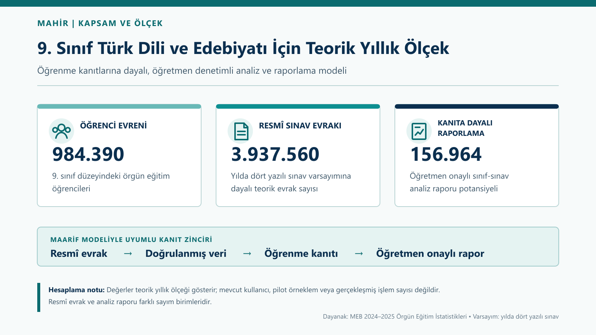

Bu doğrulama yaklaşımı, tek bir cihazda yapılan gözleme veya tek bir sınıf senaryosuna dayanmamaktadır. Ekipteki dört öğretmenin uygulama denemeleri ile beş Türk Dili ve Edebiyatı öğretmeninin gözlemci değerlendirmeleri, prototipin öğretmen deneyimi doğrultusunda geliştirilmesini sağlamıştır. [GitHub Actions test kayıtları](https://github.com/peykan1071/MAHIR-PROTOTIP-HTML/actions/workflows/tests.yml) ise yazılım davranışlarının tekrarlanabilir biçimde doğrulandığını gösterir.

### Doğrulanan gösterim senaryoları ve resmî dayanakları

README'de görsellerle sunulan doğrulama akışları, **9. sınıf Türk Dili ve Edebiyatı dersi 2025-2026 eğitim-öğretim yılı ikinci dönem ikinci yazılı sınavı** bağlamında hazırlanmış yazılı sınav evrakı ile aynı sınıf düzeyindeki dinleme/izleme ve konuşma bileşenlerini kapsar. Yazılı sınavın soru yapısı, puan dağılımı ve öğrenme çıktılarıyla ilişkisi, Millî Eğitim Bakanlığı tarafından yayımlanan ilgili konu-soru dağılım tablosu, sınav senaryosu ve resmî öğretim programı doğrultusunda MAHİR'in veri yapısına uyarlanmıştır. Dinleme/izleme ve konuşma örnekleri ise resmî 9. sınıf Türk Dili ve Edebiyatı program kataloğundaki ilgili alan becerileri ve süreç bileşenleri kullanılarak sentetik biçimde oluşturulmuştur.

Görsel evrak okuma, farklı dosya türlerinden veri alma, sınavları sınıf/şube ve bileşenlerine göre ayırma, ortak öğrenme çıktılarını ilgili şubelere aktarma, ayrı ve birleşik raporlar hazırlama ve üst yazı taslağı oluşturma akışları ekip tarafından ayrı ayrı uygulanmış ve çıktıları kontrol edilmiştir. Bu uygulamaları destekleyen kod davranışları ayrıca GitHub Actions üzerinde otomatik testlerle doğrulanmaktadır. Soru-öğrenme çıktısı ilişkileri öğretmen tarafından seçilir veya doğrulanır; sistem bu ilişkileri kendiliğinden kesin bir pedagojik eşleştirme olarak üretmez.

**Sentetik veri ile resmî dayanağın ayrımı:** Doğrulama senaryolarında kullanılan anonim öğrenci kodları ve soru puanları gerçek sınıflardan alınmamıştır. Farklı sınıf, şube ve sınav bileşenlerini temsil eden sentetik veri setleri, belge okuma, öğretmen doğrulaması, öğrenme kanıtı hesaplama, öğretim programıyla ilişkilendirme, raporlama ve üst yazı oluşturma akışlarını sınamak amacıyla üretilmiştir.

**Temsil ve etki sınırı:** Bu senaryolar, MAHİR'in resmî sınav bağlamına nasıl uyarlanabildiğini ve tanımlı iş akışlarını nasıl yürüttüğünü gösterir; gerçek bir sınıfın başarısını, Türkiye genelindeki öğrencileri, ölçülmüş zaman tasarrufunu veya sistemin eğitimsel etkisini temsil etmez.

## Ulusal ölçek modeli ve genişleme vizyonu

2025/26 dönemine ilişkin aynı kapsam ve ayrıntı düzeyinde tamamlanmış resmî veriler bulunmadığından, MEB'in 2024/25 örgün eğitim istatistikleri en yakın tam referans dönem olarak kullanılmıştır. Bu sayılar **2025/26 gerçekleşmelerini göstermez**.

| Gösterge | Resmî sayı | MAHİR açısından doğru yorum |
|---|---:|---|
| Örgün eğitim öğretmeni | 1.187.409 | Mevcut kullanıcı sayısı değil; uzun vadede ulaşılması öngörülen kullanıcı kitlesi |
| Resmî okul öğretmeni | 1.009.671 (%85,0) | Uzun vadeli kullanıcı kitlesinin resmî kurumlardaki bölümü |
| Özel okul öğretmeni | 177.738 (%15,0) | Uzun vadeli kullanıcı kitlesinin özel kurumlardaki bölümü |
| İlkokul öğrencisi | 5.704.483 | Sınav evrakı hesabına değil, gelişim izleme vizyonuna dâhil olan öğrenci grubu |
| Ortaokul öğrencisi | 5.085.890 | Sınav evrakı hesabında okul türüne göre ayrı ele alınması gereken öğrenci grubu |
| Ortaöğretim öğrencisi | 4.374.035 | Sınav evrakı hesabında okul türüne göre ayrı ele alınması gereken öğrenci grubu |

<p align="center">
  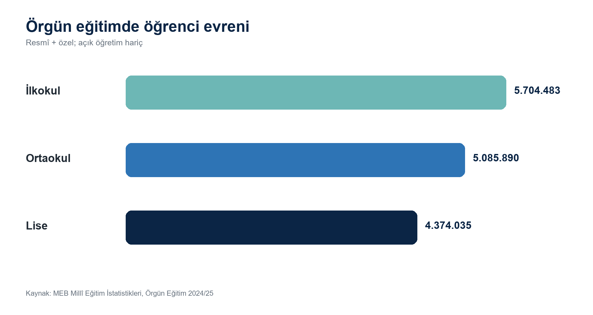
</p>

<p align="center">
  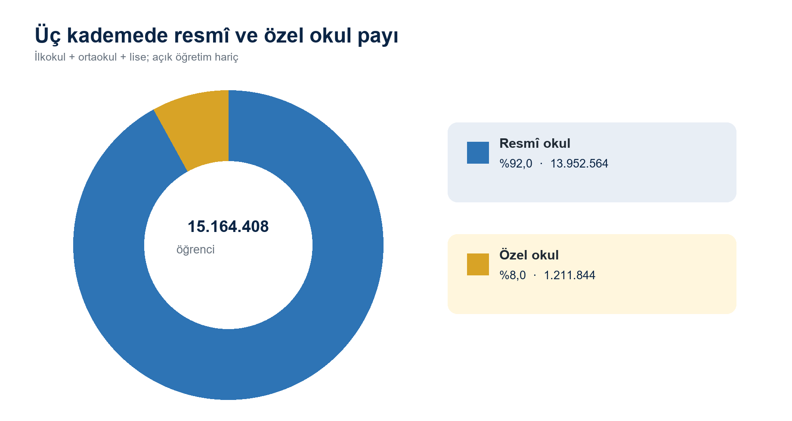
</p>

### Varsayımsal sınav evrakı ölçeği

Aşağıdaki grafik, gerçekleşmiş resmî evrak sayısını değil, sınav evrakı hacmini görünür kılmak amacıyla hazırlanmış ilk teorik hesaplamayı gösterir. Hesaplamada ortaokul öğrencisi başına yılda 24, ortaöğretim öğrencisi başına yılda 48 sınav evrakı varsayılmış ve toplam **332.015.040 potansiyel sınav evrakı** elde edilmiştir. Bu katsayılar resmî bir standart veya ölçülmüş ulusal ortalama değildir.

<p align="center">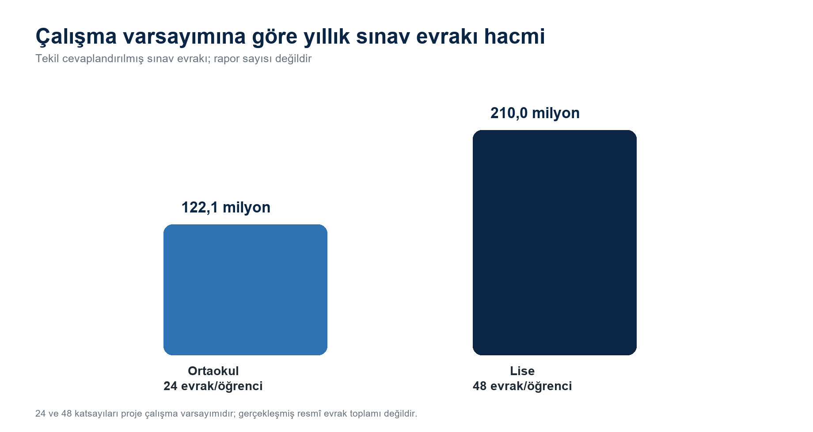</p>

Ulusal ölçekte daha ayrıntılı bir hesaplama yapılabilmesi için okul türü, sınıf düzeyi, sınava tabi ortak, seçmeli, alan ve meslek dersleri ile sınav sıklığı ayrı değişkenler olarak ele alınmalıdır. İmam hatip ortaokulları, Anadolu imam hatip liseleri, mesleki ve teknik liseler ve diğer okul türleri aynı katsayıyla temsil edilmemelidir. İlkokul ve okul öncesi öğrencileri yazılı sınav evrakı hesabına dâhil edilmemiştir; bu kademeler MAHİR'in gelişim izleme vizyonunda farklı resmî evrak türleriyle ayrıca ele alınacaktır.

### Sınav dışındaki resmî evraklar için genişleme vizyonu

MAHİR'in çalışan prototipi, sınav evrakının analizi ve raporlanması üzerine kuruludur. Aşağıdaki alanlar mevcut prototipte etkin değildir; MAHİR'in gelecekte farklı resmî evrak türlerine uyarlanabileceği alanları gösterir. Her alan için ilgili uzmanların doğrulaması, amaca özgü veri sözleşmeleri, rol ve erişim yetkileri ile kişisel verilerin korunmasına yönelik ek denetimler geliştirilmelidir.

| Uyarlanabilecek alan | İşlenebilecek resmî evrak örnekleri | Öngörülen öğretmen kontrollü destek |
|---|---|---|
| Performans ve proje değerlendirmesi | Performans görevi ve proje değerlendirme formları, rubrikler, kontrol listeleri, öz ve akran değerlendirme formları | Puan ve gözlemleri ölçütlere göre düzenleyerek öğretmenin değerlendirmesine sunma |
| Öğrenci portfolyosu | Ürün dosyaları, süreç değerlendirme kayıtları ve geri bildirim formları | Öğrencinin dönem içindeki gelişim kanıtlarını düzenli ve izlenebilir bir özete dönüştürme |
| Akademik izleme | Devamsızlık dökümleri, ders başarı çizelgeleri ve destek eğitimi kayıtları | Farklı kayıtlardaki bilgileri bir araya getirerek öğretmen ve yönetici incelemesine sunma |
| Kurul ve zümre çalışmaları | Sınav analizleri, zümre toplantı tutanakları ve karar izleme çizelgeleri | Ortak bulguları ve izlenecek çalışmaları resmî rapor taslağında düzenleme |
| Okul öncesi ve ilkokul gelişim takibi | Gözlem formları, gelişim raporları, beceri kontrol listeleri ve veli bilgilendirme formları | Sınav puanı yerine gelişim kanıtlarını öğretmen onayıyla yapılandırma |
| İdari raporlama | Stratejik plan göstergeleri, faaliyet ve dönem raporları ile resmî yazışma ekleri | Yetkili kullanıcı tarafından doğrulanan verileri, kaynağı izlenebilen bir kurumsal rapor taslağında birleştirme |

### Rehberlik ve psikolojik danışma sınırı

Gelecekte MAHİR'in rehberlik alanındaki destek kapsamı, bireyi tanıma çalışmaları, görüşme ve izleme süreçleri, yönlendirme ve etkinlik kayıtları ile e-Rehberlik verileri gibi kurumsal alanları içerebilir. Ancak sistem:

- psikolojik tanı koymaz,
- klinik risk veya kesin öğrenci profili üretmez,
- rehber öğretmenin mesleki kararının yerine geçmez,
- mahrem verileri genel amaçlı LLM/RAG katmanına göndermez,
- yalnız yetkili rol, açık amaç, veri minimizasyonu ve insan onayı bulunan süreçlerde kullanılabilir.

<a id="ihtiyacin-resmi-dayanagi-ve-ogretmen-deneyimleriyle-dogrulama"></a>
## İhtiyacın resmî dayanağı ve öğretmen deneyimleriyle doğrulama

Millî Eğitim Bakanlığı **Yazılı ve Uygulamalı Sınavlar Yönergesi**, sınav sonuçlarının ilgili ders öğretmeni tarafından sisteme girilmesini; sınavların şube ve sınıf bazında analiz edilmesini ve belirlenen konu veya kazanım eksiklikleri için iyileştirici önlemler alınmasını öngörür. Bu yükümlülük, MAHİR'in desteklediği sınav analizi ve sonuçların raporlanması iş akışının kurumsal dayanağını oluşturur.

MAHİR, öğretmenin yürüttüğü bu süreci veri doğrulama, kurallı hesaplama, öğrenme çıktısı düzeyinde inceleme, rapor oluşturma ve kurum içi yazışma taslağı hazırlama adımlarıyla desteklemek amacıyla geliştirilmiştir. Projenin gerekliliği, mevzuat ve resmî kaynak incelemelerinin yanı sıra öğretmenlerin doğrudan uygulama deneyimleri ve gözlemci değerlendirmeleri doğrultusunda ele alınmaktadır.

MEB tarafından öğretmen görüşlerine dayalı izleme ve değerlendirme çalışmaları ile ölçme-değerlendirme süreçlerine yönelik ihtiyaç belirleme çalıştayları yürütülmektedir. Bu çalışmalar, alanın geliştirilmesine yönelik kurumsal ilgiyi göstermektedir. MAHİR'in geliştirme sürecinde ise öğretmen deneyimi doğrudan merkeze alınmıştır. Ekipteki dört öğretmenin uygulama deneyimi, beş Türk Dili ve Edebiyatı öğretmeninin gözlemci değerlendirmesi ve iki demo videosuna ilişkin ayrıntılar, yukarıdaki [Öğretmen tecrübesiyle geliştirilen MAHİR](#ogretmen-tecrubesiyle-gelistirilen-mahir) bölümünde bir arada açıklanmaktadır.

Gelecekteki geliştirme sürecinde yalnızca ayrı form ve anketlerden yararlanmakla yetinilmeyecek; öğretmenlerin prototipi gerçek görev akışları içinde kullanması, karşılaştıkları ihtiyaçları doğrudan aktarması ve ortaya çıkan çıktıların birlikte değerlendirilmesi esas alınacaktır.

Kaynaklar:

- [MEB Yazılı ve Uygulamalı Sınavlar Yönergesi](https://odsgm.meb.gov.tr/meb_iys_dosyalar/2024_02/07101329_odsgm_mevzuat_kitapcigi.pdf)
- [Öğretmen görüşlerine dayalı Türkiye Yüzyılı Maarif Modeli izleme ve değerlendirme çalışmaları](https://ttkb.meb.gov.tr/www/ogretmen-goruslerine-dayali-olarak-hazirlanan-turkiye-yuzyili-maarif-modeli-izleme-ve-degerlendirme-raporlari-tamamlandi/icerik/907/tr)
- [Sınıf içi ölçme ve değerlendirme süreçlerine yönelik ihtiyaç belirleme çalıştayı](https://odsgm.meb.gov.tr/www/ortaokullarda-sinif-ici-olcme-ve-degerlendirme-sureclerine-yonelik-ihtiyac-belirleme-calistayi-gerceklestirildi/icerik/1579/tr)

## Yarışma görevlerinin tamamlanma durumu

Şartnamenin 6.4 numaralı bölümünde iki görevin birlikte tamamlanması istenmektedir. MAHİR, her iki görevi de eğitim alanına uyarlanmış çalışan bir demo akışı içinde yerine getirmektedir.

| Şartname görevi | MAHİR'deki karşılığı | Durum |
|---|---|---|
| Görev 1: Evrak Sınıflandırma ve İçerik Analizi | Sınav evrakının okunması, yapılandırılması ve doğrulanması; öğretmenin seçtiği öğrenme çıktılarının resmî öğretim programıyla uyumunun kontrol edilmesi ve puanların analiz edilmesi | **Tamamlandı — çalışan demo** |
| Görev 2: Resmî Yazı Taslaklama ve Birim Yönlendirme | Öğretmen onaylı rapordan resmî üst yazı, ek listesi ve okul yönetimine yönlendirme paketi oluşturulması | **Tamamlandı — çalışan demo** |

### Görev 1: Evrak Sınıflandırma ve İçerik Analizi

Şartnamede Görev 1 için belirtilen beklentilerin MAHİR'deki karşılıkları aşağıdadır.

| Beklenen yetenek | MAHİR'de nasıl karşılanır? |
|---|---|
| Evrakı OCR veya doğrudan metin olarak okuyabilme | DOCX, PDF, XLSX, CSV ve görsel dosyalar kabul edilir. Görseller yetkilendirilmiş uzak OCR servisiyle okunur. |
| Evrak türünü belirleme | Dosya türü ile raporun bağlı olduğu sınav bağlamı ayrı ayrı belirlenir. Sınav bileşeni öğretmenin Hazırlık ekranındaki seçimiyle belirlenir; OCR dosya adından veya işaret kutusundan tahmin yürütmez. |
| Önemli bilgi unsurlarını çıkarma | Okul, öğretmen, ders, etiketli sınıf/şube hücresi, dönem, sınav tarihi, soru puanları, öğrenci puanları ve öğrenme çıktısı eşleştirmeleri yapılandırılır. |
| Eksik bilgileri tespit etme | Zorunlu alan, puan sınırı, toplam puan, soru sayısı, ders-sınıf-program eşleşmesi ve okunamayan hücre denetimleri öğretmen onayından önce çalışır. |
| İlgili kural ve standartları önerme | Öğretmenin soru için seçtiği öğrenme çıktısı kayıtlı resmî program kataloğuyla doğrulanır; RAG katmanı yalnız öğretmen onayından sonra resmî program bağlamını kullanır. |
| Kısa ve öz özet oluşturma | Soru, öğrenme çıktısı, tema ve sınıf düzeyinde başarı özetleri ile kanıt bağlantıları üretilir. |

Görev 1'in iki çıktısı vardır: Öğretmenin düzenleyebildiği doğrulama ekranı ve bu doğrulamanın ardından oluşturulan **Sınav Sonuçları Analiz Raporu**. Sayısal başarı oranları büyük dil modeli tarafından tahmin edilmez; doğrulanmış puanlardan uygulama koduyla hesaplanır.

### Görev 2: Resmî Yazı Taslaklama ve Birim Yönlendirme

Şartnamede Görev 2 için belirtilen beklentilerin MAHİR'deki karşılıkları aşağıdadır.

| Beklenen yetenek | MAHİR'de nasıl karşılanır? |
|---|---|
| Uygun resmî yazı taslağı oluşturma | Onaylanmış analiz raporundan okul/kurum müdürlüğüne hitap eden bir üst yazı taslağı hazırlanır. |
| Resmî üsluba uygunluk | Muhatap, konu, metin, ekler, imza makamı ve sonraki işlem alanları standart bir yapıda oluşturulur. |
| Doğru birime yönlendirme önerisi | Belge, "Bilgi ve gereği" işlem türüyle okul/kurum müdürlüğüne yönlendirilir. |
| Süreç hakkında bilgilendirme | `Taslak -> Öğretmen kontrolü -> Demo aktarımı -> Paraf bekliyor -> Elektronik imza bekliyor` aşamaları kullanıcıya gösterilir. |
| Eksik bilgi talebi | Okul/kurum adı, öğretmen, ders, sınıf/şube veya dönem eksikse resmî yazı oluşturulmaz; eksik alanlar kullanıcıya bildirilir. |

Görev 2'nin çıktıları, indirilebilir Word biçimindeki üst yazı, ek listesi ve JSON biçimindeki EBYS demo aktarım paketidir. Birden fazla onaylı rapor, aynı üst yazının ayrı ekleri olarak paketlenebilir. **Demo, gerçek EBYS sistemine belge göndermez; resmî evrak numarası, kayıt tarihi, paraf veya elektronik imza üretmez.** Bu alanlar yalnızca yetkili kurum entegrasyonu sonrasında EBYS tarafından oluşturulabilir.

<a id="uctan-uca-mahir-akisi"></a>
## Uçtan uca MAHİR akışı

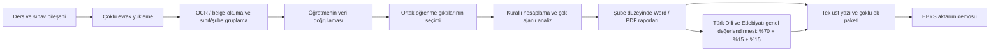

1. Öğretmen ders bağlamını ve yazılı, dinleme/izleme veya konuşma bileşenini seçer.
2. Bir ya da birden fazla şubeye ait sınav evrakı yüklenir veya veriler elle girilir.
3. Sistem dosyaları okur; yalnızca açıkça etiketlenmiş sınıf/şube bilgisini kullanarak evrakı gruplar ve eksik, okunamayan veya çelişkili alanları bildirir.
4. Öğretmen puanları, soru yapısını, öğrenci referans numaralarını ve sınıf/şube gruplarını düzeltir ve onaylar.
5. Ortak sınavın öğrenme çıktıları bir kez seçilir; seçim yalnız aynı ders, sınıf düzeyi, sınav bileşeni, soru sayısı ve azami puan yapısındaki şubelere uygulanır.
6. Başarı oranları, soru ve öğrenme çıktısı puanlarından kurallı ve yinelenebilir biçimde hesaplanır; RAG yalnızca onaylı veriler üzerinden resmî öğretim programı bağlamını getirir.
7. Her şube için rapor öğretmen incelemesinden sonra Word ve PDF olarak üretilir.
8. 9. sınıf Türk Dili ve Edebiyatı kapsamında onaylı üç bileşen raporu sabit **%70 yazılı + %15 dinleme/izleme + %15 konuşma** ağırlıklarıyla genel değerlendirme raporunda birleştirilebilir.
9. İl, ilçe, okul/kurum, öğretmen ve eğitim-öğretim yılı bilgileri ortak rapor bağlamı olarak bir kez girilir ve çalışma içindeki raporlara aktarılır.
10. Onaylı raporlar tek üst yazı, çoklu ek listesi ve kurum içi yönlendirme paketine dönüştürülür.

### Akışın ekran kanıtları

Görseller ayrıntılı inceleme için tıklanabilir.

#### 1. Rol ve eğitim bağlamı

Kullanıcı önce görev rolünü, ardından kademe, okul türü, sınıf düzeyi, ders türü ve dersi birbiriyle bağlantılı alanlardan seçer. Böylece rapor, doğru öğretim programı ve görev bağlamı temelinde hazırlanır. Türk Dili ve Edebiyatı öğretmeni ekranında yüklenebilecek sınav evrakı, MAHİR'in yapacağı işlemler ve üretilebilecek raporlar ayrıca açıklanır.

<p align="center"><a href="assets/readme/02-hazirlik-baglami.png">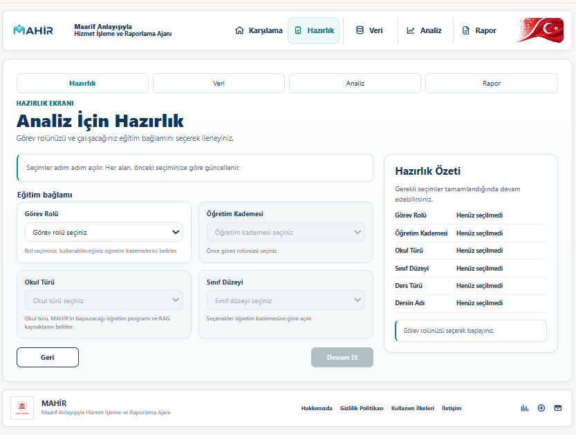</a></p>

<p align="center"><a href="assets/readme/03-tde-evrak-rehberi.png">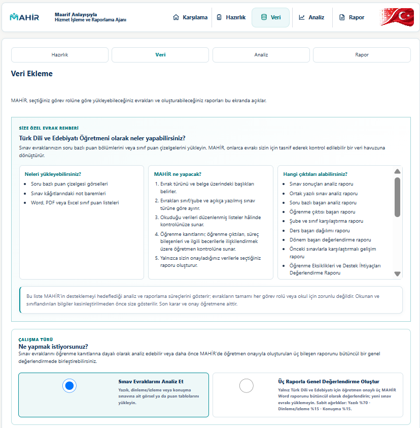</a></p>

#### 2. Veri giriş yolları ve üç bileşenli genel değerlendirme

Öğretmen soru bazlı puan çizelgesi görselleri, kendi Word/PDF/Excel tablosu, MAHİR şablonu veya elle veri girişi yollarından birini kullanabilir. Ayrı ayrı onaylanan yazılı, dinleme/izleme ve konuşma raporları daha sonra sabit **%70 + %15 + %15** ağırlıklarıyla genel değerlendirmede birleştirilebilir; bu adımda yeni sınav evrakı yüklenmez.

<p align="center"><a href="assets/readme/04-veri-giris-yollari.png">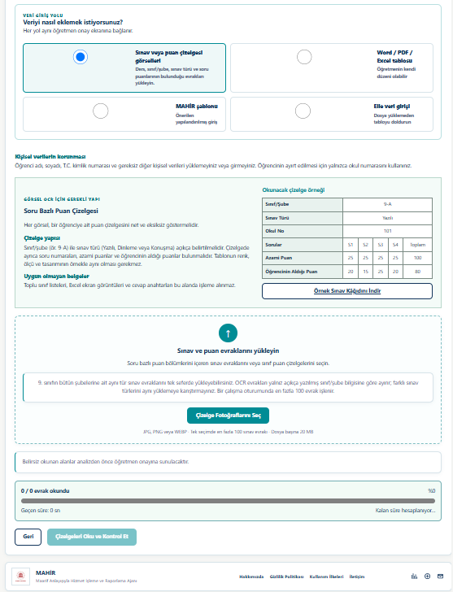</a></p>

<p align="center"><a href="assets/readme/05-uc-rapor-genel-degerlendirme.png">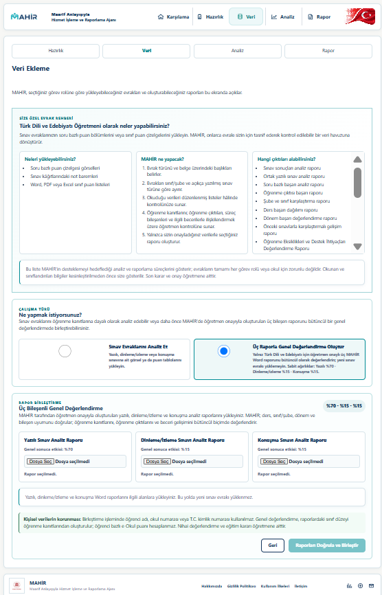</a></p>

#### 3. Toplu OCR ve kaynak izlenebilirliği

Görsel OCR yolu, her bir görselde tek bir öğrenciye ait soru bazlı puan çizelgesinin bulunduğu evrak için kullanılır. Soru numarası, azami puan, öğrencinin aldığı puan ve açıkça etiketlenmiş sınıf/şube hücresi okunur; kaynak dosyanın adı korunur. Sınav bileşeni, öğretmenin Hazırlık ekranındaki seçimiyle belirlenir. Boş puan hücreleri soru sırası bozulmadan korunur ve öğrenci referans numaraları sayısal sıraya alınır. Toplu yüklemede her dosyanın ilerleme durumu gösterilir. Fotoğraf kalitesi, çekim açısı, ışık ve el yazısı sonucu etkileyebileceğinden OCR çıktısı kendiliğinden doğru kabul edilmez.

<p align="center"><a href="assets/readme/06-toplu-ocr-okuma.png">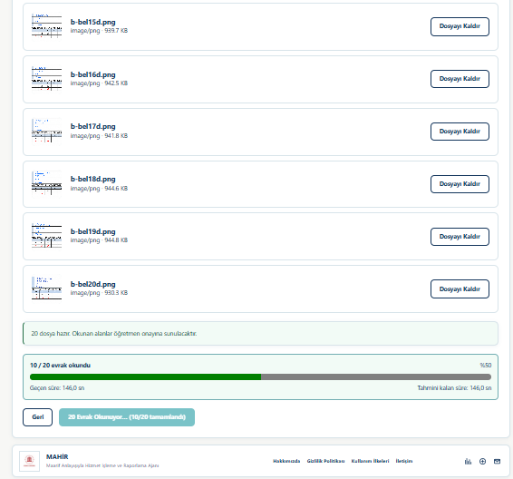</a></p>

#### 4. Veri minimizasyonu ve açık öğretmen kontrolü

Ad ve soyad bilgileri ile T.C. kimlik numarası analiz amacıyla kullanılmaz. OCR, evrakta açıkça belirtilen okul numarasını **öğrenci referans numarası** olarak aktarır; ad ve soyad bilgisini ise analiz akışına almaz. Sentetik örneklerde <code>ÖĞR-001</code> benzeri anonim referanslar kullanılır. MAHİR'in sınıf/şube düzeyinde grupladığı puanlar, azami puanlar ve toplamlar öğretmenin düzenleme ve kontrolüne sunulur; öğretmen açıkça onay vermeden analiz başlamaz.

<p align="center"><a href="assets/readme/07-sinif-veri-kontrolu.png">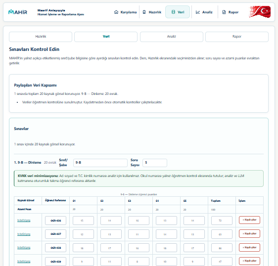</a></p>

#### 5. Ortak öğrenme çıktılarının güvenli aktarımı

Aynı yapıdaki ortak sınav için öğrenme çıktıları bir kez seçilir ve yalnızca ders, sınıf düzeyi, sınav bileşeni, soru sayısı ve azami puan dizisi eşleşen sınıf/şubelere uygulanır. Böylece bir şube için yapılan eşleştirme, diğer uygun şubelerin analizinde de kullanılır; farklı yapıdaki sınavlara aktarılmaz.

<p align="center"><a href="assets/readme/08-ortak-ogrenme-ciktilari.png">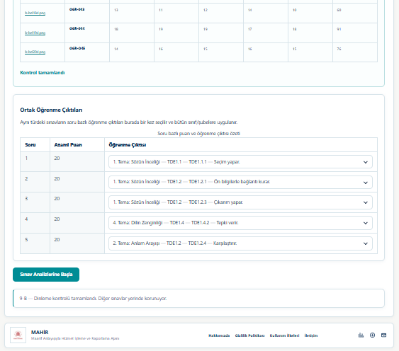</a></p>

#### 6. Altı uzman ajan ve ortak dil modeli turu

Analiz ekranı, Belge Anlama, Program Eşleştirme, Ölçme ve Değerlendirme, Pedagojik Analiz ile Raporlama adımlarını ayrı ayrı gösterir. Yükleme öncesinde çalışan Belge Okuma ve OCR Kalite Ajanı da hesaba katıldığında mimari, altı uzman görev bileşeninden oluşur. Beş analiz ajanının dil modeli istemleri, tek bir ortak turda işlenir. Ekranda gösterilen süre yalnızca ilgili çalıştırmanın analiz aşamasına aittir; veri hazırlama, öğretmen kontrolü ve rapor incelemesini içeren uçtan uca işlem süresini göstermez.

<p align="center"><a href="assets/readme/14-cok-ajanli-analiz.png">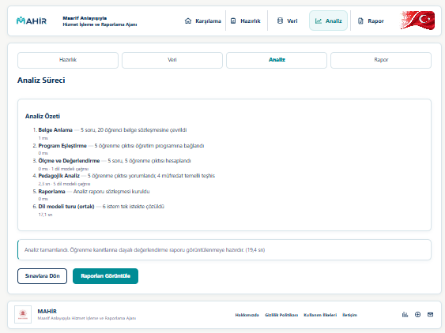</a></p>

#### 7. Kanıta ve doğrulanmış kaynağa dayalı rapor

Rapor, sınıf başarı özetini, soru bazlı gerçekleşme düzeylerini ve öğretmenin seçtiği öğrenme çıktılarının hangi puanlardan hesaplandığını birlikte gösterir. Pedagojik öneriler yalnızca onaylı puanlardan ve belge adı, ilgili sayfası ile kullanım amacı belirtilen doğrulanmış kaynaklardan üretilir.

<p align="center"><a href="assets/readme/15-ogrenme-kanitlari-raporu.png">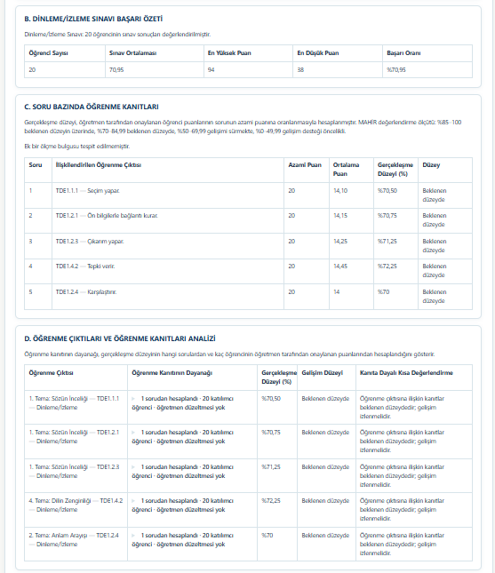</a></p>

<p align="center"><a href="assets/readme/16-kaynak-temelli-oneriler.png">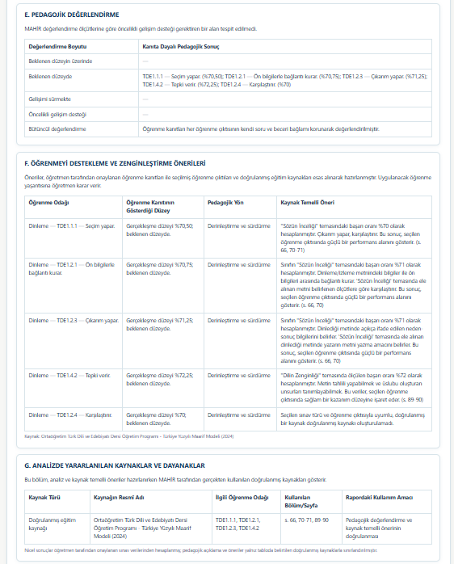</a></p>

#### 8. Öğretmen onayı, üst yazı ve EBYS demo sınırı

Nihai rapor, öğretmen onayından sonra Word veya PDF biçiminde indirilebilir. Onaylanan tek bir rapordan veya birden fazla rapordan resmî üst yazı ve ek listesi hazırlanabilir. Tamamlanan Word biçimindeki üst yazı, öğretmenin değerlendirdiği sınav evrakının kurum yönetimine sunulacak giden evrak paketine nasıl dönüştüğünü görünür kılar. Prototip MEBBİS'e veya gerçek MEB EBYS'ye bağlı değildir; evrak numarası, kayıt tarihi, paraf veya elektronik imza üretmez ve gerçek sisteme belge göndermez.

<p align="center"><a href="assets/readme/17-rapor-onayi-ebys-demo.png">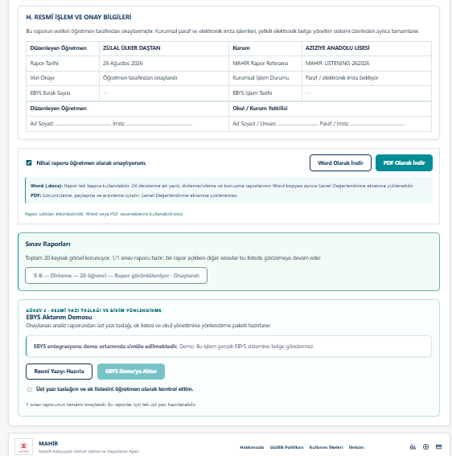</a></p>

<p align="center"><a href="assets/readme/18-resmi-ust-yazi.png">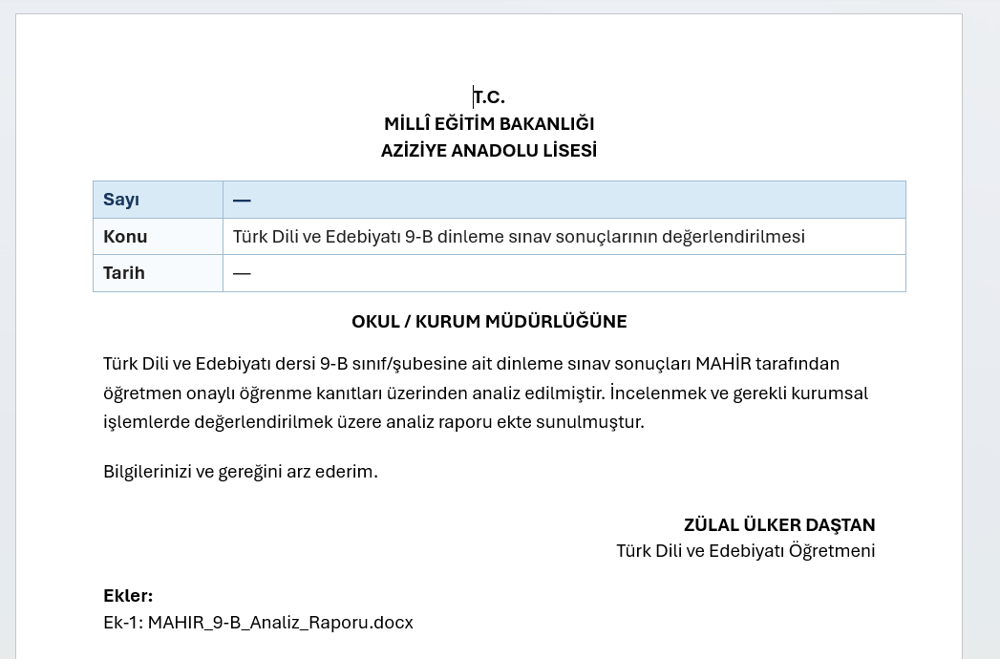</a></p>

### Çoklu sınıflarda ortak sınav ve rapor bağlamı

MAHİR, aynı sınavın birden fazla şubede uygulanması durumunda öğretmenin tekrar eden işlemlerini azaltır. Öğrenme çıktısı seçimi, ders, sınıf düzeyi, sınav bileşeni, soru sayısı ve azami puan dizisi birlikte eşleştiğinde diğer şubelere aktarılır. Farklı sınav bileşenleri veya farklı soru yapıları arasında otomatik aktarım yapılmaz. Ortak eşleştirme sonradan değişirse önceki analiz ve rapor onayı geçersiz kılınır; yeniden analiz yapılması istenir.

Kurumsal rapor bilgileri de çalışma düzeyinde paylaşılır. **İl, ilçe, okul/kurum adı, öğretmenin adı ve soyadı ile eğitim-öğretim yılı** ilk raporda doğrulandıktan sonra diğer raporlara aktarılır. **Sınıf/şube, dönem, sınav sırası ve sınav tarihi** ise her sınavın kendi bağlamında tutulur. Eğitim-öğretim yılı yalnızca `2025-2026` örneğindeki gibi birbirini izleyen iki yılı gösterecek biçimde kabul edilir.

## Çok ajanlı mimari

MAHİR'de görev sınırları belirlenmiş altı uzman ajan bulunur. Buradaki **ajan**, bağımsız bir sunucu veya ayrı bir yapay zekâ modeli değil; tanımlı girdisi, çıktısı, yetki sınırı, hata politikası ve işlem izi bulunan uzman görev bileşenidir. Belge Okuma ve OCR Kalite Ajanı dosya yükleme aşamasında; diğer beş ajan öğretmen onayından sonraki analiz aşamasında çalışır:

| Ajan | Sorumluluk | Yapmadığı işlem |
|---|---|---|
| Belge Okuma ve OCR Kalite Ajanı | Belge türünü, OCR gereksinimini ve okuma kalitesini denetler | OCR sonucunu öğretmen onayı olmadan doğru kabul etmez |
| Belge Anlama Ajanı | Onaylı girdiyi standart eğitim belgesine dönüştürür | Pedagojik yorum yapmaz |
| Program Eşleştirme Ajanı | Öğretmenin soru için seçtiği öğrenme çıktısını kayıtlı resmî program bağlamında doğrular | Otomatik öğrenme çıktısı üretmez veya puan hesaplamaz |
| Ölçme ve Değerlendirme Ajanı | Onaylanmış soru puanlarından soru ve öğrenme çıktısı başarı oranlarını hesaplar | Cevap metni puanlamaz ve LLM ile sayı üretmez |
| Pedagojik Analiz Ajanı | Onaylı kanıtı resmî program bağlamıyla yorumlar | Ham öğrenci verisini modele göndermez |
| Raporlama Ajanı | Kanıtları A-H yapısındaki resmî rapora dönüştürür | Sonuçları yeniden hesaplamaz |

Bu ayrım, bir ajanın ürettiği sonucun diğer ajanlar tarafından izlenebilmesini ve sayısal hesapların dil modeli yorumundan bağımsız kalmasını sağlar. Belge Okuma ve OCR Kalite Ajanının değerlendirmesi, yükleme kaydındaki `documentQuality` alanında tutulur. Analiz aşamasındaki diğer beş ajanın çalışma sırası, süresi, bulguları ve LLM kullanımı ise ortak işlem izine kaydedilir.

### İki aşamalı çalışma düzeni

| Aşama | Bileşenler | Öğretmen kontrolü |
|---|---|---|
| Veri kabul kapısı | Belge Okuma ve OCR Kalite Ajanı | OCR sonucu, eksik ve belirsiz alanlar öğretmene sunulur; onay verilmeden analiz başlamaz. |
| Onay sonrası analiz hattı | Belge Anlama -> Program Eşleştirme -> Ölçme ve Değerlendirme -> Pedagojik Analiz -> Raporlama | Rapor ve kurumsal belge taslakları öğretmen incelemesi ve onayı olmadan nihai kabul edilmez. |

### Standart Eğitim Belgesi — CED

**Canonical Education Document (CED)**, öğretmen tarafından onaylanan sınav bağlamını, soru yapısını, anonim öğrenci puanlarını ve öğrenme çıktısı ilişkilerini ajanlar arasında taşıyan standart eğitim belgesi modelidir. CED bir yapay zekâ kararı değildir; ajanların aynı veri sözleşmesi üzerinden çalışmasını ve bir aşamadaki bulgunun sonraki aşamada izlenebilmesini sağlar.

| CED'nin taşıdığı bilgiler | CED'nin yapmadıkları |
|---|---|
| Ders, sınıf, okul türü, dönem, sınav türü ve sınav sırası | OCR işlemi yapmaz |
| Soru numarası, azami puan ve öğretmen onaylı soru puanları | Öğrenme çıktısını kendiliğinden seçmez |
| Öğretmenin seçtiği öğrenme çıktıları ve katkı ilişkileri | Pedagojik karar veya resmî onay üretmez |
| Anonim öğrenci kodları, doğrulama bulguları ve işlem izi | Ham kimlik verisini LLM/RAG katmanına taşımaz |

### Deterministik işlemlerle LLM/RAG işlemlerinin ayrımı

| Ajan | LLM/RAG kullanımı | Bilimsel ve teknik sınır |
|---|---|---|
| Belge Okuma ve OCR Kalite | Yok | OCR kalite bulguları öğretmen doğrulamasının yerini tutmaz. |
| Belge Anlama | Yok | Yalnız onaylanmış veriyi CED yapısına dönüştürür. |
| Program Eşleştirme | Yok | Öğretmenin seçimini katalogla doğrular; otomatik pedagojik seçim yapmaz. |
| Ölçme ve Değerlendirme | Yalnız açıklayıcı anomali kontrolü | LLM hiçbir puanı, oranı veya toplamı değiştiremez. |
| Pedagojik Analiz | Doğrulanmış program kaynağıyla RAG | Kaynak yoksa veya yanıt kapsam dışına çıkarsa açıklama rapora alınmaz. |
| Raporlama | Yok | Önceki ajanların doğrulanmış sonuçlarını düzenler; yeniden hesaplama yapmaz. |

Pedagojik Analiz Ajanı isteğe bağlıdır. RAG/LLM erişimi başarısız olursa sayısal analiz tamamlanabilir ve kanıt temelli rapor, pedagojik yorum eklenmeden oluşturulabilir. Başarısız olan ajanlar ve atlanan alanlar işlem izinde saklanır; eksik kanıt tamamlanmış gibi gösterilmez.

LLM kullanan görevlerin istemleri ortak kuyruğa yazılıp tek toplu istek içinde gönderilebilir. Bu, ayrı ağ turlarını azaltan teknik bir optimizasyondur; sıfır GPU maliyeti, sabit süre veya ajan sayısından bağımsız performans iddiası değildir.

### RAG kaynak ve kapsam korumaları

- RAG yalnız öğretmenin onayladığı anonimleştirilmiş veri üzerinde çalışır.
- Arama, kayıtlı program, sınıf, tema ve seçilmiş öğrenme çıktısı bağlamıyla sınırlandırılır.
- Tema çözülemezse daha geniş ve riskli bir aramaya düşülmez.
- Kaynak bulunmayan model yanıtı rapora taşınmaz.
- Başka öğrenme çıktısı koduna veya yanlış beceri alanına sapan yanıt reddedilir.
- Kullanılan kaynaklar belge adı ve orijinal PDF sayfa numaralarıyla işlem izine eklenir.
- RAG başarısızlığı deterministik sayısal analizi durdurmaz.

## Projeyi inceleme rehberi

### Sunumu izlemeden depo üzerinden inceleme

Projeyi yalnızca depo ve belgeler üzerinden değerlendiren okuyucu aşağıdaki kanıt zincirini izleyebilir:

1. [Örnek sınav girdisi](shared/sample-exam.csv): Sisteme hangi verilerin sağlandığını gösterir.
2. [Yapılandırılmış standart eğitim belgesi örneği](shared/ced-example.json): Onaylı verinin ajanlar arasında hangi ortak sözleşmeyle taşındığını gösterir.
3. [9. sınıf Türk Dili ve Edebiyatı pilot veri paketi ve kapsam açıklaması](shared/pilot/tde9/README.md): Öğretmenin seçtiği öğrenme çıktısının program bağlamında nasıl doğrulandığını gösterir.
4. [Ajan mimari belgeleri](docs/architecture/): Altı bileşenin görev, yetki, hata ve LLM sınırlarını gösterir.
5. [Örnek analiz raporu](shared/report-example.txt): Sayısal sonuçların ve kanıtların nasıl sunulduğunu gösterir.
6. [Otomatik testler](tests/): İş akışının, güvenlik sınırlarının ve öğretmen kontrol noktalarının nasıl doğrulandığını gösterir.

Bu dosyalar, örnek girdiden yapılandırılmış veriye, analiz çıktısına ve doğrulama kontrollerine uzanan akışın depo üzerinden izlenebilmesini sağlar. Örnek dosyalar sentetiktir; gerçek öğrenci kimliği içermez.

### Windows'ta çalıştırma

1. Depoyu GitHub'dan klonlayınız veya ZIP olarak indirip klasöre çıkarınız.
2. Bilgisayarınızda **Python 3.10 veya üzeri** bulunduğunu kontrol ediniz.
3. Proje ana klasöründeki `MAHIR_BASLAT.cmd` dosyasına çift tıklayınız.
4. Tarayıcı otomatik olarak açılmazsa `http://127.0.0.1:8000/index.html` adresine gidiniz.
5. MAHİR'i kullandığınız süre boyunca açılan sunucu penceresini açık tutunuz.

Lütfen `index.html` dosyasını doğrudan açmayınız. Belge yükleme ve analiz servislerinin başlatılabilmesi için `MAHIR_BASLAT.cmd` dosyasını kullanınız.

### Komut satırıyla çalıştırma

```bash
git clone https://github.com/peykan1071/MAHIR-PROTOTIP-HTML.git
cd MAHIR-PROTOTIP-HTML
python backend/run_file_receiver.py
```

Windows'ta `python` komutu tanınmıyorsa aşağıdaki komutu kullanınız:

```powershell
py backend/run_file_receiver.py
```

## OCR ve RAG demo erişimi

Depo tek başına indirildiğinde arayüz, belge doğrulama ve yerel analiz akışı çalıştırılabilir. Yetkilendirilmiş uzak **OCR ve RAG** servislerini kullanabilmek için proje sahibinin ayrıca sağladığı `secrets.local.txt` dosyasını proje ana klasörüne yerleştiriniz:

```text
MAHIR_OCR_SHARED_SECRET=<ayrıca sağlanan erişim anahtarı>
MAHIR_RAG_SHARED_SECRET=<ayrıca sağlanan erişim anahtarı>
```

Erişim anahtarı olmadan ücretli uzak servisler kullanılamaz. Uzak GPU servisleri kullanılmadığında sıfıra ölçeklenir; bu nedenle ilk OCR veya RAG isteği normalden daha uzun sürebilir.

### Erişim anahtarları neden depoda bulunmuyor?

Bu durum bir kurulum eksikliği değil; bilinçli bir güvenlik ve maliyet kontrolü kararıdır.

- Git deposuna eklenen bir erişim anahtarı, daha sonra silinse bile depo geçmişinde ve çatallarda kalabilir.
- Herkese açık anahtarlar, ücretli GPU servislerinin yetkisiz kullanılmasına neden olabilir.
- Gerçek servis kimlik bilgilerinin koddan ayrı tutulması, kontrollü erişim ve veri minimizasyonu yaklaşımının gereğidir.
- `.gitignore`, `secrets.local.txt` dosyasının yanlışlıkla Git geçmişine eklenmesini engeller.

Yetkili değerlendirme sırasında tam erişim, ayrıca iletilen yerel yapılandırma dosyasıyla veya süre ve kota sınırı bulunan değerlendirme erişimi üzerinden sağlanır.

## 9. sınıf Türk Dili ve Edebiyatı pilotu

MAHİR'in ilk doğrulama alanı **9. sınıf Türk Dili ve Edebiyatı** dersidir. Pilot veri paketi:

- dört temayı kapsayan **54 öğrenme çıktısı**,
- resmî programdan yapılandırılan **237 süreç bileşeni** ve **614 ayrıntılı gösterge**,
- dinleme/izleme, okuma, konuşma ve yazma alan becerileri,
- tema, ders, sınıf ve sınav bileşeni bağlamını koruyan kayıt yapısı

içerir.

Türk Dili ve Edebiyatı (TDE) kodları yalnızca **Türk Dili ve Edebiyatı + 9. sınıf** profili seçildiğinde kullanıma açılır. Başka bir ders veya sınıf bağlamında bu kodların gönderilmesi arka uç tarafından reddedilir. Ayrıntılı bilgi için [9. sınıf Türk Dili ve Edebiyatı pilot veri paketini](shared/pilot/tde9/README.md) inceleyebilirsiniz.

## Doğruluk ve halüsinasyon kontrolü

- Belge gelmeden soru, puan veya öğrenme çıktısı üretilmez.
- Program kodları serbest metinden uydurulmaz; tanımlı ders-sınıf kataloğundan alınır.
- Öğrenci toplamları soru puanlarından hesaplanır; LLM'e hesap yaptırılmaz.
- Her soru puanı tanımlı azami puanla sınırlandırılır.
- Ortak öğrenme çıktıları yalnız aynı sınav yapısındaki şubelere aktarılır; farklı sınav bileşenleri birbirine karıştırılmaz.
- Eksik veya okunamayan veri öğretmen tarafından düzeltilmeden analiz tamamlanmaz.
- RAG yalnız öğretmen onayından sonraki pedagojik raporlama aşamasında kullanılır.
- Kaynak bağlam bulunamazsa sistem içerik uydurmak yerine bu durumu açıkça bildirir.
- Word ve PDF çıktıları öğretmen onayı verilmeden etkinleşmez.

## Veri güvenliği ve etik sınırlar

- Depoda gerçek öğrenci adı, T.C. kimlik numarası veya okul numarası bulunmaz.
- Pilot verilerde `ÖĞR-001` benzeri anonim kimlikler kullanılır.
- Ham öğrenci listesi ve kimliği belirleyebilecek kurumsal bilgiler LLM/RAG istemlerine gönderilmez.
- Öğrenci eşleştirmesi yalnızca oturum süresince geçerli takma referanslarla yapılır.
- Gerçek kamu verisi yerine sentetik, anonim veya kullanımı açık örnek veriler kullanılır.
- Üretim ortamına geçişten önce kurumsal kimlik doğrulama, yetkilendirme, kayıt politikası ve KVKK kontrolleri ayrıca tamamlanmalıdır.

## Çalışan özellikler ve prototip sınırları

| Bileşen | Güncel durum |
|---|---|
| Tek sayfalık öğretmen akışı | Çalışıyor |
| 9. sınıf Türk Dili ve Edebiyatı program kataloğu ve ayrıntılı süreç bileşenleri | Çalışıyor |
| DOCX, PDF, XLSX ve CSV belge okuma | Çalışıyor |
| Çoklu görsel OCR ve etiketli sınıf/şube gruplama | Çalışıyor - uzak GPU servisiyle |
| Öğretmen veri doğrulaması | Çalışıyor |
| Aynı yapıdaki çoklu şubelerde ortak öğrenme çıktısı | Çalışıyor; seçim bir kez yapılır ve eşleşen şubelere uygulanır |
| Kurallı sınav ve öğrenme çıktısı analizi | Çalışıyor |
| Program kaynaklı RAG yorumlama | Çalışıyor - uzak GPU servisiyle |
| Yazılı, dinleme/izleme ve konuşma için Word/PDF raporu | Çalışıyor |
| Türk Dili ve Edebiyatı genel değerlendirme raporu | Çalışıyor; sabit %70 yazılı + %15 dinleme/izleme + %15 konuşma |
| Ortak kurumsal rapor bilgilerinin yeniden kullanımı | Çalışıyor; sınava özgü alanlar ayrı korunur |
| Tek üst yazıda birden fazla onaylı rapor eki | Çalışıyor - demo kapsamında |
| Gerçek EBYS aktarımı ve elektronik imza | Simüle ediliyor; yetkili kurum entegrasyonu gerektirir |
| Kalıcı ilişkisel veritabanı | Sonraki geliştirme aşaması |
| Kurumsal kullanıcı hesabı ve yetkilendirme | Prototip sonrası |

## Testler

Python doğrulamalarını çalıştırmak için:

```bash
python -m unittest discover -s tests -p "test_*.py"
```

Node.js kuruluysa repodaki 13 JavaScript test dosyasının tamamı ve ana tarayıcı betiğinin sözdizimi kontrolü çalıştırılabilir:

```bash
node --test tests/*.test.js
node --check script.js
```

JavaScript test **dosyası** sayısı, test vakası sayısı değildir. CI başarısı kodla tanımlanan davranışları doğrular; gerçek kullanıcı etkisini veya bütün belge türlerinde kusursuzluğu kanıtlamaz.

## Proje yapısı

```text
MAHIR-PROTOTIP-HTML/
|-- index.html                 # Ekranların anlamsal yapısı
|-- styles.css                # Arayüz ve rapor görünümü
|-- script.js                 # Kullanıcı akışı ve ön yüz bağlantıları
|-- MAHIR_BASLAT.cmd          # Windows hızlı başlatıcı
|-- assets/js/                # Program kataloğu, yedekleme ve çıktı üreticileri
|   |-- mahir-shared-outcomes.js # Aynı yapıdaki şubeler için ortak çıktı eşleştirmesi
|   `-- mahir-ebys-demo.js    # Tek üst yazı ve çoklu ek demo paketi
|-- backend/app/              # Belge okuma, doğrulama ve analiz motorları
|-- backend/app/agents/       # Öğretmen onayı sonrası beş analiz ajanı ve orkestratör
|-- backend/app/ocr_quality_agent.py # Yükleme aşamasındaki OCR kalite ajanı
|-- backend/app/general_report_merger.py # Üç Türk Dili ve Edebiyatı bileşen raporunu birleştirme
|-- shared/pilot/tde9/        # 9. sınıf Türk Dili ve Edebiyatı pilot program verileri
|-- shared/templates/         # Veri giriş ve rapor şablonları
|-- tests/                    # Python ve JavaScript kontrolleri
`-- docs/                     # Mimari ve geliştirme belgeleri
```

## Teknik belgeler ve kaynaklar

- [Belge Anlama Ajanı](docs/architecture/document-understanding-agent.md)
- [Belge Okuma ve OCR Kalite Ajanı](docs/architecture/ocr-quality-agent.md)
- [Program Eşleştirme Ajanı](docs/architecture/program-mapping-agent.md)
- [Ölçme ve Değerlendirme Ajanı](docs/architecture/measurement-evaluation-agent.md)
- [Pedagojik Analiz Ajanı](docs/architecture/pedagogical-analysis-agent.md)
- [Raporlama Ajanı](docs/architecture/reporting-agent.md)
- [Standart Eğitim Belgesi](docs/architecture/canonical-education-document.md)
- [Türkiye Yüzyılı Maarif Modeli](https://tymm.meb.gov.tr/)
- [9. sınıf Türk Dili ve Edebiyatı pilot veri paketi](shared/pilot/tde9/README.md)
- [Geliştirme ilkeleri](DEVELOPMENT_CHARTER.md)
- [Değişiklik günlüğü](CHANGELOG.md)

## Sonraki geliştirme adımları

1. OCR ve RAG akışlarının farklı anonim belge örnekleriyle genişletilmiş doğrulaması
2. Süreli ve kullanım kotası sınırlandırılmış değerlendirme erişimi
3. Kalıcı ilişkisel veritabanı
4. Kurumsal kimlik doğrulama ve yetkilendirme
5. Yetkili kurumlarla gerçek EBYS entegrasyonu
6. Üretim ortamı için KVKK, denetim kaydı ve saklama politikaları

## Ekip

### Zülal Ülker Daştan — Takım Kaptanı ve Kurucu Lider

Türk Dili ve Edebiyatı öğretmenidir. Alanında tezsiz yüksek lisans eğitimi almış; eğitim teknolojileri, ölçme ve değerlendirme, yapay zekâ ve proje koordinasyonu alanlarında deneyim kazanmıştır.

**MAHİR'deki sorumluluğu:** Proje vizyonunu ve ürün stratejisini oluşturur; kullanıcı deneyimi, yapay zekâ senaryoları, içerik yaklaşımı, ekip koordinasyonu, sürüm takibi ve yaygınlaştırma çalışmalarını yönetir.

### Lokman Daştan — Araştırma Lideri

Din Kültürü ve Ahlak Bilgisi öğretmenidir. İlahiyat alanında yüksek lisans eğitimi almış; eğitim araştırmaları, pedagojik değerlendirme, etik, veri gizliliği ve raporlama alanlarında deneyim kazanmıştır.

**MAHİR'deki sorumluluğu:** Pedagojik uygunluğu, etik ve gizlilik ilkelerini, öğretmen doğrulama adımlarını ve üretilen raporların eğitim dili bakımından tutarlılığını denetler.

### Gonca Ergül — Bilimsel İçerik Lideri

Fen Bilimleri öğretmenidir. Bilimsel içerik, STEM uygulamaları, rubrik geliştirme, beceri temelli ölçme ve dijital eğitim araçları alanlarında deneyimlidir.

**MAHİR'deki sorumluluğu:** Bilimsel içerik doğrulamasını, program ve öğrenme çıktısıyla uyumlu değerlendirme tasarımını, rubrik çalışmalarını ve öğretmen geri bildirimlerinin ürüne aktarılmasını yönetir.

### Hakan Ergül — Teknik Lider

Matematik öğretmenidir. Alanında yüksek lisans eğitimi almış; Python programlama, veri analizi, algoritma geliştirme ve web tabanlı sistemler alanlarında deneyim kazanmıştır.

**MAHİR'deki sorumluluğu:** Sistem mimarisi, veri analizi ve algoritmaları geliştirir; bileşenlerin entegrasyonu ile test, güvenlik, performans ve teknik sürdürülebilirlik çalışmalarını yönetir.

---

**MAHİR öğretmenin yerine karar vermez. Öğrenme kanıtlarını görünür, sınav analizini izlenebilir hâle getirir. Resmî raporlama ve kurum içi yazışma süreçlerinde öğretmene yardımcı olur.**
