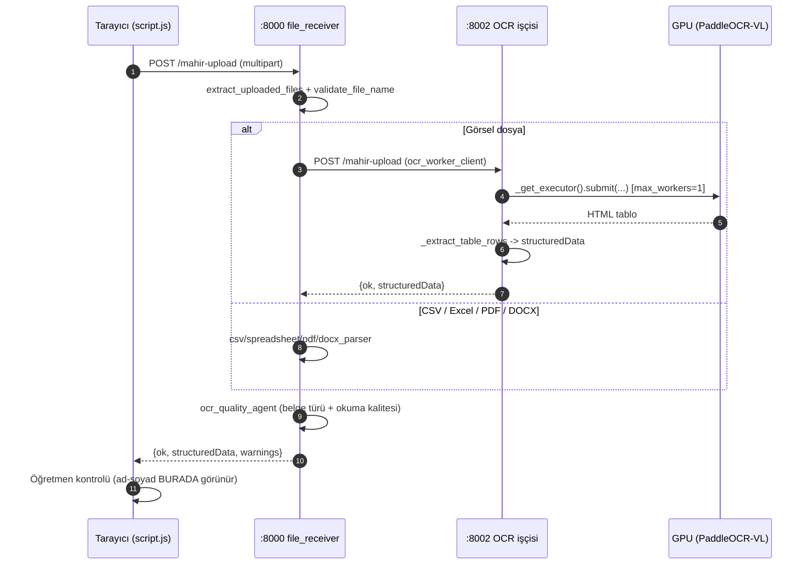
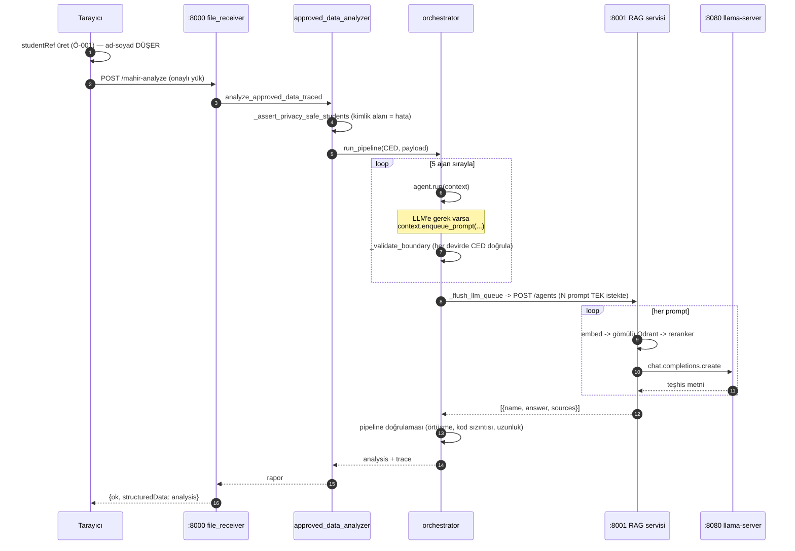
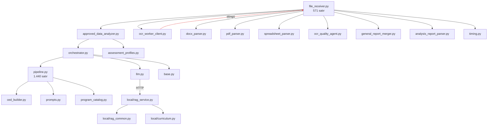
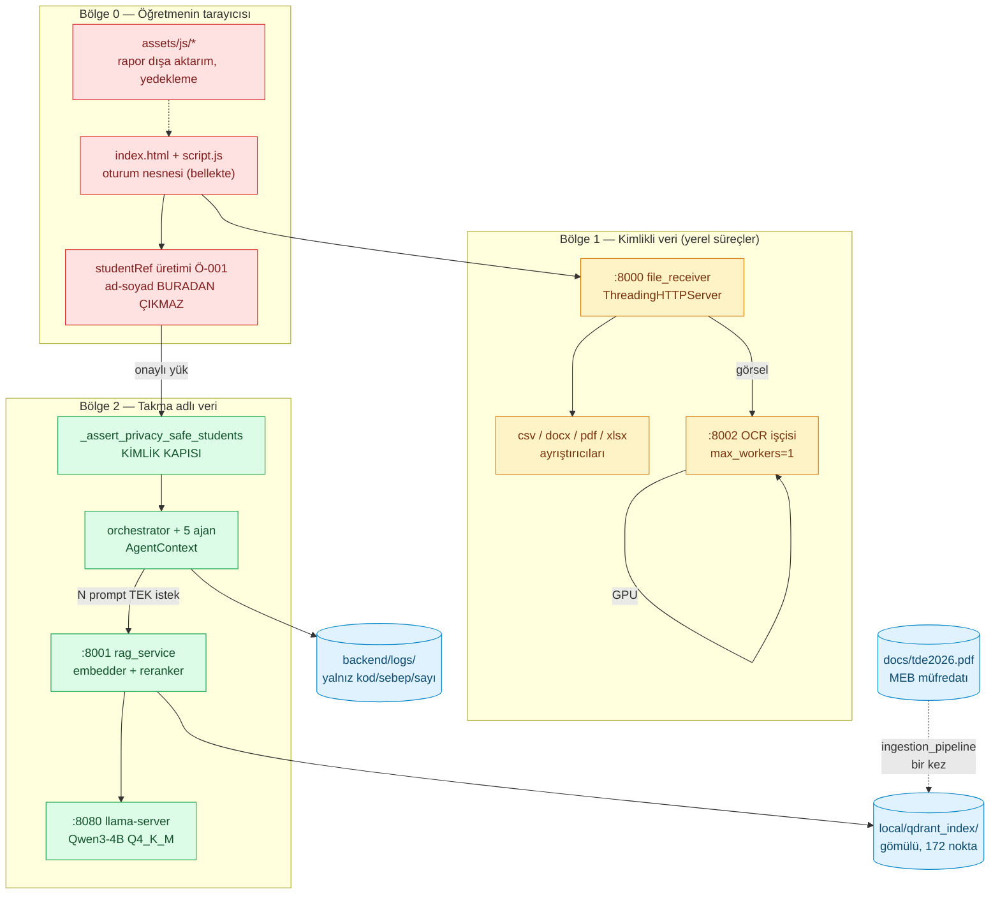

# MAHİR kod tabanı analizi

> Bu belge kodun **bugünkü** hâlini anlatır; tasarım niyetini değil. Dil
> kasıtlı olarak süslemesizdir. Satır numaraları 2026-09-24 tarihli
> `yerel-parsing-ocr` dalına (`e4547e5`) göredir.

**Ölçek:** ~20.000 satır / 45 kaynak dosya.

| Katman | Satır | Dosya |
|---|---:|---:|
| Ön yüz (`script.js` + `assets/js` + `index.html`) | ~9.700 | 10 |
| Backend (`backend/`) | ~7.000 | 30 |
| RAG yığını (`local/`) | ~3.600 | 4 |

---

## 1. High-level mimari ve veri akışı

### 1.1 Süreçler ve giriş noktaları

Sistem tek bir uygulama değil, **dört ayrı süreçtir**. Hiçbiri diğerini
başlatmaz; hepsini [`MAHIR_BASLAT.ps1`](../../MAHIR_BASLAT.ps1) açar ve
hepsi yalnız `127.0.0.1`'e bağlanır.

| Süreç | Port | Sunucu | Rotalar | Ağır bağımlılık |
|---|---|---|---|---|
| Web backend | 8000 | `ThreadingHTTPServer` (stdlib) | `/mahir-upload`, `/mahir-analyze`, `/mahir-merge-reports` + statik dosyalar | yok (pdfplumber/openpyxl/python-docx) |
| RAG servisi | 8001 | FastAPI + uvicorn | `/health`, `/retrieve`, `/query`, `/agents` | torch, sentence-transformers, qdrant-client |
| OCR işçisi | 8002 | `ThreadingHTTPServer` (stdlib) | `/mahir-upload` | paddle, PaddleOCR-VL (GPU) |
| llama-server | 8080 | llama.cpp | OpenAI uyumlu `/v1/*` | GGUF model (GPU) |

Vektör indeksi **süreç değildir**: `qdrant-client`'ın gömülü kipiyle
[`local/qdrant_index/`](../../local/) klasöründen okunur.

Bu ayrım bilinçli: web backend'i ağır ML paketlerini hiç import etmez,
bu yüzden bir model çökmesi öğretmenin arayüzünü düşürmez.

### 1.2 Akış A — evrak yükleme ve OCR



### 1.3 Akış B — analiz turu



**Dikkat:** `/agents` turu **hepsi-ya-hiç**tir. Tek prompt düşerse
`run_agent_prompts` `False` döner ve tüm tur kaybolur (bkz. 3.4).

---

## 2. Dosya envanteri ve sorumluluk matrisi

### 2.1 Bağımlılık omurgası



Kırmızı kenar gerçek bir döngüdür (bkz. 3.1).

### 2.2 Web katmanı

| Dosya | Görevi | Bağımlılık | Kritik fonksiyon | State rolü |
|---|---|---|---|---|
| [`file_receiver.py`](../../backend/app/file_receiver.py) | Üç rotayı ve statik sunumu yürütür; hangi ayrıştırıcının çağrılacağına karar verir | 9 modül (hub) | `run_existing_backend_flow:391`, `extract_uploaded_files:513` | **State yok** — her istek bağımsız |
| [`script.js`](../../script.js) | Tüm arayüz, öğretmen onayı, takma ad üretimi, rapor gösterimi | `assets/js/*` | `createSession:17`, `studentRef` üretimi `:5400` | **Tek oturum nesnesi**, bellekte; sayfa yenilenince biter |
| [`ocr_worker_client.py`](../../backend/app/ocr_worker_client.py) | Görsel grubunu `:8002`'ye taşır | `file_receiver` (döngü) | `request_image_group_ocr` | yok |
| [`ocr_quality_agent.py`](../../backend/app/ocr_quality_agent.py) | Belge türü ve okuma kalitesi kararı (deterministik, LLM yok) | — | — | yok |

### 2.3 Ayrıştırıcılar

| Dosya | Görevi | Besler |
|---|---|---|
| [`docx_parser.py`](../../backend/app/docx_parser.py) (642) | MAHİR Veri Giriş Şablonu tablolarını okur | `file_receiver` |
| [`table_parser.py`](../../backend/app/table_parser.py) (192) | Başlık anlamına göre öğretmen tablosunu çözer | `pdf_parser`, `spreadsheet_parser` |
| [`csv_parser.py`](../../backend/app/csv_parser.py) (131) | Örnek CSV'den CED üretir | `validator`, `models` |
| [`pdf_parser.py`](../../backend/app/pdf_parser.py) (27) · [`spreadsheet_parser.py`](../../backend/app/spreadsheet_parser.py) (23) | `table_parser`'a ince sarmalayıcı | `file_receiver` |

### 2.4 Ajan hattı

| Dosya | Görevi | Kritik fonksiyon | State rolü |
|---|---|---|---|
| [`base.py`](../../backend/app/agents/base.py) | Ajan protokolü ve **merkezî state**: `AgentContext` | `AgentContext:108` | `ced`, `analysis`, `scratch`, `trace`, `llm_queue` |
| [`orchestrator.py`](../../backend/app/agents/orchestrator.py) | Ajanları sırayla koşturur, her devirde CED doğrular, LLM kuyruğunu boşaltır | `run_pipeline:167`, `_flush_llm_queue:249` | `AgentContext`'i sahiplenir |
| [`pipeline.py`](../../backend/app/agents/pipeline.py) | **Beş ajanın tamamı** tek dosyada | `DocumentUnderstandingAgent:167`, `ProgramMappingAgent:215`, `MeasurementAgent:279`, `PedagogicalAnalysisAgent:417`, `ReportingAgent:672` | `context.scratch`'e yazar |
| [`llm.py`](../../backend/app/agents/llm.py) | `/agents` tel sözleşmesi; gövdeyi beyaz listeyle kurar | `run_agent_prompts:86` | yok |
| [`ced_builder.py`](../../backend/app/agents/ced_builder.py) | Tarayıcı yükünü bellek-içi CED'e çevirir | `build_ced_from_payload:80` | **Gizlilik:** yalnız `studentRef` taşır |
| [`prompts.py`](../../backend/app/agents/prompts.py) | Sistem promptları ve çıktı sözleşmesi | `DIAGNOSIS_SYSTEM_PROMPT:75` | yok |

**LLM kuyruğu deseni** ([`base.py:127`](../../backend/app/agents/base.py)):
ajanlar LLM'i doğrudan çağırmaz, promptlarını kuyruğa yazar; orkestratör
hepsini **tek HTTP isteğinde** gönderir. Doğru bir karar — ama 3.4'teki
hepsi-ya-hiç sorununun da kaynağı.

### 2.5 Veri ve doğrulama

| Dosya | Görevi | State rolü |
|---|---|---|
| [`models.py`](../../backend/app/models.py) | CED veri sınıfları; OCR/AI/API mantığı **kasıtlı olarak yok** | Şema sözleşmesi |
| [`approved_data_analyzer.py`](../../backend/app/approved_data_analyzer.py) | `/mahir-analyze` girişi; **gizlilik kapısı** | `analyze_approved_data_traced:58`, `_assert_privacy_safe_students:259` |
| [`validator.py`](../../backend/app/validator.py) | CED şema doğrulaması | `validate_ced_payload:48` |
| [`measurement_engine.py`](../../backend/app/measurement_engine.py) | Soru ve kazanım düzeyinde ham toplamlar | saf fonksiyon |
| [`assessment_profiles.py`](../../backend/app/assessment_profiles.py) | Derse özgü bileşen ve ağırlık kuralları | sabit tablo |

### 2.6 RAG yığını

| Dosya | Görevi | Kritik fonksiyon | State rolü |
|---|---|---|---|
| [`rag_service.py`](../../local/rag_service.py) (930) | Dört uç; getirim + LLM | `run_agent_prompts:622`, `_chat:540` | `RAGService` **uzun ömürlü**: embedder, reranker, Qdrant istemcisi |
| [`rag_common.py`](../../local/rag_common.py) (691) | `Settings`, `CpuEmbedder`, `CrossEncoderReranker`, Qdrant yardımcıları | `Settings.from_env:212`, `make_qdrant_client` | Ayarlar `frozen=True`; modeller **kilitli** |
| [`curriculum.py`](../../local/curriculum.py) (791) | Müfredat PDF'inin yapısını çözer (tema/sınıf/beceri) | `theme_match_key:178`, `skill_match_key:212` | saf |
| [`ingestion_pipeline.py`](../../local/ingestion_pipeline.py) (1.220) | PDF → Docling → parça → gömme → indeks | `DoclingParser:311` | İndeksi **yazan tek yer** |

### 2.7 Küçük yardımcılar

| Dosya | Satır | Tek cümle |
|---|---:|---|
| [`timing.py`](../../backend/app/timing.py) | 68 | Süreleri tek biçimde konsola yazar |
| [`parsing_utils.py`](../../backend/app/parsing_utils.py) | 53 | `docx_parser`/`table_parser` ortak yardımcıları |
| [`program_catalog.py`](../../backend/app/program_catalog.py) | 71 | Ders/sınıf kapsamlı program kaydı |
| [`analysis_report_parser.py`](../../backend/app/analysis_report_parser.py) | 81 | Word raporundaki gömülü kanıtı geri okur |
| [`general_report_merger.py`](../../backend/app/general_report_merger.py) | 98 | Üç bileşen raporunu ağırlıklandırıp birleştirir |
| [`run_*.py`](../../backend/) | 27-293 | Süreç başlatıcılar (`file_receiver`, `ocr_worker`, `validation`, `diagnosis_test`) |

---

## 3. Zayıf noktalar ve "vibe coding" borçları

### 3.0 Önce doğru yapılanlar

Eleştirinin güvenilir olması için: bu kod tabanı birkaç şeyi
beklenenden **iyi** yapıyor.

- **Gizlilik kodda zorlanıyor.** [`_assert_privacy_safe_students`](../../backend/app/approved_data_analyzer.py)
  `studentNo`, `fullName`, `name`, `surname`, `tckn`, `sourceFile`
  alanlarını analiz sınırında reddediyor. Yorum değil, çalışan kapı.
- **Paylaşılan modeller iş parçacığı güvenli.** `CpuEmbedder` ve
  `CrossEncoderReranker` `threading.Lock` kullanıyor
  ([`rag_common.py:400`](../../local/rag_common.py), `:498`).
- **GPU erişimi seri.** OCR çıkarımı `ThreadPoolExecutor(max_workers=1)`
  üzerinden gidiyor ([`ocr_engine.py:41`](../../backend/app/ocr_engine.py)),
  yani `ThreadingHTTPServer` olmasına rağmen iki eşzamanlı yükleme GPU'da
  çakışmıyor.
- **Zarif bozulma.** OCR ya da RAG kapalıyken CSV/Excel akışı çalışmaya
  devam ediyor.
- **365 test** (352 Python + 13 JS) ve modül docstring'leri gerçekten iyi.

### 3.1 Döngüsel bağımlılık — `file_receiver` ↔ `ocr_worker_client`

[`ocr_worker_client.py:20`](../../backend/app/ocr_worker_client.py) modül
düzeyinde `from .file_receiver import UploadedFile` yapıyor;
[`file_receiver.py:508`](../../backend/app/file_receiver.py) ise
`from .ocr_worker_client import request_image_group_ocr`'ı **fonksiyon
içine** saklayarak döngüyü kırıyor.

Bu klasik bir vibe coding yamasıdır: döngü çözülmemiş, ertelenmiş.
`UploadedFile` bir **veri sınıfıdır**, HTTP sunucu modülünde durmamalıdır.
Doğru yeri `models.py` ya da yeni bir `upload_types.py`.

### 3.2 `file_receiver.py` tanrı-modül

571 satırda: statik dosya sunumu, çok parçalı gövde ayrıştırma, dosya adı
doğrulama, dört ayrıştırıcıya yönlendirme, OCR yönlendirmesi, analiz
rotası, rapor birleştirme rotası. **Dokuz modüle** bağımlı.

Sonuç: OCR yönlendirmesini değiştirmek için statik sunucuyu barındıran
dosyaya dokunmak gerekiyor; test etmek için HTTP katmanını ayağa
kaldırmak gerekiyor.

### 3.3 `script.js` — 6.217 satırlık tek IIFE

259 fonksiyon, 68 `addEventListener`, tek `createSession()` nesnesi, modül
sınırı yok, dışa aktarım yok. `assets/js/` altında sekiz modül ayrılmış
ama ana dosya hâlâ yekpare.

Pratik sonuç: rapor gösterimini değiştirirken yükleme akışını bozma riski
var ve bu riski sınırlayan bir tip ya da arayüz yok.

### 3.4 `/agents` hepsi-ya-hiç — en pahalı borç

[`rag_service.py`](../../local/rag_service.py) `run_agent_prompts` bir
prompt düştüğünde `return False` ediyor; orkestratör turu tamamen atıyor.

Canlı kanıt ([`backend/logs/mahir-backend.log`](../../backend/logs/)):

```
LLM turu başarısız (Ajan yanıtları üretilemedi: Model boş yanıt döndürdü.)
LLM turu: prompt=11 sonuc=0 sure=249.3s
```

**11 istemden 10'u başarılı olsa bile 249 saniyelik iş çöpe gidiyor.**
(Bu kayıt, uzak bir LLM ucunun denendiği bir oturumda oluştu ve o deneme
geri alındı; ama kusur modele değil **yapıya** aittir: boş yanıt hangi
modelden gelirse gelsin tur tümüyle düşer.)
Kod yorumundaki gerekçe ("yarım tur, yanlış ajana yanlış yanıt
bağlanmasından daha kötü olurdu") mantıklı ama yanlış ikilem kuruyor:
sonuçlar zaten indeksle eşleşiyor, düşen prompt açık bir hata taşıyabilir.

### 3.5 Darboğaz — reranker

Servis logundan: ajan istemi başına `rerank_ms` **~8.000**. Reranker
kilitli olduğu için istemler arasında seri koşuyor. 11 istemlik bir turda
**tek başına ~88 saniye**. Getirim `search_ms` ise 6 ms — yani darboğaz
vektör araması değil, CPU'daki cross-encoder.

`RERANKER_ENABLED=false` bir kaçış yolu ama ölçüme göre kaliteyi düşürüyor
(R 1,00 → 0,85). Gerçek çözüm reranker'ı GPU'ya almak ya da aday havuzunu
daraltmak.

### 3.6 Kimlik doğrulama yok, CORS `*`

Hiçbir serviste kimlik doğrulama yok;
[`file_receiver.py:89`](../../backend/app/file_receiver.py)
`Access-Control-Allow-Origin: *` gönderiyor. Her şey `127.0.0.1`'e bağlı
olduğu sürece savunulabilir — ama bu, sistemi bir ağa ya da buluta taşımayı
**bugün imkânsız** kılıyor. Deponun geçmişinde bir zamanlar paylaşılan
parola vardı ve kaldırıldı (`chore/remove-shared-secret-auth`).

### 3.7 Geniş istisna yakalama

`except Exception` sayısı: `ingestion_pipeline.py` **12**,
`rag_service.py` **8**, `orchestrator.py` 3. Üç yerde `except` gövdesi
`pass`/`continue` ile bitiyor.

Çoğu bilinçli ve yorumlanmış ("model indirme/CUDA/bellek; hepsi aynı
davranış") — ama bu genişlik gerçek hataları da yutuyor. `_get_pipeline`
içindeki `ImportError` ile bir CUDA OOM aynı mesaja düşüyor.

### 3.8 Gizli yarış — `_get_executor()`

[`ocr_engine.py:41`](../../backend/app/ocr_engine.py) global `_executor`'ı
kilitsiz tembel kuruyor. İki eşzamanlı istek ikisi de `None` görürse **iki
executor, iki iş parçacığı, iki pipeline** oluşur → 6 GB kartta OOM.

Pratikte açılıştaki `ensure_available()` executor'ı önceden kurduğu için
tetiklenmiyor. Yani **gizli**, ama duruyor.

### 3.9 `pipeline.py` — 1.440 satır

Beş ajanın tamamı tek dosyada. `PedagogicalAnalysisAgent` (`:417`)
başlayıp `ReportingAgent` (`:672`) ile biten aralık, teşhis doğrulaması,
prompt kurma ve yeniden deneme mantığını da içeriyor.

---

## 4. İlk üç refactor

Sıralama **etki ÷ risk** ile yapıldı.

### 1) `/agents` kısmi sonuç — en yüksek etki, en düşük risk

**Neden ilk:** tek dosyada, ~20 satır, davranış değişikliği ölçülebilir ve
kullanıcının bugün yaşadığı somut hatayı çözüyor.

**Ne yapılmalı:** düşen prompt turu düşürmesin; sonucunda açık bir hata
alanı taşısın, `pipeline.py` bunu "teşhis üretilemedi" olarak göstersin.
`tests/test_agents_contract.py::test_generation_failure_returns_false_with_a_turkish_message`
sözleşmesi bilinçli olarak güncellenmeli.

**Bedeli:** sözleşme değişikliği. Yarım turun gösterimi arayüzde
düşünülmeli.

### 2) `file_receiver.py` ayrıştırması

**Neden ikinci:** 3.1'deki döngüyü de çözüyor ve testleri HTTP'den
kurtarıyor.

**Ne yapılmalı:** `UploadedFile`/`FileCheckResult` veri sınıflarını ayrı
bir modüle al (döngü kırılır); rota işleyicilerini (`upload`, `analyze`,
`merge`) ayrı modüllere böl; `file_receiver` yalnız HTTP + yönlendirme
kalsın.

**Bedeli:** orta. `ocr_worker.py` de `file_receiver`'dan import ediyor,
o da güncellenmeli.

### 3) `script.js` modüllemesi

**Neden üçüncü:** en yüksek kazanç ama en yüksek risk — 68 olay dinleyici
ve tek oturum nesnesi, tip yok, tarayıcı testleri sınırlı.

**Ne yapılmalı:** kademeli. Önce oturum state'ini açık bir modüle çıkar,
sonra `assets/js/` desenini izleyerek yükleme / onay / rapor bölümlerini
ayrı ES modüllerine taşı.

**Bedeli:** yüksek. Bu iş ancak arayüz testleri güçlendirildikten sonra
güvenli olur — aksi hâlde regresyon görünmez kalır.

> **Listeye alınmayan ama unutulmaması gereken:** reranker darboğazı
> (3.5) mimari değil ayar sorunu; kimlik doğrulama (3.6) ise yerel
> kullanımda borç değil, yalnız taşıma anında blokerdir.

---

## 5. Bileşen şeması



**Şemanın okunuşu:** kırmızı ve sarı bölgeler ad-soyad görür; yeşil bölge
**görmez**. Bu sınır [`script.js:5400`](../../script.js) ile
[`approved_data_analyzer.py:259`](../../backend/app/approved_data_analyzer.py)
arasında kuruluyor ve kod düzeyinde zorlanıyor. Sistemin en değerli
mimari özelliği budur; herhangi bir taşıma kararında korunması gereken
şey de bu sınırdır.
